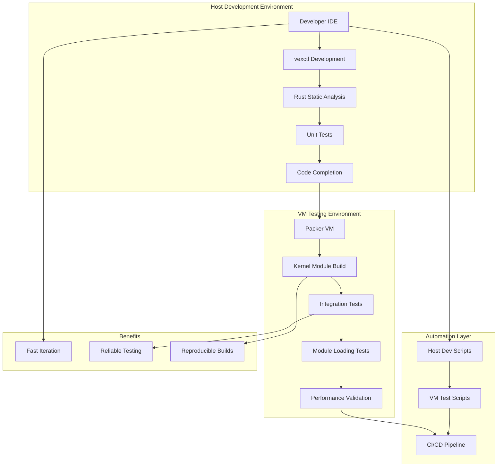

# VexFS Hybrid Development Strategy

## 🎯 **Overview**

This document outlines the comprehensive hybrid development strategy for VexFS, combining host-based development for rapid iteration with VM-based testing for kernel module validation.

## 🏗️ **Architecture**



## 🔄 **Implementation Sequence**

### **Phase 1: Foundation Fixes**

#### **Step 1: Fix vexctl ioctl Issue**
- **Problem**: `nix::sys::ioctl::ioctl` removed in nix 0.27.1
- **Solution**: Replace with direct `libc::ioctl` call
- **Location**: `vexctl/src/main.rs:62`
- **Impact**: Enables host compilation of vexctl tool

**Required Changes:**
```rust
// Replace this:
match unsafe { nix::sys::ioctl::ioctl(fd, VEXFS_IOCTL_GET_STATUS_FULL_CMD as u64, 0 as *mut _) }

// With this:
match unsafe { libc::ioctl(fd, VEXFS_IOCTL_GET_STATUS_FULL_CMD as libc::c_ulong, 0) }
```

**Dependencies to Update:**
- Add `libc` dependency to `vexctl/Cargo.toml`
- Remove unused `nix::sys::ioctl` import

#### **Step 2: Verify Host Development**
- Test vexctl compilation on host
- Validate static analysis works
- Confirm IDE features function

#### **Step 3: Test VM Environment**
- Verify current Packer setup works
- Test kernel module compilation in VM
- Validate integration test capability

### **Phase 2: Automation Creation**

#### **Step 4: Host Development Scripts**
Create `scripts/dev-host.sh`:
- Compile vexctl
- Run Rust static analysis
- Execute unit tests
- Provide quick feedback loop

#### **Step 5: VM Testing Scripts**
Create `scripts/test-vm.sh`:
- Build Packer VM
- Mount source directory
- Run full integration tests
- Generate test reports

#### **Step 6: Enhanced Packer Configuration**
Improve `test_env/vexfs.pkr.hcl`:
- Add debugging tools
- Configure source mounting
- Optimize build time
- Add test automation

### **Phase 3: Documentation & Integration**

#### **Step 7: Workflow Documentation**
- Developer quickstart guide
- Troubleshooting documentation
- CI/CD integration guide

## 🛠️ **Development Workflows**

### **Daily Development Workflow**

1. **Host Development (Fast Iteration)**
   ```bash
   # Quick development cycle
   scripts/dev-host.sh
   # - Compiles vexctl
   # - Runs static analysis
   # - Executes unit tests
   # - Provides immediate feedback
   ```

2. **VM Testing (Validation)**
   ```bash
   # Full validation cycle
   scripts/test-vm.sh
   # - Builds VM environment
   # - Compiles kernel module
   # - Runs integration tests
   # - Validates kernel interaction
   ```

### **Feature Development Process**

1. **Design Phase** (Architect Mode)
   - Architecture planning
   - Interface design
   - Implementation strategy

2. **Implementation Phase** (Code Mode)
   - Host-based development
   - vexctl userspace tool
   - Static analysis validation

3. **Integration Phase** (Test Mode)
   - VM-based testing
   - Kernel module validation
   - Integration test execution

4. **Validation Phase**
   - Performance testing
   - Reliability validation
   - Documentation updates

## 📁 **File Structure**

```
vexfs/
├── src/                    # Kernel module source (VM-only build)
│   ├── lib.rs
│   ├── vector_*.rs
│   └── anns/
├── vexctl/                 # Userspace tool (host + VM build)
│   ├── Cargo.toml
│   └── src/main.rs
├── scripts/
│   ├── dev-host.sh         # Host development automation
│   ├── test-vm.sh          # VM testing automation
│   ├── setup-env.sh        # Environment setup
│   └── ci-pipeline.sh      # CI/CD integration
├── test_env/               # Enhanced Packer configuration
│   ├── vexfs.pkr.hcl      # VM build configuration
│   ├── setup-vm.sh        # VM setup automation
│   └── test-runner.sh     # Test execution in VM
└── docs/
    ├── DEVELOPMENT.md      # Developer guide
    ├── TESTING.md          # Testing procedures
    └── TROUBLESHOOTING.md  # Common issues & solutions
```

## 🔧 **Tool Requirements**

### **Host Environment**
- Rust toolchain (stable)
- cargo and rustc
- IDE with Rust support
- Static analysis tools (clippy, rustfmt)

### **VM Environment** 
- Packer for VM builds
- QEMU for virtualization
- Linux kernel headers
- Rust-for-Linux toolchain

## 🚀 **Benefits**

### **Development Speed**
- **⚡ Fast Feedback**: Host development provides immediate compilation feedback
- **🔄 Quick Iteration**: No VM startup time for basic development
- **💡 IDE Features**: Full code completion and analysis on host

### **Testing Reliability**
- **🔒 Kernel Validation**: VM testing ensures kernel compatibility
- **🧪 Integration Testing**: Full system testing in controlled environment
- **📊 Reproducible Results**: Consistent testing environment

### **Team Scalability**
- **📖 Clear Workflows**: Documented processes for different development phases
- **🛠️ Automated Scripts**: Reduce manual setup and configuration
- **🎯 Role Separation**: Clear boundaries between different types of work

## 🎯 **Success Metrics**

- vexctl compiles successfully on host
- VM environment builds and tests kernel module
- Development scripts automate common workflows
- Documentation enables new team members to contribute
- CI/CD pipeline validates all changes

## 🔄 **Next Steps**

1. Fix vexctl ioctl issue (Code Mode)
2. Create automation scripts (Code Mode)
3. Enhance Packer configuration (Code Mode)
4. Test complete workflow (Test Mode)
5. Document processes (Architect Mode)

This hybrid strategy provides the best of both worlds: fast development iteration and reliable kernel module testing.