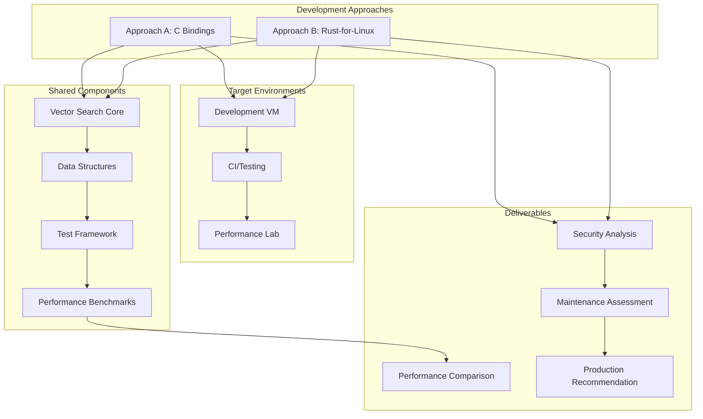

# VexFS Kernel Development Strategy: Dual-Approach Toolchain

## Executive Summary

This document outlines a comprehensive dual-approach strategy for VexFS kernel development, enabling parallel exploration and performance comparison between **C Bindings** and **Rust-for-Linux** implementations. The strategy provides immediate development capabilities while building toward production-ready kernel modules.

## Current State Analysis

### What We Have ✅
- **Excellent vector search engine** (userspace, 3-7ms search times)
- **Hybrid C+Rust architecture** already in place
- **VM testing infrastructure** (QEMU-based)
- **Performance testing framework** (userspace)
- **Build system foundations** (Makefile + Cargo)

### Key Challenges ❌
- **155 compilation errors** in kernel library build
- **Kernel development environment** not properly configured
- **Dual compilation targets** (std vs no_std) causing conflicts
- **Module dependency resolution** issues

## Strategic Architecture



## Dual-Approach Implementation Plan

### Approach A: C Bindings (Stable Foundation)
**Philosophy**: Leverage mature kernel APIs with Rust core logic

**Architecture**:
```
┌─────────────────┐    ┌─────────────────┐    ┌─────────────────┐
│   Linux VFS     │◄───│  C Wrapper      │◄───│  Rust Core      │
│   (Kernel API)  │    │  (vexfs_*.c)    │    │  (no_std)       │
└─────────────────┘    └─────────────────┘    └─────────────────┘
```

**Advantages**:
- ✅ **Immediate viability** - works with any kernel version
- ✅ **Mature toolchain** - standard kernel build process
- ✅ **Lower risk** - well-understood integration patterns
- ✅ **Debugging support** - full GDB/KGDB support
- ✅ **Community support** - extensive documentation

**Implementation Steps**:
1. **Fix Rust library compilation** (resolve 155 errors)
2. **Expand C wrapper layer** (VFS operations, IOCTL handlers)
3. **FFI interface design** (safe Rust ↔ C boundaries)
4. **Error handling strategy** (kernel errno ↔ Rust Result)
5. **Memory management** (kernel allocators, reference counting)

### Approach B: Rust-for-Linux (Cutting Edge)
**Philosophy**: Native Rust kernel modules with memory safety guarantees

**Architecture**:
```
┌─────────────────┐    ┌─────────────────┐
│   Linux VFS     │◄───│  Rust Module    │
│   (Kernel API)  │    │  (kernel crate) │
└─────────────────┘    └─────────────────┘
```

**Advantages**:
- ✅ **Memory safety** - eliminates entire classes of kernel bugs
- ✅ **Performance potential** - zero-cost abstractions
- ✅ **Type safety** - compile-time correctness guarantees
- ✅ **Modern language** - better abstractions and maintainability
- ✅ **Future-proof** - alignment with kernel development trends

**Requirements**:
- **Rust-for-Linux kernel** (6.1+ with CONFIG_RUST=y)
- **Specialized toolchain** (rust-analyzer, kernel-specific tools)
- **Custom build process** (kernel integration)

## Toolchain Setup Strategy

### Phase 1: Foundation Setup (Week 1-2)

#### 1.1 Development Environment
```bash
# Multi-kernel environment setup
environments/
├── stable/          # Standard kernel (Approach A)
├── rust-for-linux/  # RfL kernel (Approach B)
├── shared/          # Common tools and scripts
└── benchmarks/      # Performance testing
```

#### 1.2 Build System Enhancement
```makefile
# Enhanced Makefile with dual approach support
APPROACH ?= c-bindings  # or rust-for-linux

ifeq ($(APPROACH),c-bindings)
    include Makefile.c-bindings
else ifeq ($(APPROACH),rust-for-linux)
    include Makefile.rust-for-linux
endif
```

#### 1.3 Cargo Configuration
```toml
# Cargo.toml enhancement
[features]
default = ["std"]
std = []
kernel = []
c-bindings = ["kernel"]
rust-for-linux = ["kernel", "rfl"]

[dependencies.kernel]
git = "https://github.com/Rust-for-Linux/linux.git"
branch = "rust-next"
optional = true
```

### Phase 2: Approach A Implementation (Week 2-4)

#### 2.1 Fix Current Compilation Issues
**Priority Order**:
1. **Module import conflicts** (HnswIndex vs AnnsIndex)
2. **Duplicate type definitions** (VectorIoctlError)
3. **Namespace resolution** (vector_storage imports)
4. **Generic type parameters** (Result<T, E> issues)
5. **Conditional compilation** (std vs no_std features)

#### 2.2 C Wrapper Expansion
```c
// vexfs_vfs_ops.c - VFS operation wrappers
extern int vexfs_rust_mount(struct super_block *sb, void *data, int silent);
extern void vexfs_rust_unmount(struct super_block *sb);
extern int vexfs_rust_statfs(struct dentry *dentry, struct kstatfs *buf);

// vexfs_file_ops.c - File operation wrappers  
extern ssize_t vexfs_rust_read(struct file *file, char __user *buf, 
                               size_t count, loff_t *ppos);
extern ssize_t vexfs_rust_write(struct file *file, const char __user *buf,
                                size_t count, loff_t *ppos);

// vexfs_ioctl_ops.c - IOCTL wrappers
extern long vexfs_rust_ioctl(struct file *file, unsigned int cmd, 
                              unsigned long arg);
```

#### 2.3 FFI Safety Layer
```rust
// src/ffi/mod.rs - Safe FFI boundaries
#[repr(C)]
pub struct CFileHandle {
    pub file_ptr: *mut c_void,
    pub inode_id: u64,
    pub flags: u32,
}

#[no_mangle]
pub extern "C" fn vexfs_rust_search_vectors(
    handle: *const CFileHandle,
    query: *const f32,
    query_len: usize,
    results: *mut CSearchResult,
    max_results: usize,
) -> i32 {
    // Safe conversion and error handling
}
```

### Phase 3: Approach B Implementation (Week 4-6)

#### 3.1 Rust-for-Linux Environment Setup
```bash
# RfL kernel build
git clone https://github.com/Rust-for-Linux/linux.git rfl-kernel
cd rfl-kernel
git checkout rust-next

# Configure for Rust support
make LLVM=1 rustavailable
make LLVM=1 defconfig
scripts/config --enable CONFIG_RUST
scripts/config --enable CONFIG_SAMPLES_RUST
make LLVM=1 -j$(nproc)
```

#### 3.2 Native Rust Module
```rust
// src/rfl/mod.rs - Rust-for-Linux implementation
use kernel::prelude::*;
use kernel::{file, fs, ioctl};

#[derive(Default)]
struct VexfsModule;

impl kernel::Module for VexfsModule {
    fn init() -> Result<Self> {
        pr_info!("VexFS: Native Rust module initialized\n");
        vexfs_register_filesystem()?;
        Ok(VexfsModule)
    }
}

impl Drop for VexfsModule {
    fn drop(&mut self) {
        pr_info!("VexFS: Native Rust module exiting\n");
        vexfs_unregister_filesystem();
    }
}

module! {
    type: VexfsModule,
    name: "vexfs",
    license: "GPL",
    description: "Vector-Native File System (Pure Rust)",
}
```

### Phase 4: Performance Testing Framework (Week 5-7)

#### 4.1 Benchmarking Infrastructure
```rust
// benchmarks/src/lib.rs
pub struct KernelBenchmark {
    pub name: &'static str,
    pub setup: fn() -> Result<TestContext>,
    pub test: fn(&TestContext) -> BenchResult,
    pub cleanup: fn(TestContext),
}

pub struct BenchResult {
    pub latency_us: u64,
    pub throughput_ops_sec: u64,
    pub memory_kb: u64,
    pub cpu_cycles: u64,
}

// Benchmark suite
const BENCHMARKS: &[KernelBenchmark] = &[
    KernelBenchmark {
        name: "vector_search_1k",
        setup: setup_1k_vectors,
        test: bench_vector_search,
        cleanup: cleanup_vectors,
    },
    // ... more benchmarks
];
```

#### 4.2 VM Testing Environment
```bash
# test_env/run_comparison.sh
#!/bin/bash

echo "Starting VexFS Dual-Approach Performance Comparison"

# Build both approaches
make APPROACH=c-bindings clean all
cp vexfs.ko /tmp/vexfs-c-bindings.ko

make APPROACH=rust-for-linux clean all  
cp vexfs.ko /tmp/vexfs-rust-for-linux.ko

# Run benchmarks in VM
qemu-system-x86_64 \
    -enable-kvm \
    -cpu host \
    -m 4G \
    -kernel /boot/vmlinuz-$(uname -r) \
    -append "console=ttyS0 benchmark=both" \
    -nographic \
    -device pci-bridge,id=bridge \
    -drive file=benchmark-disk.img,format=raw
```

#### 4.3 Automated Comparison Reports
```python
# scripts/generate_comparison.py
class PerformanceComparison:
    def __init__(self):
        self.c_bindings_results = []
        self.rust_for_linux_results = []
    
    def generate_report(self):
        return {
            'latency_comparison': self.compare_latency(),
            'throughput_comparison': self.compare_throughput(),
            'memory_usage': self.compare_memory(),
            'security_analysis': self.analyze_security(),
            'maintainability_score': self.score_maintainability()
        }
```

## Implementation Timeline

### Immediate (Week 1-2): Foundation
- [ ] Fix 155 compilation errors in current codebase
- [ ] Set up dual-approach build system
- [ ] Configure development VM environment
- [ ] Establish baseline performance metrics

### Short Term (Week 2-4): C Bindings Approach
- [ ] Expand C wrapper layer for VFS operations
- [ ] Implement safe FFI boundaries
- [ ] Create kernel module build pipeline
- [ ] Basic functional testing in VM

### Medium Term (Week 4-6): Rust-for-Linux Approach  
- [ ] Set up RfL kernel development environment
- [ ] Implement native Rust module
- [ ] Port core vector operations to kernel crate
- [ ] Comparative functional testing

### Long Term (Week 6-8): Performance Analysis
- [ ] Comprehensive benchmark suite
- [ ] Security vulnerability analysis
- [ ] Memory safety verification
- [ ] Production readiness assessment

## Success Metrics

### Performance Benchmarks
- **Latency**: Vector search operations (target: <10μs)
- **Throughput**: Operations per second (target: >100K ops/sec)
- **Memory**: Kernel memory usage efficiency
- **Scalability**: Performance under load

### Quality Metrics
- **Security**: Vulnerability assessment scores
- **Reliability**: Crash resistance and error handling
- **Maintainability**: Code complexity and documentation
- **Compatibility**: Kernel version support range

### Decision Framework
Based on 8-week evaluation:
- **Performance Leader**: Approach with superior benchmarks
- **Security Champion**: Better memory safety guarantees
- **Practical Winner**: Easier deployment and maintenance
- **Future Proof**: Better long-term kernel ecosystem fit

## Risk Mitigation

### Approach A Risks
- **Performance overhead**: FFI boundary costs
- **Memory safety**: Traditional kernel vulnerability classes
- **Complexity**: Managing C↔Rust boundaries

### Approach B Risks
- **Kernel compatibility**: Limited to RfL-enabled kernels
- **Toolchain maturity**: Newer, less stable development tools
- **Community support**: Smaller ecosystem

### Shared Risks
- **Development time**: Dual approach increases complexity
- **Resource requirements**: More comprehensive testing needed
- **Integration challenges**: VM and CI setup complexity

## Conclusion

This dual-approach strategy provides a comprehensive framework for evaluating both C bindings and Rust-for-Linux implementations while maintaining development velocity. The strategy enables data-driven decision making based on actual performance, security, and maintainability metrics rather than theoretical considerations.

The immediate focus on fixing current compilation issues ensures rapid progress toward a working kernel module, while the parallel exploration of both approaches provides valuable insights for the optimal long-term technical direction.