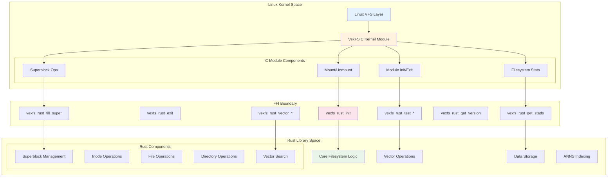

# VexFS C FFI Architecture Documentation

## Overview

VexFS implements a hybrid C-Rust architecture where the kernel module is written in C to handle Linux kernel integration, while the core filesystem logic is implemented in Rust for safety and performance. This document details the Foreign Function Interface (FFI) design that enables seamless integration between these two components.

## Architecture Philosophy

### Design Principles

1. **Clear Separation of Concerns**
   - **C Kernel Module**: Handles Linux VFS integration, kernel API compliance, and system-level operations
   - **Rust Library**: Implements filesystem logic, vector operations, and complex data structures

2. **Safety-First Approach**
   - Kernel-space constraints handled in C where kernel APIs require it
   - Business logic in Rust leverages memory safety and error handling
   - FFI boundary acts as a controlled interface with explicit error handling

3. **Performance Optimization**
   - Static linking eliminates runtime overhead
   - Direct function calls across FFI boundary
   - Zero-copy data structures where possible

### Architecture Diagram



## FFI Interface Design

### Function Categories

The FFI interface is organized into several functional categories:

1. **Lifecycle Management**
   - Module initialization and cleanup
   - Resource allocation and deallocation

2. **Filesystem Operations**
   - Superblock initialization
   - Filesystem statistics

3. **Testing & Validation**
   - Basic functionality tests
   - Vector operation validation

4. **Version & Metadata**
   - Version information
   - Capability reporting

### FFI Function Signatures

#### Lifecycle Management

```c
/**
 * Initialize Rust components
 * Returns: 0 on success, negative error code on failure
 */
int vexfs_rust_init(void);

/**
 * Cleanup Rust components
 */
void vexfs_rust_exit(void);
```

#### Filesystem Operations

```c
/**
 * Initialize superblock with Rust components
 * @sb: Linux superblock structure
 * Returns: 0 on success, negative error code on failure
 */
int vexfs_rust_fill_super(struct super_block *sb);

/**
 * Get filesystem statistics
 * @blocks: Total blocks (output)
 * @free_blocks: Free blocks (output)
 * @files: Total files (output)
 * @free_files: Free files (output)
 * Returns: 0 on success, negative error code on failure
 */
int vexfs_rust_get_statfs(uint64_t *blocks, uint64_t *free_blocks, 
                          uint64_t *files, uint64_t *free_files);
```

#### Testing & Validation

```c
/**
 * Basic FFI functionality test
 * Returns: 0 on success, negative error code on failure
 */
int vexfs_rust_test_basic(void);

/**
 * Vector operations test
 * Returns: 0 on success, negative error code on failure
 */
int vexfs_rust_test_vector_ops(void);
```

#### Version & Metadata

```c
/**
 * Get Rust library version
 * Returns: Version number as uint32_t
 */
uint32_t vexfs_rust_get_version(void);
```

## Implementation Details

### Header Generation

VexFS uses **cbindgen** to automatically generate C headers from Rust code:

```toml
# cbindgen.toml
language = "C"
style = "both"
cpp_compat = true

[export]
include = ["VexfsResult", "VexfsError"]

[fn]
prefix = "vexfs_rust_"
postfix = ""
```

Generated header structure:
```c
/* Auto-generated by cbindgen */
#ifndef VEXFS_FFI_H
#define VEXFS_FFI_H

#include <stdint.h>
#include <linux/types.h>

/* Function declarations */
int vexfs_rust_init(void);
void vexfs_rust_exit(void);
/* ... other functions ... */

#endif /* VEXFS_FFI_H */
```

### Error Handling Strategy

#### Rust Error Types

```rust
#[repr(C)]
pub enum VexfsError {
    Success = 0,
    InvalidArgument = -22,  // EINVAL
    OutOfMemory = -12,      // ENOMEM
    IoError = -5,           // EIO
    NotSupported = -95,     // EOPNOTSUPP
}

pub type VexfsResult<T> = Result<T, VexfsError>;
```

#### C Error Mapping

```c
/* Error code mapping in C module */
static int rust_to_linux_error(int rust_error) {
    switch (rust_error) {
        case 0: return 0;                    // Success
        case -22: return -EINVAL;            // Invalid argument
        case -12: return -ENOMEM;            // Out of memory
        case -5: return -EIO;                // I/O error
        case -95: return -EOPNOTSUPP;        // Not supported
        default: return -EIO;                // Generic error
    }
}
```

### Memory Management

#### Ownership Model

1. **C-Allocated Memory**: Managed by kernel allocators (kmalloc, etc.)
2. **Rust-Allocated Memory**: Managed by Rust's allocator with no_std constraints
3. **Shared Data**: Passed by value or const references across FFI boundary

#### Data Structure Mapping

```rust
// Rust side - kernel-compatible types
#[repr(C)]
pub struct VexfsStats {
    pub total_blocks: u64,
    pub free_blocks: u64,
    pub total_files: u64,
    pub free_files: u64,
}

// C side - direct mapping
struct vexfs_stats {
    uint64_t total_blocks;
    uint64_t free_blocks;
    uint64_t total_files;
    uint64_t free_files;
};
```

### Conditional Compilation

The architecture supports both full C+Rust builds and C-only fallback builds:

#### Build Configuration

```c
/* C module conditional compilation */
#ifdef VEXFS_RUST_FFI_ENABLED
    #include "vexfs_ffi.h"
    // Full FFI functionality
#else
    #define VEXFS_MAGIC 0x56454653
    // C-only fallback
#endif
```

#### Rust Feature Flags

```toml
# Cargo.toml
[features]
default = []
kernel-minimal = ["no-std-compat"]

[dependencies.no-std-compat]
version = "0.4"
features = ["alloc"]
optional = true
```

## Build System Integration

### Build Process Flow


### Makefile Targets

```makefile
# Build Rust static library
rust-lib:
    cargo build --release --target=x86_64-unknown-linux-gnu --features=kernel-minimal
    cp target/x86_64-unknown-linux-gnu/release/libvexfs.a ./libvexfs.a

# Create combined object file
vexfs_rust_combined.o: libvexfs.a
    # Extract all object files from static library
    mkdir -p .rust_extract
    cd .rust_extract && ar x ../libvexfs.a
    # Combine into single object file
    ld -r -o vexfs_rust_combined_raw.o .rust_extract/*.o
    # Strip LLVM metadata for kernel compatibility
    objcopy --remove-section=.llvmbc --remove-section=.llvmcmd \
            vexfs_rust_combined_raw.o vexfs_rust_combined.o

# Build kernel module
kernel-module: vexfs_rust_combined.o
    $(MAKE) -C $(KERNEL_DIR) M=$(PWD) modules
```

### Kbuild Integration

```makefile
# Kbuild configuration
obj-m += vexfs.o

ifndef VEXFS_C_ONLY
    ifneq (,$(wildcard $(src)/vexfs_rust_combined.o))
        ccflags-y += -DVEXFS_RUST_FFI_ENABLED
        vexfs-objs := vexfs_module_entry.o vexfs_rust_combined.o
    else
        ccflags-y += -DVEXFS_C_ONLY_BUILD
        vexfs-objs := vexfs_module_entry.o
    endif
else
    ccflags-y += -DVEXFS_C_ONLY_BUILD
    vexfs-objs := vexfs_module_entry.o
endif
```

## Development Patterns

### Adding New FFI Functions

#### Step 1: Define Rust Function

```rust
// In src/ffi.rs
#[no_mangle]
pub extern "C" fn vexfs_rust_new_operation(param: u32) -> i32 {
    match internal_new_operation(param) {
        Ok(result) => result as i32,
        Err(e) => e as i32,
    }
}
```

#### Step 2: Update C Module

```c
/* In vexfs_module_entry.c */
#ifdef VEXFS_RUST_FFI_ENABLED
    extern int vexfs_rust_new_operation(uint32_t param);
    
    /* Usage in appropriate VFS operation */
    int result = vexfs_rust_new_operation(some_param);
    if (result < 0) {
        printk(KERN_ERR "VexFS: New operation failed: %d\n", result);
        return result;
    }
#endif
```

#### Step 3: Regenerate Headers

```bash
# Update headers
cargo build
# Headers automatically updated via cbindgen
```

### Testing Strategy

#### Unit Testing (Rust)

```rust
#[cfg(test)]
mod tests {
    use super::*;
    
    #[test]
    fn test_ffi_basic_functionality() {
        let result = vexfs_rust_test_basic();
        assert_eq!(result, 0);
    }
}
```

#### Integration Testing (C Module)

```c
/* Test FFI integration during module init */
static int test_ffi_integration(void) {
    int ret;
    
    ret = vexfs_rust_test_basic();
    if (ret != 0) {
        printk(KERN_ERR "VexFS: Basic FFI test failed: %d\n", ret);
        return ret;
    }
    
    ret = vexfs_rust_test_vector_ops();
    if (ret != 0) {
        printk(KERN_ERR "VexFS: Vector ops test failed: %d\n", ret);
        return ret;
    }
    
    return 0;
}
```

#### VM Testing

```bash
# Full integration testing in VM environment
make vm-build
./test_env/test_module_vm.sh
```

### Performance Considerations

#### Function Call Overhead

- **Static Linking**: Eliminates dynamic library overhead
- **Inlining**: Compiler can optimize across FFI boundary in some cases
- **Batch Operations**: Group related operations to minimize FFI calls

#### Memory Efficiency

- **Stack Allocation**: Prefer stack-allocated data structures
- **Zero-Copy**: Pass references rather than copying large structures
- **Buffer Reuse**: Reuse buffers across multiple FFI calls

#### Error Handling Optimization

```rust
// Fast path for success cases
#[inline]
pub extern "C" fn vexfs_rust_fast_operation() -> i32 {
    // Optimize for the success case
    match likely_success_operation() {
        Ok(_) => 0,
        Err(e) => e as i32,
    }
}
```

## Security Considerations

### Input Validation

```rust
#[no_mangle]
pub extern "C" fn vexfs_rust_safe_operation(ptr: *const u8, len: usize) -> i32 {
    // Validate pointer before use
    if ptr.is_null() || len == 0 {
        return VexfsError::InvalidArgument as i32;
    }
    
    // Create safe slice from raw pointer
    let data = unsafe {
        std::slice::from_raw_parts(ptr, len)
    };
    
    // Process safely
    match process_data(data) {
        Ok(_) => 0,
        Err(e) => e as i32,
    }
}
```

### Memory Safety

1. **No Rust Panics**: All FFI functions use Result types and explicit error handling
2. **Pointer Validation**: Check all incoming pointers for null/validity
3. **Bounds Checking**: Validate array indices and buffer sizes
4. **Resource Cleanup**: Ensure proper cleanup on error paths

### Kernel Compatibility

```rust
// Use kernel-compatible allocators
#[cfg(feature = "kernel-minimal")]
use linked_list_allocator::LockedHeap;

// Avoid standard library features
#![no_std]
#![forbid(unsafe_op_in_unsafe_fn)]
```

## Maintenance Guidelines

### Version Compatibility

1. **FFI Stability**: Maintain backward compatibility in FFI interface
2. **ABI Versioning**: Use version checks for interface changes
3. **Graceful Degradation**: Handle missing functionality gracefully

### Code Organization

```
vexfs/src/
├── ffi.rs              # FFI function implementations
├── lib.rs              # Main library interface
├── superblock.rs       # Superblock operations
├── inode.rs           # Inode management
├── file_ops.rs        # File operations
├── dir_ops.rs         # Directory operations
└── vector_search.rs   # Vector search functionality
```

### Documentation Requirements

1. **FFI Functions**: Document all parameters, return values, and error conditions
2. **Error Codes**: Maintain mapping between Rust and Linux error codes
3. **Usage Examples**: Provide examples for complex operations
4. **Performance Notes**: Document performance characteristics

## Future Evolution

### Planned Extensions

1. **Extended Vector Operations**: Additional ANNS algorithms
2. **Advanced File Operations**: Support for extended attributes
3. **Performance Monitoring**: Detailed performance metrics via FFI
4. **Dynamic Configuration**: Runtime configuration through FFI

### Migration Strategy

1. **Incremental Updates**: Add new FFI functions while maintaining old ones
2. **Feature Flags**: Use Cargo features for experimental functionality
3. **Testing Coverage**: Ensure comprehensive testing for all FFI paths
4. **Documentation Updates**: Keep documentation synchronized with code changes

## Conclusion

The VexFS C FFI architecture successfully bridges the gap between kernel-space C requirements and user-space Rust development benefits. This design provides:

- **Safety**: Rust's memory safety within filesystem logic
- **Performance**: Efficient static linking and minimal overhead
- **Maintainability**: Clear separation of concerns and automated header generation
- **Testability**: Comprehensive testing at both unit and integration levels
- **Flexibility**: Support for both full and fallback build configurations

This architecture serves as the foundation for all VexFS development, enabling rapid iteration while maintaining kernel compatibility and safety requirements.