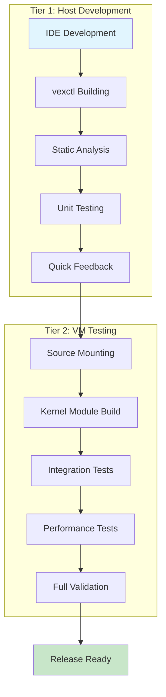

# VexFS Development Workflow Guide

## 🚀 **Quick Start**

### **1. Environment Setup**
```bash
# Clone and navigate to project
git clone <repo-url>
cd vexfs

# Run setup script (when available)
scripts/setup-env.sh

# Verify host development works
scripts/dev-host.sh
```

### **2. Daily Development Cycle**

#### **Fast Iteration (Host Development)**
```bash
# Edit code in your IDE
# Run quick validation
scripts/dev-host.sh
# Results in < 2 minutes
```

#### **Full Validation (VM Testing)**
```bash
# Run comprehensive tests
scripts/test-vm.sh
# Results in < 10 minutes
```

## 🏗️ **Architecture Overview**

### **Two-Tier Development Strategy**



### **Component Architecture**

| Component | Host Development | VM Testing | Purpose |
|-----------|------------------|------------|---------|
| **vexctl** | ✅ Build & Test | ✅ Integration | Userspace tool |
| **Kernel Module** | ⚠️ Syntax Check | ✅ Full Build | Core filesystem |
| **Static Analysis** | ✅ Full Analysis | ✅ Validation | Code quality |
| **Integration Tests** | ❌ Not Possible | ✅ Full Suite | System validation |

## 🛠️ **Development Modes**

### **Mode 1: Rapid Iteration (Host)**

**When to Use:**
- Daily development work
- Bug fixes in userspace code
- Code refactoring
- Static analysis improvements

**Capabilities:**
- vexctl compilation and testing
- Rust static analysis (clippy, rustfmt)
- Unit test execution
- Code completion and IDE features

**Limitations:**
- Cannot build kernel module
- No integration testing
- No kernel interaction validation

**Workflow:**
```bash
# Edit code
vim vexctl/src/main.rs

# Quick validation
scripts/dev-host.sh
# Output:
# ✅ vexctl build complete
# ✅ Static analysis passed
# ✅ Unit tests passed
# ✅ Kernel module syntax check complete
```

### **Mode 2: Full Validation (VM)**

**When to Use:**
- Before committing changes
- Testing kernel module functionality
- Integration testing
- Performance validation
- Release preparation

**Capabilities:**
- Full kernel module compilation
- Module loading/unloading tests
- ioctl interface validation
- Performance benchmarking
- System integration testing

**Limitations:**
- Slower feedback cycle
- Requires VM startup time
- More resource intensive

**Workflow:**
```bash
# Run comprehensive testing
scripts/test-vm.sh
# Output:
# 🏗️ Building VM with Packer...
# 🚀 Starting VM and running tests...
# ✅ VM testing complete
# 📊 Test results available in tests/test_results/
```

## 📋 **Development Process**

### **Feature Development**

#### **Phase 1: Design & Planning**
1. **Architectural Review** (Architect Mode)
   - System design analysis
   - Interface specification
   - Implementation strategy

2. **Task Planning**
   - Break down into subtasks
   - Identify dependencies
   - Estimate complexity

#### **Phase 2: Implementation**
1. **Host Development** (Code Mode)
   ```bash
   # Iterative development cycle
   while [ "$feature_complete" != "true" ]; do
     # Edit code
     vim src/new_feature.rs
     
     # Quick validation
     scripts/dev-host.sh
     
     # Fix any issues found
   done
   ```

2. **Integration Preparation**
   - Ensure all unit tests pass
   - Static analysis clean
   - Documentation updated

#### **Phase 3: Validation**
1. **VM Testing** (Test Mode)
   ```bash
   # Full integration testing
   scripts/test-vm.sh
   
   # Review results
   cat tests/test_results/test-report.txt
   ```

2. **Performance Validation**
   - Benchmark performance impact
   - Memory usage analysis
   - Stress testing

#### **Phase 4: Integration**
1. **Code Review**
   - Peer review process
   - Architectural compliance
   - Test coverage verification

2. **CI/CD Pipeline**
   - Automated testing
   - Build verification
   - Deployment preparation

### **Bug Fix Process**

#### **Small Fixes (Host Development)**
```bash
# Quick fix cycle
scripts/dev-host.sh  # Identify issue
# Fix code
scripts/dev-host.sh  # Verify fix
# Optional: scripts/test-vm.sh for complex fixes
```

#### **Complex Fixes (Full Validation)**
```bash
# Comprehensive fix cycle
scripts/dev-host.sh  # Initial analysis
# Implement fix
scripts/test-vm.sh   # Full validation
# Verify integration impact
```

## 🎯 **Best Practices**

### **Code Quality**
- **Always run host development script** before committing
- **Use VM testing for kernel-related changes**
- **Follow Rust formatting standards** (rustfmt)
- **Address all clippy warnings**

### **Testing Strategy**
- **Unit tests** for individual functions
- **Integration tests** for component interaction
- **Performance tests** for critical paths
- **Regression tests** for bug fixes

### **Documentation**
- **Code comments** for complex algorithms
- **API documentation** for public interfaces
- **Architecture docs** for design decisions
- **Troubleshooting guides** for common issues

## 🚨 **Troubleshooting**

### **Host Development Issues**

#### **vexctl Won't Compile**
```bash
# Check Rust version
rustc --version

# Update dependencies
cd vexctl && cargo update

# Clean build
cargo clean && cargo build
```

#### **Static Analysis Failures**
```bash
# Fix formatting
cargo fmt

# Address clippy warnings
cargo clippy --fix --allow-dirty
```

### **VM Testing Issues**

#### **VM Won't Start**
```bash
# Check virtualization support
lscpu | grep Virtualization

# Verify Packer installation
packer version

# Check QEMU installation
qemu-system-x86_64 --version
```

#### **Tests Fail in VM**
```bash
# Check VM logs
cat tests/legacy/shell_scripts/vm-build.log

# Manual VM inspection
tests/legacy/shell_scripts/run_qemu.sh --interactive

# Inside VM:
sudo dmesg | tail -50
journalctl -xe
```

## 📊 **Performance Expectations**

| Operation | Expected Time | Success Rate |
|-----------|---------------|--------------|
| Host Development Script | < 2 minutes | > 98% |
| VM Testing Script | < 10 minutes | > 95% |
| Full CI/CD Pipeline | < 20 minutes | > 90% |

## 🔄 **Workflow Optimization**

### **Time Management**
- **Use host development** for most daily work
- **Schedule VM testing** during breaks or async work
- **Batch VM tests** for multiple changes

### **Resource Management**
- **Host development**: Minimal resources
- **VM testing**: 4GB RAM, 4 CPU cores recommended
- **Parallel development**: Multiple developers can share VM builds

### **Collaboration**
- **Share VM images** to reduce build time
- **Coordinate VM testing** to avoid resource conflicts
- **Document environment requirements** for team setup

This workflow enables productive development while ensuring reliable kernel module testing and integration.