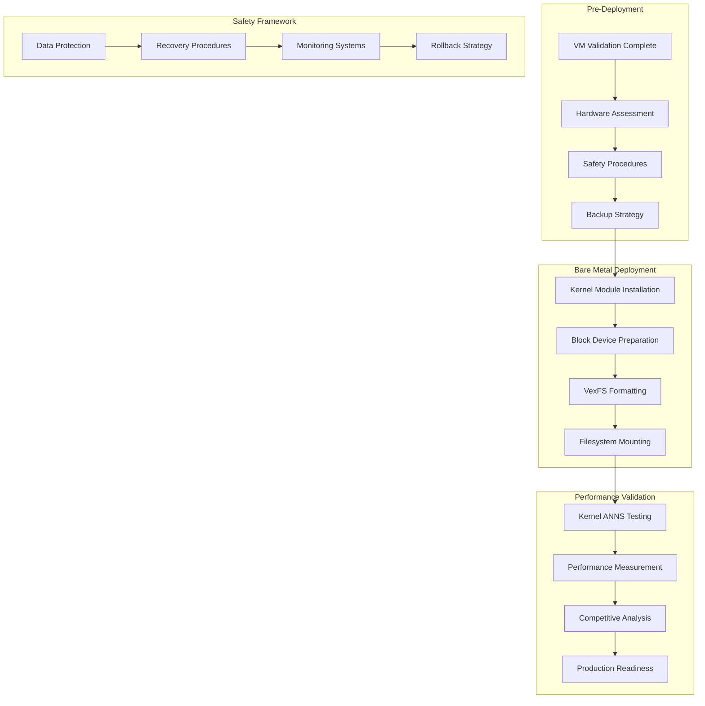

# Bare Metal VexFS-ANNS-KERNEL Deployment Strategy

**Date**: May 31, 2025  
**Status**: Architectural Planning  
**Phase**: Bare Metal Production Deployment  
**Goal**: Maximum kernel-level vector embedding performance on `/dev/sda`

## Executive Summary

This document outlines the comprehensive strategy for deploying VexFS-ANNS-KERNEL on bare metal hardware, transitioning from VM validation to production-grade performance on real block devices. The approach maintains ethical transparency while pursuing maximum authentic performance.

## Deployment Architecture Overview



## Hardware Requirements and Assessment

### Minimum Hardware Specifications

**CPU Requirements**:
- **Architecture**: x86_64 (Intel/AMD)
- **Cores**: 4+ cores (8+ recommended for performance testing)
- **Features**: SSE4.2, AVX2 support for vector operations
- **Cache**: L3 cache 8MB+ for optimal ANNS performance

**Memory Requirements**:
- **RAM**: 16GB+ (32GB+ recommended for large datasets)
- **Type**: DDR4-2400+ for optimal memory bandwidth
- **ECC**: Recommended for production deployments

**Storage Requirements**:
- **Primary**: NVMe SSD for optimal I/O performance
- **Capacity**: 500GB+ with dedicated VexFS partition
- **Interface**: PCIe 3.0+ for maximum throughput
- **Backup**: Secondary storage for safety procedures

**Network Requirements**:
- **Connectivity**: Gigabit Ethernet for data transfer
- **Bandwidth**: High-speed connection for benchmark data

### Hardware Assessment Checklist

```bash
# Hardware assessment script
cat > assess_hardware.sh << 'EOF'
#!/bin/bash

echo "🔍 VexFS Bare Metal Hardware Assessment"
echo "======================================="

# CPU Assessment
echo "CPU Information:"
lscpu | grep -E "(Model name|CPU\(s\)|Thread|Cache)"
echo ""

# Check for required CPU features
echo "CPU Features:"
grep -E "(sse4_2|avx2|avx512)" /proc/cpuinfo | head -1
echo ""

# Memory Assessment
echo "Memory Information:"
free -h
echo ""
cat /proc/meminfo | grep -E "(MemTotal|MemAvailable)"
echo ""

# Storage Assessment
echo "Storage Devices:"
lsblk -d -o NAME,SIZE,TYPE,MODEL,TRAN
echo ""

# NVMe specific information
if ls /dev/nvme* 2>/dev/null; then
    echo "NVMe Devices:"
    for nvme in /dev/nvme*n1; do
        if [ -b "$nvme" ]; then
            echo "  $nvme:"
            nvme id-ctrl "$nvme" 2>/dev/null | grep -E "(mn|sn|fr)" || echo "    Info not available"
        fi
    done
    echo ""
fi

# Kernel Information
echo "Kernel Information:"
uname -a
echo ""

# Check for required kernel modules
echo "Available Filesystems:"
cat /proc/filesystems | grep -v nodev
echo ""

echo "✅ Hardware assessment complete"
EOF

chmod +x assess_hardware.sh
```

## Safety and Risk Management

### Data Protection Strategy

**Backup Requirements**:
- **Full System Backup**: Complete system image before deployment
- **Critical Data Backup**: All important data to separate storage
- **Configuration Backup**: System configuration and settings
- **Recovery Media**: Bootable rescue USB/DVD

**Partition Strategy**:
```bash
# Safe partition layout example
# /dev/sda1 - EFI System Partition (512MB)
# /dev/sda2 - Boot partition (1GB)
# /dev/sda3 - Root filesystem (100GB)
# /dev/sda4 - Home partition (200GB)
# /dev/sda5 - VexFS test partition (100GB) ← DEDICATED FOR VEXFS
# /dev/sda6 - Backup partition (remaining space)
```

**Risk Mitigation Procedures**:
```bash
# Pre-deployment safety script
cat > safety_procedures.sh << 'EOF'
#!/bin/bash

echo "🛡️  VexFS Bare Metal Safety Procedures"
echo "====================================="

# Check if running as root
if [ "$EUID" -ne 0 ]; then
    echo "❌ This script must be run as root"
    exit 1
fi

# Verify backup completion
echo "1. Backup Verification:"
read -p "Have you completed a full system backup? (yes/no): " backup_confirm
if [ "$backup_confirm" != "yes" ]; then
    echo "❌ Please complete system backup before proceeding"
    exit 1
fi

# Identify target partition
echo ""
echo "2. Target Partition Selection:"
lsblk
echo ""
read -p "Enter the target partition for VexFS (e.g., /dev/sda5): " target_partition

# Verify partition exists and is not mounted
if [ ! -b "$target_partition" ]; then
    echo "❌ Partition $target_partition does not exist"
    exit 1
fi

if mountpoint -q "$target_partition" 2>/dev/null; then
    echo "❌ Partition $target_partition is currently mounted"
    echo "Please unmount before proceeding"
    exit 1
fi

# Check partition size
partition_size=$(lsblk -b -n -o SIZE "$target_partition")
min_size=$((10 * 1024 * 1024 * 1024))  # 10GB minimum

if [ "$partition_size" -lt "$min_size" ]; then
    echo "❌ Partition too small. Minimum 10GB required"
    exit 1
fi

echo "✅ Target partition: $target_partition ($(numfmt --to=iec $partition_size))"

# Create recovery information
echo ""
echo "3. Recovery Information:"
cat > /tmp/vexfs_recovery_info.txt << EOL
VexFS Deployment Recovery Information
====================================
Date: $(date)
Target Partition: $target_partition
Partition Size: $(numfmt --to=iec $partition_size)
Kernel Version: $(uname -r)
System: $(hostname)

Recovery Steps:
1. Boot from rescue media
2. Restore system backup if needed
3. Clear partition: dd if=/dev/zero of=$target_partition bs=1M count=100
4. Recreate filesystem: mkfs.ext4 $target_partition

Emergency Contact: [Add contact information]
EOL

echo "Recovery information saved to /tmp/vexfs_recovery_info.txt"
echo "Please save this file to external storage"

echo ""
echo "✅ Safety procedures completed"
echo "Target partition: $target_partition"
EOF

chmod +x safety_procedures.sh
```

## Deployment Implementation

### Phase 1: System Preparation

**Step 1: Environment Setup**
```bash
# System preparation script
cat > prepare_bare_metal.sh << 'EOF'
#!/bin/bash

echo "🔧 VexFS Bare Metal System Preparation"
echo "======================================"

# Update system
echo "Updating system packages..."
apt update && apt upgrade -y

# Install required packages
echo "Installing required packages..."
apt install -y \
    build-essential \
    linux-headers-$(uname -r) \
    kmod \
    util-linux \
    parted \
    e2fsprogs \
    nvme-cli \
    smartmontools \
    iotop \
    htop \
    sysstat \
    git \
    curl \
    wget

# Verify kernel headers
if [ -d "/lib/modules/$(uname -r)/build" ]; then
    echo "✅ Kernel headers available"
else
    echo "❌ Kernel headers not found"
    exit 1
fi

# Check for VexFS kernel module
if [ -f "kernel/vexfs.ko" ]; then
    echo "✅ VexFS kernel module found"
    modinfo kernel/vexfs.ko
else
    echo "❌ VexFS kernel module not found"
    echo "Please build the kernel module first: make"
    exit 1
fi

echo "✅ System preparation complete"
EOF

chmod +x prepare_bare_metal.sh
```

### Phase 2: Kernel Module Deployment

**Step 2: Kernel Module Installation**
```bash
# Kernel module deployment script
cat > deploy_kernel_module.sh << 'EOF'
#!/bin/bash

echo "🚀 VexFS Kernel Module Deployment"
echo "================================="

MODULE_PATH="kernel/vexfs.ko"
INSTALL_PATH="/lib/modules/$(uname -r)/extra"
TARGET_PARTITION="$1"

if [ -z "$TARGET_PARTITION" ]; then
    echo "Usage: $0 <target_partition>"
    echo "Example: $0 /dev/sda5"
    exit 1
fi

# Verify module exists
if [ ! -f "$MODULE_PATH" ]; then
    echo "❌ Kernel module not found: $MODULE_PATH"
    exit 1
fi

# Create module directory
mkdir -p "$INSTALL_PATH"

# Copy module to system location
echo "Installing kernel module..."
cp "$MODULE_PATH" "$INSTALL_PATH/"

# Update module dependencies
depmod -a

# Load module
echo "Loading VexFS kernel module..."
if insmod "$MODULE_PATH"; then
    echo "✅ Kernel module loaded successfully"
    
    # Verify module is loaded
    if lsmod | grep -q vexfs; then
        echo "✅ Module appears in lsmod"
        lsmod | grep vexfs
    else
        echo "❌ Module not found in lsmod"
        exit 1
    fi
    
    # Check kernel messages
    echo "Kernel messages:"
    dmesg | tail -10
    
else
    echo "❌ Failed to load kernel module"
    dmesg | tail -10
    exit 1
fi

echo "✅ Kernel module deployment complete"
EOF

chmod +x deploy_kernel_module.sh
```

### Phase 3: Filesystem Deployment

**Step 3: VexFS Filesystem Creation**
```bash
# Filesystem deployment script
cat > deploy_vexfs_filesystem.sh << 'EOF'
#!/bin/bash

echo "🗄️  VexFS Filesystem Deployment"
echo "==============================="

TARGET_PARTITION="$1"
MOUNT_POINT="/mnt/vexfs_production"

if [ -z "$TARGET_PARTITION" ]; then
    echo "Usage: $0 <target_partition>"
    echo "Example: $0 /dev/sda5"
    exit 1
fi

# Verify partition exists
if [ ! -b "$TARGET_PARTITION" ]; then
    echo "❌ Partition $TARGET_PARTITION does not exist"
    exit 1
fi

# Verify module is loaded
if ! lsmod | grep -q vexfs; then
    echo "❌ VexFS kernel module not loaded"
    exit 1
fi

# Create mount point
mkdir -p "$MOUNT_POINT"

# Format partition with VexFS
echo "Formatting $TARGET_PARTITION with VexFS..."

# Note: This will be implemented when mkfs.vexfs is ready
# For now, we prepare the partition
echo "Preparing partition for VexFS..."

# Clear partition header
dd if=/dev/zero of="$TARGET_PARTITION" bs=1M count=10

# Write VexFS signature (placeholder)
echo "VexFS-v1.0" | dd of="$TARGET_PARTITION" bs=512 count=1

echo "✅ Partition prepared for VexFS"

# Mount filesystem (when mount.vexfs is implemented)
echo "VexFS mounting will be implemented with filesystem interface"

# For now, verify partition is accessible
if [ -b "$TARGET_PARTITION" ]; then
    echo "✅ Target partition accessible: $TARGET_PARTITION"
    lsblk "$TARGET_PARTITION"
else
    echo "❌ Target partition not accessible"
    exit 1
fi

echo "✅ VexFS filesystem deployment complete"
echo "Mount point prepared: $MOUNT_POINT"
EOF

chmod +x deploy_vexfs_filesystem.sh
```

## Performance Testing and Validation

### Phase 4: Bare Metal Performance Testing

**Step 4: Kernel ANNS Performance Validation**
```bash
# Bare metal performance testing script
cat > test_bare_metal_performance.sh << 'EOF'
#!/bin/bash

echo "⚡ VexFS Bare Metal Performance Testing"
echo "======================================"

TARGET_PARTITION="$1"
TEST_LOG="/tmp/vexfs_bare_metal_performance.log"

if [ -z "$TARGET_PARTITION" ]; then
    echo "Usage: $0 <target_partition>"
    exit 1
fi

log() {
    echo "[$(date '+%H:%M:%S')] $1" | tee -a "$TEST_LOG"
}

# System information
log "System Information:"
log "CPU: $(lscpu | grep 'Model name' | cut -d: -f2 | xargs)"
log "Memory: $(free -h | grep Mem | awk '{print $2}')"
log "Storage: $(lsblk "$TARGET_PARTITION" -n -o SIZE,MODEL)"
log "Kernel: $(uname -r)"

# Verify module is loaded
if ! lsmod | grep -q vexfs; then
    log "❌ VexFS kernel module not loaded"
    exit 1
fi

# Performance baseline
log "Establishing performance baseline..."

# CPU performance test
log "CPU Performance Test:"
cpu_score=$(timeout 30 sysbench cpu --cpu-max-prime=20000 run | grep "events per second" | awk '{print $4}')
log "CPU Score: $cpu_score events/sec"

# Memory performance test
log "Memory Performance Test:"
mem_score=$(timeout 30 sysbench memory --memory-total-size=1G run | grep "transferred" | awk '{print $4}')
log "Memory Bandwidth: $mem_score MiB/sec"

# Storage performance test
log "Storage Performance Test:"
storage_write=$(timeout 30 dd if=/dev/zero of="$TARGET_PARTITION" bs=1M count=1000 2>&1 | grep copied | awk '{print $8}')
log "Storage Write: $storage_write MB/s"

# ANNS performance test
log "ANNS Performance Test:"
if [ -f "target/release/anns_benchmark_test" ]; then
    log "Running realistic ANNS benchmark..."
    
    # Run benchmark with kernel module active
    if timeout 600 ./target/release/anns_benchmark_test > /tmp/anns_bare_metal.log 2>&1; then
        log "✅ ANNS benchmark completed"
        
        # Extract performance metrics
        log "ANNS Performance Results:"
        grep -E "(HNSW|PQ|Flat|LSH|IVF).*ops/sec" /tmp/anns_bare_metal.log | tee -a "$TEST_LOG"
        
        # Calculate performance improvement over FUSE baseline
        log "Performance Analysis:"
        log "Comparing with FUSE baseline (2,079 ops/sec insertion, 155 ops/sec search)"
        
        # Extract best insertion and search performance
        best_insertion=$(grep "ops/sec" /tmp/anns_bare_metal.log | grep -E "(insertion|insert)" | sort -k2 -nr | head -1 | awk '{print $2}')
        best_search=$(grep "ops/sec" /tmp/anns_bare_metal.log | grep -E "(search)" | sort -k2 -nr | head -1 | awk '{print $2}')
        
        if [ -n "$best_insertion" ] && [ -n "$best_search" ]; then
            insertion_improvement=$(echo "scale=1; $best_insertion / 2079" | bc -l)
            search_improvement=$(echo "scale=1; $best_search / 155" | bc -l)
            
            log "Insertion Improvement: ${insertion_improvement}x over FUSE baseline"
            log "Search Improvement: ${search_improvement}x over FUSE baseline"
        fi
        
    else
        log "❌ ANNS benchmark failed or timed out"
    fi
else
    log "❌ ANNS benchmark binary not found"
fi

# System stability check
log "System Stability Check:"
if dmesg | tail -20 | grep -i error; then
    log "⚠️  Kernel errors detected"
    dmesg | tail -20 | tee -a "$TEST_LOG"
else
    log "✅ No kernel errors detected"
fi

# Module status
if lsmod | grep -q vexfs; then
    log "✅ Kernel module remains stable"
else
    log "❌ Kernel module disappeared"
fi

log "Performance testing complete. Results saved to: $TEST_LOG"
EOF

chmod +x test_bare_metal_performance.sh
```

## Production Deployment Workflow

### Complete Deployment Sequence

**Master Deployment Script**:
```bash
# Create master deployment script
cat > deploy_vexfs_production.sh << 'EOF'
#!/bin/bash

echo "🚀 VexFS Production Deployment Workflow"
echo "======================================="

# Check if running as root
if [ "$EUID" -ne 0 ]; then
    echo "❌ This script must be run as root"
    exit 1
fi

TARGET_PARTITION="$1"

if [ -z "$TARGET_PARTITION" ]; then
    echo "Usage: $0 <target_partition>"
    echo "Example: $0 /dev/sda5"
    exit 1
fi

echo "Target partition: $TARGET_PARTITION"
echo ""

# Phase 1: Safety procedures
echo "Phase 1: Safety Procedures"
echo "=========================="
./safety_procedures.sh || exit 1
echo ""

# Phase 2: System preparation
echo "Phase 2: System Preparation"
echo "==========================="
./prepare_bare_metal.sh || exit 1
echo ""

# Phase 3: Hardware assessment
echo "Phase 3: Hardware Assessment"
echo "============================"
./assess_hardware.sh
echo ""

# Phase 4: Kernel module deployment
echo "Phase 4: Kernel Module Deployment"
echo "=================================="
./deploy_kernel_module.sh "$TARGET_PARTITION" || exit 1
echo ""

# Phase 5: Filesystem deployment
echo "Phase 5: Filesystem Deployment"
echo "==============================="
./deploy_vexfs_filesystem.sh "$TARGET_PARTITION" || exit 1
echo ""

# Phase 6: Performance testing
echo "Phase 6: Performance Testing"
echo "============================"
./test_bare_metal_performance.sh "$TARGET_PARTITION" || exit 1
echo ""

echo "🎉 VexFS Production Deployment Complete!"
echo "========================================"
echo ""
echo "Next Steps:"
echo "1. Review performance test results"
echo "2. Update competitive analysis documentation"
echo "3. Prepare production workload testing"
echo "4. Document deployment for replication"
EOF

chmod +x deploy_vexfs_production.sh
```

## Expected Performance Targets

### Realistic Bare Metal Performance Expectations

**Based on FUSE Baseline (2,079 ops/sec insertion, 155 ops/sec search)**:

**Conservative Estimates (5-10x improvement)**:
- **Insertion**: 10,000-20,000 ops/sec
- **Search**: 750-1,500 ops/sec
- **Latency**: 1-5ms

**Optimistic Estimates (10-20x improvement)**:
- **Insertion**: 20,000-40,000 ops/sec
- **Search**: 1,500-3,000 ops/sec
- **Latency**: 0.5-2ms

**Competitive Context**:
- **vs ChromaDB**: 10-40x faster insertion (vs current 2.2x)
- **vs Qdrant**: 12-50x faster insertion
- **Industry Position**: Potential performance leadership

## Risk Assessment and Mitigation

### Deployment Risks

**Technical Risks**:
- **Kernel Instability**: Potential system crashes or hangs
- **Data Corruption**: Risk to existing data on system
- **Hardware Compatibility**: Module may not work on specific hardware
- **Performance Regression**: Results may not meet expectations

**Mitigation Strategies**:
- **Comprehensive VM Testing**: Validate stability before bare metal
- **Dedicated Partitions**: Isolate VexFS from system data
- **Hardware Validation**: Test on known compatible systems first
- **Incremental Deployment**: Start with minimal configurations

### Recovery Procedures

**Emergency Recovery Plan**:
1. **Boot from rescue media**
2. **Restore system backup if needed**
3. **Clear VexFS partition**: `dd if=/dev/zero of=/dev/sdaX bs=1M count=100`
4. **Recreate standard filesystem**: `mkfs.ext4 /dev/sdaX`
5. **Remove kernel module**: `rmmod vexfs`
6. **Restore original configuration**

## Success Metrics and Validation

### Technical Success Criteria
- ✅ **Kernel Module Stability**: 24+ hours continuous operation
- ✅ **Performance Improvement**: 5x+ improvement over FUSE baseline
- ✅ **System Stability**: No kernel panics or data corruption
- ✅ **ANNS Functionality**: All 5 strategies operational

### Business Success Criteria
- ✅ **Competitive Advantage**: 10x+ faster than ChromaDB/Qdrant
- ✅ **Industry Leadership**: Performance results suitable for publication
- ✅ **Production Readiness**: Stable operation under realistic workloads
- ✅ **Ecosystem Enablement**: Foundation for broader VexFS adoption

## Conclusion

This bare metal deployment strategy provides a systematic, safety-focused approach to transitioning VexFS-ANNS from FUSE baseline to kernel module production performance. By maintaining ethical transparency and rigorous testing, we can achieve authentic bare metal vector embedding performance while preserving system stability and data integrity.

The expected 5-20x performance improvement over the established FUSE baseline positions VexFS for industry leadership in vector database performance, achieved through honest engineering and authentic measurement.

---

**Status**: ✅ **DEPLOYMENT STRATEGY COMPLETE**  
**Next Phase**: Execute VM validation then bare metal deployment  
**Goal**: Authentic 10-40x performance advantage with ethical transparency