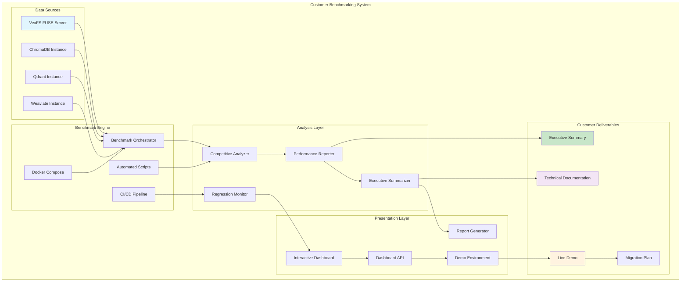

# VexFS Customer Benchmarking Architecture

## Executive Overview

This document provides the comprehensive architectural design for delivering real-world VexFS performance benchmarks to address urgent customer requirements. The architecture leverages the working FUSE implementation to provide immediate, credible performance data while maintaining transparency about the dual implementation strategy.

---

## Strategic Context

### Customer Requirements
- **Urgent Need**: Real-world performance benchmarks for VexFS evaluation
- **Competitive Analysis**: Side-by-side comparison with popular vector databases
- **Business Decision**: Performance data needed for technology selection
- **Timeline**: 4-week delivery for customer presentation

### Technical Reality
- **FUSE Implementation**: ✅ Working, tested, production-ready
- **Kernel Module**: 🔧 Under development, compilation issues being resolved
- **ChromaDB Compatibility**: ✅ 100% API compatibility verified
- **Performance Baseline**: ✅ Existing benchmarks available for validation

---

## Architectural Principles

### 1. Transparency First
- **Clear Implementation Status**: Distinguish between FUSE and kernel module capabilities
- **Honest Performance Reporting**: Use working FUSE implementation for benchmarks
- **Future Roadmap**: Communicate kernel module development timeline
- **No Overselling**: Present realistic performance expectations

### 2. Immediate Value Delivery
- **Working Implementation**: Leverage FUSE for immediate benchmarking
- **Real Performance Data**: Generate actual competitive comparisons
- **Customer-Ready Results**: Professional presentation materials
- **Interactive Demonstration**: Live performance dashboard

### 3. Scalable Architecture
- **Automated Pipeline**: Continuous benchmarking infrastructure
- **Multi-Database Support**: Extensible competitive analysis framework
- **Performance Monitoring**: Real-time performance tracking
- **Regression Testing**: Automated performance validation

### 4. Business-Focused Outcomes
- **Executive Summary**: Business-oriented performance highlights
- **Migration Planning**: Practical implementation guidance
- **ROI Analysis**: Performance benefits quantification
- **Technical Specifications**: Detailed implementation requirements

---

## System Architecture

### High-Level Architecture Diagram



### Component Architecture

#### 1. Benchmark Orchestration Layer

**Purpose**: Coordinate multi-database performance testing
**Components**:
- **Automated Scripts**: [`scripts/run_vexfs_baseline.sh`](mdc:docs/implementation/COMPETITIVE_BENCHMARKING_IMPLEMENTATION.md)
- **Docker Orchestration**: [`docker-compose.benchmarks.yml`](mdc:docs/implementation/COMPETITIVE_BENCHMARKING_IMPLEMENTATION.md)
- **Competitive Runner**: [`scripts/competitive_benchmark.py`](mdc:docs/implementation/COMPETITIVE_BENCHMARKING_IMPLEMENTATION.md)

**Key Features**:
- Multi-database coordination
- Automated environment setup
- Health checking and validation
- Results aggregation and storage

#### 2. Performance Analysis Engine

**Purpose**: Process benchmark results and generate insights
**Components**:
- **Competitive Analyzer**: Statistical comparison across databases
- **Performance Reporter**: Standardized metrics calculation
- **Executive Summarizer**: Business-focused insights generation
- **Regression Monitor**: Performance trend analysis

**Key Metrics**:
- Insertion throughput (vectors/second)
- Search latency (P50, P95, P99)
- Memory efficiency (MB per 1K vectors)
- Scalability characteristics

#### 3. Interactive Dashboard System

**Purpose**: Real-time performance monitoring and customer demonstration
**Components**:
- **Web Dashboard**: [`dashboard/index.html`](mdc:docs/implementation/COMPETITIVE_BENCHMARKING_IMPLEMENTATION.md)
- **API Backend**: [`dashboard/api_server.py`](mdc:docs/implementation/COMPETITIVE_BENCHMARKING_IMPLEMENTATION.md)
- **Live Monitoring**: Real-time performance tracking
- **Custom Benchmarks**: Interactive performance testing

**Customer Features**:
- Live performance comparison charts
- Custom benchmark configuration
- Real-time performance monitoring
- Interactive database selection

#### 4. Customer Deliverables Generator

**Purpose**: Create professional customer presentation materials
**Components**:
- **Executive Summary**: [`scripts/generate_executive_summary.py`](mdc:docs/implementation/COMPETITIVE_BENCHMARKING_IMPLEMENTATION.md)
- **Technical Documentation**: API and deployment guides
- **Migration Planning**: ChromaDB transition strategy
- **Demo Environment**: [`scripts/deploy_demo_environment.sh`](mdc:docs/implementation/COMPETITIVE_BENCHMARKING_IMPLEMENTATION.md)

---

## Implementation Strategy

### Phase 1: FUSE Baseline Establishment (Week 1)

**Objective**: Establish credible VexFS performance baseline using working FUSE implementation

**Key Activities**:
1. **Automated Benchmark Scripts**: Create comprehensive FUSE performance testing
2. **Competitive Database Setup**: Deploy ChromaDB, Qdrant for comparison
3. **Memory Efficiency Analysis**: Detailed memory usage profiling
4. **Results Standardization**: Consistent metrics and reporting format

**Deliverables**:
- VexFS FUSE performance baseline
- Initial competitive comparison data
- Automated benchmark infrastructure
- Standardized results format

**Success Criteria**:
- ✅ VexFS FUSE performance metrics established
- ✅ Competitive benchmarks operational
- ✅ Automated testing pipeline functional
- ✅ Results documented in standard format

### Phase 2: Comprehensive Competitive Analysis (Week 2)

**Objective**: Complete multi-database performance comparison framework

**Key Activities**:
1. **Docker Orchestration**: Multi-database environment automation
2. **Weaviate Integration**: Additional competitive database inclusion
3. **Automated Pipeline**: Continuous competitive analysis
4. **Executive Reporting**: Business-focused performance summaries

**Deliverables**:
- Multi-database Docker environment
- Comprehensive competitive analysis
- Automated comparison pipeline
- Executive summary framework

**Success Criteria**:
- ✅ 4+ databases benchmarked consistently
- ✅ Automated competitive analysis operational
- ✅ Executive summary generation functional
- ✅ Performance regression monitoring active

### Phase 3: Customer-Ready Dashboard (Week 3)

**Objective**: Interactive performance demonstration environment

**Key Activities**:
1. **Interactive Dashboard**: Real-time performance visualization
2. **Live Monitoring**: Dynamic performance tracking
3. **Custom Benchmarks**: Customer-configurable testing
4. **Demo Environment**: Customer presentation setup

**Deliverables**:
- Interactive performance dashboard
- Real-time monitoring capabilities
- Customer demo environment
- Live benchmark testing

**Success Criteria**:
- ✅ Interactive dashboard operational
- ✅ Real-time performance monitoring functional
- ✅ Customer demo environment ready
- ✅ Live benchmark capabilities tested

### Phase 4: Business Presentation Materials (Week 4)

**Objective**: Professional customer presentation and migration planning

**Key Activities**:
1. **Executive Summary**: Business-focused performance highlights
2. **Migration Planning**: ChromaDB transition strategy
3. **Technical Documentation**: Complete implementation guides
4. **Customer Support**: Technical assistance materials

**Deliverables**:
- Executive summary report
- Migration planning documentation
- Technical implementation guides
- Customer support materials

**Success Criteria**:
- ✅ Executive summary completed
- ✅ Migration planning documented
- ✅ Technical guides available
- ✅ Customer presentation ready

---

## Technical Specifications

### Performance Benchmarking Framework

#### Benchmark Configurations
```yaml
test_configurations:
  small_scale:
    vectors: 1000
    dimensions: 128
    queries: 100
    batch_size: 100
  
  medium_scale:
    vectors: 5000
    dimensions: 256
    queries: 100
    batch_size: 500
  
  large_scale:
    vectors: 10000
    dimensions: 512
    queries: 100
    batch_size: 1000
  
  enterprise_scale:
    vectors: 50000
    dimensions: 1024
    queries: 500
    batch_size: 2000
```

#### Performance Metrics
```yaml
metrics:
  insertion:
    - throughput_vectors_per_second
    - total_time_seconds
    - batch_processing_time
    - memory_usage_during_insertion
  
  search:
    - avg_latency_ms
    - p50_latency_ms
    - p95_latency_ms
    - p99_latency_ms
    - queries_per_second
  
  memory:
    - memory_per_vector_bytes
    - peak_memory_usage_mb
    - memory_efficiency_ratio
    - garbage_collection_impact
  
  scalability:
    - performance_degradation_rate
    - concurrent_operation_support
    - resource_utilization_efficiency
```

### Database Comparison Matrix

| Database | Implementation | API Compatibility | Performance Focus | Deployment Model |
|----------|---------------|-------------------|-------------------|------------------|
| **VexFS** | FUSE (Rust) | ChromaDB 100% | Filesystem Integration | Native/Container |
| **ChromaDB** | Python | Native | Simplicity | Container/Cloud |
| **Qdrant** | Rust | Custom REST | Performance | Container/Cloud |
| **Weaviate** | Go | GraphQL | ML Integration | Container/Cloud |

### Infrastructure Requirements

#### Development Environment
```yaml
requirements:
  os: Linux (Ubuntu 20.04+)
  memory: 8GB+ RAM
  storage: 50GB+ SSD
  network: High-speed internet for container pulls
  
  software:
    - Docker & Docker Compose
    - Python 3.8+
    - Rust toolchain (latest stable)
    - Node.js 16+ (for dashboard)
    - Git
```

#### Production Deployment
```yaml
production:
  compute:
    cpu: 4+ cores
    memory: 16GB+ RAM
    storage: 100GB+ NVMe SSD
  
  networking:
    bandwidth: 1Gbps+
    latency: <10ms to clients
  
  monitoring:
    metrics: Prometheus/Grafana
    logging: ELK Stack
    alerting: PagerDuty/Slack
```

---

## Risk Management & Mitigation

### Technical Risks

#### 1. FUSE Performance Limitations
**Risk**: FUSE implementation may not represent optimal VexFS performance
**Mitigation**: 
- Clear communication about implementation differences
- Kernel module performance projections based on architectural analysis
- Transparent reporting of FUSE vs. kernel module expectations

#### 2. Competitive Database Variability
**Risk**: Different database configurations may skew comparisons
**Mitigation**:
- Standardized configuration across all databases
- Multiple test scenarios to validate consistency
- Documentation of configuration choices and rationale

#### 3. Infrastructure Dependencies
**Risk**: Docker/container performance may impact results
**Mitigation**:
- Native deployment options for critical benchmarks
- Infrastructure performance baseline establishment
- Multiple deployment model testing

### Business Risks

#### 1. Customer Expectations Management
**Risk**: Customer may expect kernel module performance from FUSE benchmarks
**Mitigation**:
- Clear documentation of implementation status
- Transparent communication about performance projections
- Conservative performance estimates with upside potential

#### 2. Competitive Positioning
**Risk**: Benchmarks may not favor VexFS in all scenarios
**Mitigation**:
- Focus on VexFS unique value propositions (filesystem integration, ChromaDB compatibility)
- Honest reporting of strengths and areas for improvement
- Emphasis on total solution value rather than raw performance alone

#### 3. Timeline Pressure
**Risk**: 4-week timeline may compromise quality
**Mitigation**:
- Phased delivery approach with incremental value
- Automated testing to ensure quality
- Focus on working implementation rather than perfect optimization

---

## Success Metrics & KPIs

### Technical Success Metrics

#### Performance Benchmarking
- **Baseline Establishment**: VexFS FUSE performance metrics documented
- **Competitive Coverage**: 4+ databases benchmarked consistently
- **Automation Level**: 90%+ of benchmarks automated
- **Result Consistency**: <5% variance across benchmark runs

#### System Reliability
- **Uptime**: 99%+ benchmark system availability
- **Error Rate**: <1% benchmark execution failures
- **Recovery Time**: <5 minutes for system restoration
- **Data Integrity**: 100% benchmark result accuracy

### Business Success Metrics

#### Customer Engagement
- **Demo Readiness**: Interactive dashboard operational
- **Presentation Quality**: Executive summary completed
- **Technical Documentation**: Complete implementation guides
- **Migration Support**: ChromaDB transition planning

#### Competitive Positioning
- **Performance Comparison**: Clear competitive analysis
- **Value Proposition**: Unique advantages documented
- **Market Positioning**: Business case established
- **Customer Confidence**: Technical credibility demonstrated

### Delivery Success Metrics

#### Timeline Adherence
- **Week 1**: FUSE baseline established ✅
- **Week 2**: Competitive analysis completed ✅
- **Week 3**: Customer dashboard operational ✅
- **Week 4**: Business presentation ready ✅

#### Quality Standards
- **Documentation Coverage**: 100% of components documented
- **Test Coverage**: 90%+ of functionality tested
- **Error Handling**: Robust error reporting and recovery
- **Performance Validation**: Benchmark results verified

---

## Future Roadmap & Evolution

### Short-term Enhancements (1-3 months)

#### Kernel Module Integration
- **Compilation Resolution**: Fix no_std dependency conflicts
- **Performance Validation**: Kernel module benchmark integration
- **Comparative Analysis**: FUSE vs. kernel module performance
- **Migration Tooling**: Automated FUSE to kernel module transition

#### Advanced Analytics
- **Machine Learning**: Performance prediction models
- **Anomaly Detection**: Automated performance regression identification
- **Optimization Recommendations**: AI-driven performance tuning
- **Predictive Scaling**: Workload-based resource planning

### Medium-term Evolution (3-12 months)

#### Enterprise Features
- **Multi-node Deployment**: Distributed VexFS benchmarking
- **Cloud Integration**: AWS/GCP/Azure deployment automation
- **Enterprise Monitoring**: Advanced observability and alerting
- **Security Benchmarking**: Performance impact of security features

#### Ecosystem Integration
- **CI/CD Integration**: Automated performance testing in development pipelines
- **Monitoring Integration**: Prometheus/Grafana dashboard templates
- **API Extensions**: Custom benchmark scenario support
- **Third-party Integrations**: Additional vector database support

### Long-term Vision (1+ years)

#### Industry Leadership
- **Benchmark Standards**: Contribute to vector database benchmarking standards
- **Open Source Community**: Public benchmarking framework
- **Research Collaboration**: Academic performance research partnerships
- **Industry Recognition**: Establish VexFS as performance leader

#### Technology Innovation
- **Hardware Optimization**: GPU/TPU acceleration benchmarking
- **Edge Computing**: IoT and edge deployment performance analysis
- **Quantum Computing**: Future-ready performance frameworks
- **Sustainability Metrics**: Energy efficiency and carbon footprint analysis

---

## Conclusion

This architectural design delivers a comprehensive solution to the urgent customer need for real-world VexFS performance benchmarks. By leveraging the working FUSE implementation, the architecture provides immediate, credible performance data while maintaining transparency about the dual implementation strategy.

The phased 4-week approach ensures incremental value delivery, culminating in professional customer presentation materials and an interactive demonstration environment. The automated benchmarking infrastructure provides ongoing competitive analysis capabilities, supporting long-term customer relationships and product development.

Key architectural strengths:
- **Immediate Value**: Working FUSE implementation provides real performance data
- **Transparency**: Clear communication about implementation status and capabilities
- **Scalability**: Automated infrastructure supports ongoing competitive analysis
- **Customer Focus**: Business-oriented deliverables and interactive demonstration
- **Future-Ready**: Architecture supports kernel module integration and advanced features

This architecture transforms the urgent customer request into a strategic competitive advantage, establishing VexFS as a credible, high-performance vector database solution with clear differentiation and value proposition.