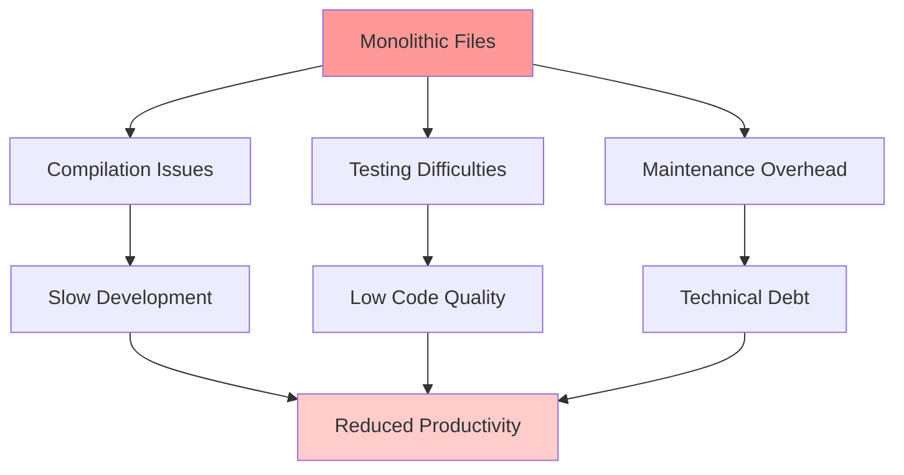
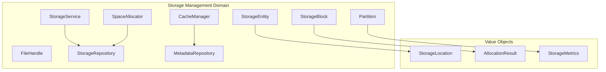
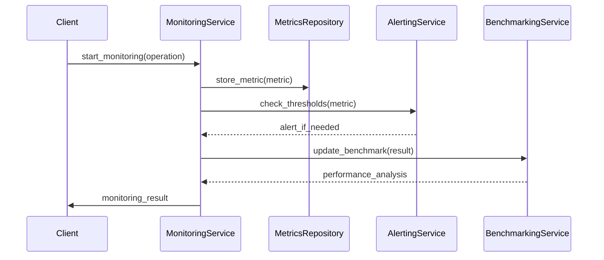
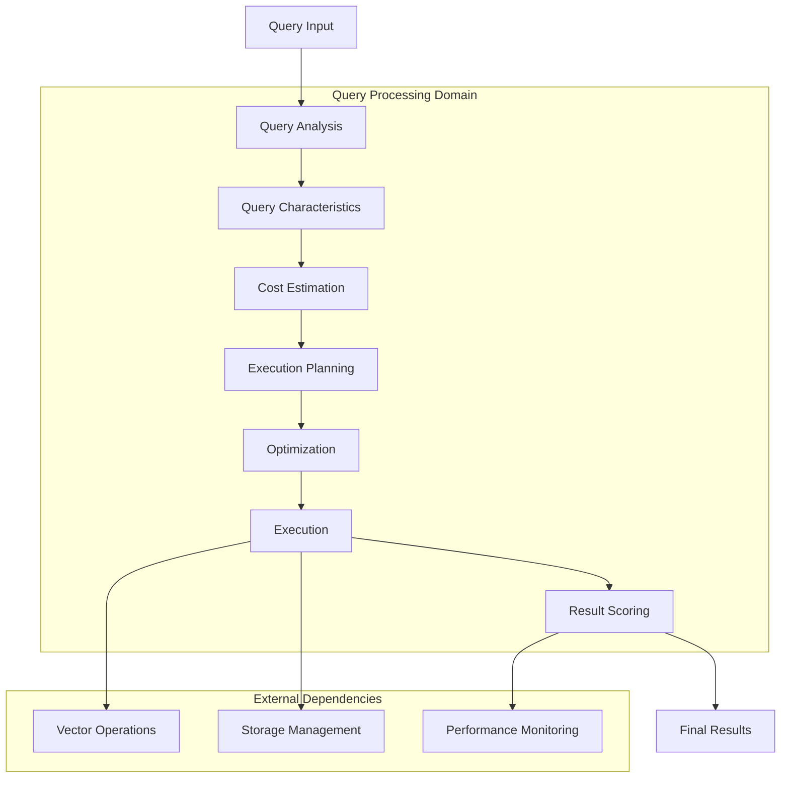
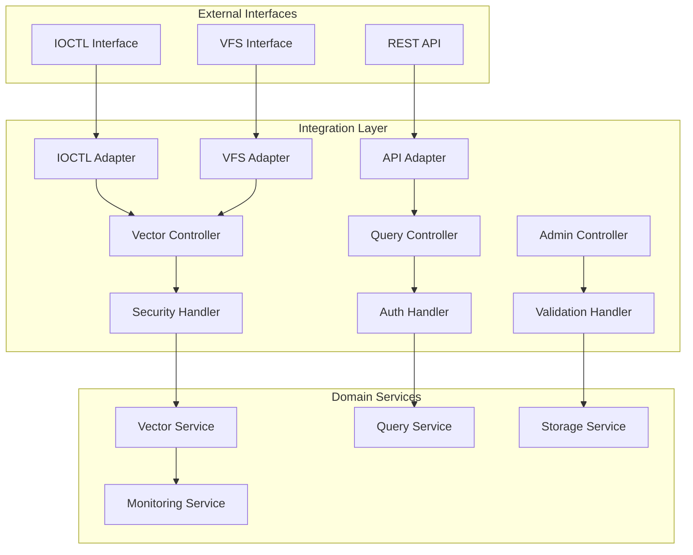

# VexFS DDD Refactoring Implementation Plan

## Overview

This document provides the detailed implementation plan for refactoring the VexFS server codebase using Domain-Driven Design principles. The plan includes step-by-step instructions, dependency management, and success criteria for each phase.

## Current State Analysis

### Compilation Issues Root Cause
The current compilation issues stem from:
1. **Circular Dependencies**: Monolithic files creating complex interdependencies
2. **Visibility Problems**: Public/private declarations scattered across massive files
3. **Memory Pressure**: Large files causing compiler memory issues
4. **Incremental Compilation**: Changes to large files trigger extensive recompilation

### Architecture Debt Assessment



## Implementation Phases

### Phase 1: Foundation Setup (Days 1-3)

#### 1.1 Create Directory Structure
```bash
# Create new domain directories
mkdir -p rust/src/domain/{vector_operations,query_processing,storage_management,performance_monitoring}
mkdir -p rust/src/domain/vector_operations/{entities,value_objects,services,repositories,tests}
mkdir -p rust/src/domain/query_processing/{entities,value_objects,services,repositories,tests}
mkdir -p rust/src/domain/storage_management/{entities,value_objects,services,repositories,tests}
mkdir -p rust/src/domain/performance_monitoring/{entities,value_objects,services,repositories,tests}

# Create integration layer
mkdir -p rust/src/integration/{adapters,controllers,handlers,tests}

# Create shared concerns
mkdir -p rust/src/shared/{security,error_handling,caching,observability}

# Create interfaces and container
mkdir -p rust/src/{interfaces,container}
```

#### 1.2 Set Up Dependency Injection Framework
```toml
# Add to Cargo.toml
[dependencies]
shaku = "0.6"
async-trait = "0.1"
```

#### 1.3 Create Base Interfaces
```rust
// rust/src/interfaces/mod.rs
pub mod vector_operations;
pub mod query_processing;
pub mod storage_management;
pub mod performance_monitoring;

// rust/src/interfaces/vector_operations.rs
use async_trait::async_trait;
use crate::shared::errors::VexfsResult;

#[async_trait]
pub trait VectorRepository: Send + Sync {
    async fn store(&self, vector: &Vector) -> VexfsResult<VectorId>;
    async fn retrieve(&self, id: VectorId) -> VexfsResult<Option<Vector>>;
    async fn delete(&self, id: VectorId) -> VexfsResult<()>;
    async fn search(&self, query: &SearchQuery) -> VexfsResult<Vec<ScoredResult>>;
}

#[async_trait]
pub trait VectorSearchService: Send + Sync {
    async fn search(&self, query: SearchQuery) -> VexfsResult<Vec<ScoredResult>>;
    async fn batch_search(&self, queries: Vec<SearchQuery>) -> VexfsResult<Vec<Vec<ScoredResult>>>;
    async fn index_vector(&self, vector: &Vector) -> VexfsResult<()>;
}
```

### Phase 2: Vector Operations Domain (Days 4-6)

#### 2.1 Extract Vector Entities

```mermaid
classDiagram
    class Vector {
        +VectorId id
        +Vec~f32~ data
        +VectorMetadata metadata
        +new(data: Vec~f32~) Vector
        +dimensions() usize
        +normalize() Result~(), VexfsError~
    }
    
    class VectorIndex {
        +IndexId id
        +IndexStrategy strategy
        +IndexMetadata metadata
        +add_vector(vector: Vector) Result~(), VexfsError~
        +search(query: SearchQuery) Result~Vec~ScoredResult~, VexfsError~
    }
    
    class VectorEmbedding {
        +EmbeddingId id
        +Vector vector
        +FileInode inode
        +created_at: Timestamp
        +updated_at: Timestamp
    }
    
    Vector ||--o{ VectorEmbedding
    VectorIndex ||--o{ Vector
```

**Implementation Steps:**
1. Create `rust/src/domain/vector_operations/entities/vector.rs` (< 200 lines)
2. Create `rust/src/domain/vector_operations/entities/vector_index.rs` (< 300 lines)
3. Create `rust/src/domain/vector_operations/entities/embedding.rs` (< 200 lines)

#### 2.2 Extract Value Objects

```rust
// rust/src/domain/vector_operations/value_objects/distance.rs
#[derive(Debug, Clone, Copy, PartialEq)]
pub struct Distance {
    value: f32,
    metric: DistanceMetric,
}

impl Distance {
    pub fn euclidean(value: f32) -> Self {
        Self { value, metric: DistanceMetric::Euclidean }
    }
    
    pub fn cosine(value: f32) -> Self {
        Self { value, metric: DistanceMetric::Cosine }
    }
    
    pub fn value(&self) -> f32 {
        self.value
    }
    
    pub fn metric(&self) -> DistanceMetric {
        self.metric
    }
}
```

#### 2.3 Create Vector Services

```rust
// rust/src/domain/vector_operations/services/search_service.rs
use crate::interfaces::vector_operations::{VectorRepository, VectorSearchService};
use shaku::{Component, Interface};

#[derive(Component)]
#[shaku(interface = VectorSearchService)]
pub struct VectorSearchServiceImpl {
    #[shaku(inject)]
    repository: Arc<dyn VectorRepository>,
    #[shaku(inject)]
    metrics: Arc<dyn VectorMetrics>,
}

#[async_trait]
impl VectorSearchService for VectorSearchServiceImpl {
    async fn search(&self, query: SearchQuery) -> VexfsResult<Vec<ScoredResult>> {
        // Implementation extracted from current vector_search.rs
        // Focus on business logic, delegate storage to repository
        let candidates = self.repository.search(&query).await?;
        let scored = self.score_results(candidates, &query)?;
        Ok(scored)
    }
}
```

### Phase 3: Storage Management Domain (Days 7-9)

#### 3.1 Storage Architecture



#### 3.2 Extract Storage Components

**From `space_alloc.rs` (880 lines) → Multiple focused files:**
- `entities/storage_block.rs` (< 200 lines)
- `entities/partition.rs` (< 250 lines)
- `services/space_allocator.rs` (< 400 lines)
- `value_objects/allocation_result.rs` (< 150 lines)

**From `storage.rs` → Storage service:**
- `services/storage_service.rs` (< 350 lines)
- `repositories/storage_repository.rs` (< 250 lines)

### Phase 4: Performance Monitoring Domain (Days 10-12)

#### 4.1 Monitoring Architecture



#### 4.2 Extract Performance Components

**From `anns/performance_validation.rs` (1,969 lines) → Focused modules:**
- `entities/performance_metric.rs` (< 200 lines)
- `entities/benchmark.rs` (< 250 lines)
- `services/monitoring_service.rs` (< 350 lines)
- `services/benchmarking_service.rs` (< 400 lines)
- `value_objects/measurement.rs` (< 100 lines)

### Phase 5: Query Processing Domain (Days 13-16)

#### 5.1 Query Processing Flow



#### 5.2 Extract Query Components

**From `query_planner.rs` (2,215 lines) → Focused modules:**
- `entities/query.rs` (< 200 lines)
- `entities/execution_plan.rs` (< 300 lines)
- `services/query_planner.rs` (< 400 lines)
- `value_objects/query_characteristics.rs` (< 150 lines)

**From `hybrid_query_optimizer.rs` (2,304 lines) → Focused modules:**
- `services/query_optimizer.rs` (< 450 lines)
- `entities/optimization_strategy.rs` (< 250 lines)
- `value_objects/cost_estimate.rs` (< 200 lines)

### Phase 6: Integration Layer Refactoring (Days 17-20)

#### 6.1 Integration Architecture



#### 6.2 Refactor IOCTL Integration

**From `ioctl_integration.rs` (9,402 lines) → Multiple focused files:**

**Security Components:**
- `handlers/security_handler.rs` (< 300 lines)
- `handlers/auth_handler.rs` (< 200 lines)
- `shared/security/security_validator.rs` (< 300 lines)

**IOCTL Handling:**
- `adapters/ioctl_adapter.rs` (< 400 lines)
- `controllers/vector_controller.rs` (< 300 lines)
- `controllers/query_controller.rs` (< 350 lines)

**Performance & Caching:**
- `shared/caching/cache_strategies.rs` (< 250 lines)
- `shared/caching/performance_optimizer.rs` (< 300 lines)

**Error Handling & Recovery:**
- `shared/error_handling/error_recovery.rs` (< 300 lines)
- `shared/error_handling/transaction_recovery.rs` (< 350 lines)

**Logging & Observability:**
- `shared/observability/structured_logging.rs` (< 250 lines)
- `shared/observability/audit_trails.rs` (< 300 lines)

## Dependency Injection Configuration

### Container Setup

```rust
// rust/src/container/mod.rs
use shaku::{module, Component, Interface, HasComponent};

module! {
    pub VexfsContainer {
        components = [
            // Vector Operations
            VectorSearchServiceImpl,
            VectorRepositoryImpl,
            VectorIndexServiceImpl,
            
            // Query Processing
            QueryPlannerServiceImpl,
            QueryOptimizerServiceImpl,
            ExecutionEngineImpl,
            
            // Storage Management
            StorageServiceImpl,
            SpaceAllocatorImpl,
            CacheManagerImpl,
            
            // Performance Monitoring
            MonitoringServiceImpl,
            BenchmarkingServiceImpl,
            AlertingServiceImpl,
            
            // Integration Layer
            IoctlAdapterImpl,
            VectorControllerImpl,
            QueryControllerImpl,
        ],
        providers = []
    }
}

// Usage in main application
pub fn create_container() -> VexfsContainer {
    VexfsContainer::builder()
        .with_component_parameters::<VectorSearchServiceImpl>(VectorSearchServiceImplParameters {
            // Configuration parameters
        })
        .build()
}
```

## Migration Strategy

### Step-by-Step Migration Process

#### Step 1: Prepare Migration Environment
```bash
# Create feature branch
git checkout -b feature/ddd-refactoring

# Create backup of current working state
git tag backup-before-ddd-refactoring

# Set up parallel development
cp -r rust/src rust/src_backup
```

#### Step 2: Incremental Migration with Feature Flags

```rust
// rust/src/lib.rs
#[cfg(feature = "ddd-architecture")]
pub mod domain;
#[cfg(feature = "ddd-architecture")]
pub mod integration;
#[cfg(feature = "ddd-architecture")]
pub mod container;

#[cfg(not(feature = "ddd-architecture"))]
pub mod ioctl_integration;
#[cfg(not(feature = "ddd-architecture"))]
pub mod hybrid_query_optimizer;
// ... other legacy modules
```

#### Step 3: Parallel Implementation
1. Implement new domain modules alongside existing code
2. Create adapter layer to bridge old and new implementations
3. Gradually migrate functionality with comprehensive testing
4. Use feature flags to switch between implementations

#### Step 4: Testing Strategy

```rust
// Integration tests to ensure compatibility
#[cfg(test)]
mod migration_tests {
    use super::*;
    
    #[test]
    fn test_vector_search_compatibility() {
        // Test that new implementation produces same results as old
        let old_result = legacy_vector_search(query.clone());
        let new_result = new_vector_search_service.search(query).await;
        assert_eq!(old_result, new_result);
    }
    
    #[test]
    fn test_performance_regression() {
        // Ensure no performance regression
        let start = Instant::now();
        let _result = new_implementation(test_data);
        let duration = start.elapsed();
        assert!(duration < PERFORMANCE_THRESHOLD);
    }
}
```

## Success Metrics and Validation

### Code Quality Metrics

| Metric | Current | Target | Validation Method |
|--------|---------|--------|-------------------|
| Max File Size | 9,402 lines | < 500 lines | `find src -name "*.rs" -exec wc -l {} + \| sort -nr \| head -1` |
| Average File Size | ~800 lines | < 300 lines | `find src -name "*.rs" -exec wc -l {} + \| awk '{sum+=$1; count++} END {print sum/count}'` |
| Cyclomatic Complexity | High | Reduced 60% | `cargo clippy -- -W clippy::cognitive_complexity` |
| Test Coverage | ~40% | > 80% | `cargo tarpaulin --out Html` |

### Architecture Metrics

| Metric | Target | Validation Method |
|--------|--------|-------------------|
| Circular Dependencies | 0 | `cargo machete` + dependency analysis |
| Interface Compliance | 100% | All cross-domain calls through interfaces |
| Domain Isolation | Complete | Each domain testable in isolation |
| Compilation Time | 40% improvement | `cargo build --timings` |

### Performance Metrics

| Metric | Requirement | Validation Method |
|--------|-------------|-------------------|
| Vector Search Throughput | > 500K ops/sec | Performance benchmarks |
| Memory Usage | No regression | Memory profiling |
| Latency | No regression | Latency benchmarks |
| Resource Utilization | Improved | System monitoring |

## Risk Mitigation

### Technical Risks

| Risk | Probability | Impact | Mitigation |
|------|-------------|--------|------------|
| Breaking Changes | Medium | High | Comprehensive test suite, feature flags |
| Performance Regression | Low | High | Continuous benchmarking, performance gates |
| Integration Issues | Medium | Medium | Incremental migration, adapter patterns |
| Timeline Overrun | Medium | Medium | Phased approach, clear milestones |

### Rollback Strategy

```bash
# If issues arise, quick rollback process
git checkout main
git reset --hard backup-before-ddd-refactoring
cargo build --release
# Restore previous working state
```

## Timeline and Milestones

### Week 1: Foundation (Days 1-5)
- [ ] Directory structure creation
- [ ] Dependency injection setup
- [ ] Base interfaces definition
- [ ] Migration environment preparation

### Week 2: Vector Operations (Days 6-10)
- [ ] Vector entities extraction
- [ ] Vector services implementation
- [ ] Vector repositories creation
- [ ] Unit tests for vector domain

### Week 3: Storage Management (Days 11-15)
- [ ] Storage entities extraction
- [ ] Storage services implementation
- [ ] Space allocation refactoring
- [ ] Integration tests

### Week 4: Performance Monitoring (Days 16-20)
- [ ] Monitoring entities extraction
- [ ] Benchmarking services implementation
- [ ] Metrics collection refactoring
- [ ] Performance validation

### Week 5-6: Query Processing (Days 21-30)
- [ ] Query entities extraction
- [ ] Query planning services
- [ ] Optimization services
- [ ] Complex integration tests

### Week 7: Integration Layer (Days 31-35)
- [ ] IOCTL adapter refactoring
- [ ] Security handler extraction
- [ ] Controller implementation
- [ ] End-to-end testing

### Week 8: Testing & Documentation (Days 36-40)
- [ ] Comprehensive testing
- [ ] Performance benchmarking
- [ ] Documentation updates
- [ ] Migration guide creation

## Conclusion

This implementation plan provides a systematic approach to refactoring the VexFS codebase using Domain-Driven Design principles. The phased approach ensures:

1. **Minimal Risk**: Incremental changes with rollback capabilities
2. **Continuous Validation**: Testing at each phase
3. **Clear Progress**: Measurable milestones and success criteria
4. **Maintainable Result**: Clean architecture with proper separation of concerns

The end result will be a codebase that is:
- **Easier to maintain**: Clear domain boundaries and single responsibility
- **Faster to compile**: Smaller files and better dependency management
- **More testable**: Isolated domains with dependency injection
- **Better performing**: Optimized architecture without monolithic bottlenecks

This refactoring will resolve the current compilation issues while establishing a solid foundation for future development.