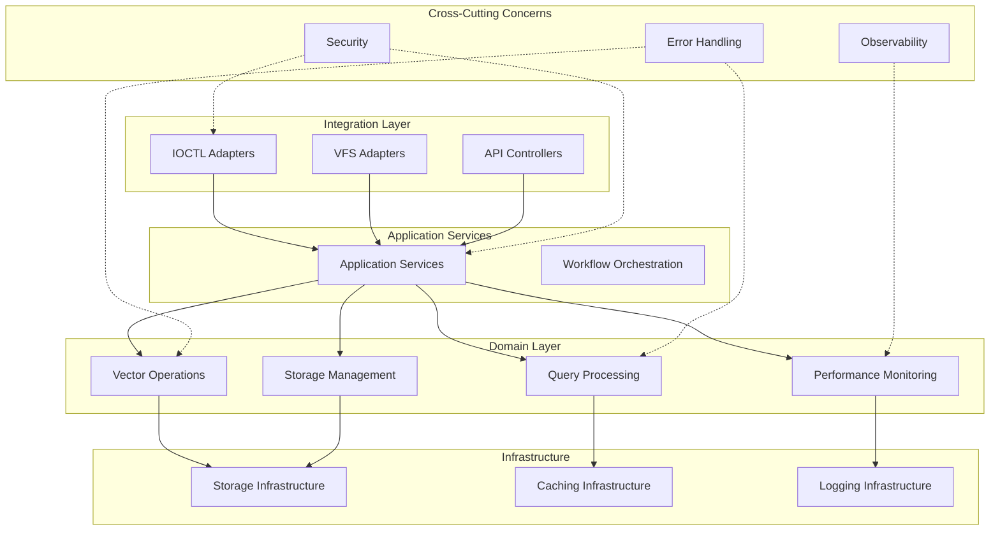

# VexFS Domain-Driven Design Refactoring Architecture

## Executive Summary

This document outlines the comprehensive Domain-Driven Design (DDD) refactoring strategy for the VexFS server codebase. The current monolithic architecture has grown to over 15,000 lines in single files, creating compilation bottlenecks, testing difficulties, and maintenance challenges. This refactoring will transform the codebase into a clean, modular architecture following DDD principles.

## Current Architecture Problems

### Monolithic File Analysis

| File | Lines | Primary Issues |
|------|-------|----------------|
| `src/ioctl_integration.rs` | 9,402 | 400+ types mixing security, performance, caching, logging, recovery |
| `src/hybrid_query_optimizer.rs` | 2,304 | 100+ types mixing query representation, execution planning, optimization |
| `src/query_planner.rs` | 2,215 | Query analysis, planning, execution mixed together |
| `src/anns/performance_validation.rs` | 1,969 | Performance testing mixed with monitoring and statistical analysis |

### Key Problems
- **Violation of Single Responsibility Principle**: Single files handling multiple unrelated concerns
- **Complex Interdependencies**: Tight coupling making testing and modification difficult
- **Compilation Performance**: Large files slow down incremental compilation
- **Code Navigation**: Difficult to locate specific functionality
- **Testing Challenges**: Monolithic structures prevent focused unit testing

## Target Architecture: Domain-Driven Design

### Core Principles
1. **Bounded Contexts**: Clear domain boundaries with explicit interfaces
2. **Clean Architecture**: Dependency inversion with domain at the center
3. **Single Responsibility**: Each module has one reason to change
4. **Dependency Injection**: Loose coupling through interfaces
5. **Testability**: Each domain can be tested in isolation

### Domain Boundaries



## Domain Specifications

### 1. Vector Operations Domain (`src/domain/vector_operations/`)

**Responsibility**: Core vector storage, retrieval, and mathematical operations

**Module Structure**:
```
src/domain/vector_operations/
├── mod.rs                    # Domain module exports
├── entities/
│   ├── mod.rs
│   ├── vector.rs            # Vector entity (< 200 lines)
│   ├── vector_index.rs      # VectorIndex entity (< 300 lines)
│   └── embedding.rs         # VectorEmbedding entity (< 200 lines)
├── value_objects/
│   ├── mod.rs
│   ├── distance.rs          # Distance calculations (< 250 lines)
│   ├── similarity.rs        # Similarity metrics (< 200 lines)
│   └── metadata.rs          # VectorMetadata (< 150 lines)
├── services/
│   ├── mod.rs
│   ├── search_service.rs    # VectorSearchService (< 400 lines)
│   ├── index_service.rs     # IndexManagementService (< 350 lines)
│   └── storage_service.rs   # VectorStorageService (< 300 lines)
├── repositories/
│   ├── mod.rs
│   ├── vector_repository.rs # VectorRepository trait + impl (< 250 lines)
│   └── index_repository.rs  # IndexRepository trait + impl (< 200 lines)
└── tests/
    ├── mod.rs
    ├── vector_tests.rs
    ├── search_tests.rs
    └── integration_tests.rs
```

**Key Extractions from Current Code**:
- From `ioctl_integration.rs`: Vector storage, SIMD optimization configs
- From `vector_storage.rs`: VectorStorageManager, VectorHeader, compression
- From `vector_search.rs`: VectorSearchEngine, SearchQuery, SearchOptions
- From `vector_metrics.rs`: Distance calculations, SIMD optimizations

### 2. Query Processing Domain (`src/domain/query_processing/`)

**Responsibility**: Query analysis, planning, optimization, and execution

**Module Structure**:
```
src/domain/query_processing/
├── mod.rs
├── entities/
│   ├── mod.rs
│   ├── query.rs             # Query entity (< 200 lines)
│   ├── execution_plan.rs    # ExecutionPlan entity (< 300 lines)
│   └── optimization_strategy.rs # OptimizationStrategy (< 250 lines)
├── value_objects/
│   ├── mod.rs
│   ├── query_characteristics.rs # QueryCharacteristics (< 150 lines)
│   ├── cost_estimate.rs     # CostEstimate (< 200 lines)
│   └── execution_metrics.rs # ExecutionMetrics (< 150 lines)
├── services/
│   ├── mod.rs
│   ├── query_planner.rs     # QueryPlanner service (< 400 lines)
│   ├── query_optimizer.rs   # QueryOptimizer service (< 450 lines)
│   └── execution_engine.rs  # ExecutionEngine service (< 350 lines)
├── repositories/
│   ├── mod.rs
│   ├── query_cache_repository.rs # Query cache (< 200 lines)
│   └── performance_history_repository.rs # Performance history (< 250 lines)
└── tests/
    ├── mod.rs
    ├── planner_tests.rs
    ├── optimizer_tests.rs
    └── execution_tests.rs
```

**Key Extractions from Current Code**:
- From `query_planner.rs`: QueryPlanner, CostModel, QueryCharacteristics
- From `hybrid_query_optimizer.rs`: HybridQueryOptimizer, execution strategies
- From `search_cache.rs`: SearchResultCache, caching strategies

### 3. Storage Management Domain (`src/domain/storage_management/`)

**Responsibility**: Data persistence, space allocation, and storage optimization

**Module Structure**:
```
src/domain/storage_management/
├── mod.rs
├── entities/
│   ├── mod.rs
│   ├── storage_block.rs     # StorageBlock entity (< 200 lines)
│   ├── partition.rs         # Partition entity (< 250 lines)
│   └── file_handle.rs       # FileHandle entity (< 200 lines)
├── value_objects/
│   ├── mod.rs
│   ├── storage_location.rs  # StorageLocation (< 100 lines)
│   ├── allocation_result.rs # AllocationResult (< 150 lines)
│   └── storage_metrics.rs   # StorageMetrics (< 200 lines)
├── services/
│   ├── mod.rs
│   ├── storage_service.rs   # StorageService (< 350 lines)
│   ├── space_allocator.rs   # SpaceAllocator (< 400 lines)
│   └── cache_manager.rs     # CacheManager (< 300 lines)
├── repositories/
│   ├── mod.rs
│   ├── storage_repository.rs # StorageRepository (< 250 lines)
│   └── metadata_repository.rs # MetadataRepository (< 200 lines)
└── tests/
    ├── mod.rs
    ├── storage_tests.rs
    ├── allocation_tests.rs
    └── cache_tests.rs
```

**Key Extractions from Current Code**:
- From `space_alloc.rs`: VexfsSpaceAllocator, BlockHandle, FreeSpaceInfo
- From `storage.rs`: StorageManager functionality
- From `vector_cache.rs`: VectorCacheManager, caching strategies

### 4. Performance Monitoring Domain (`src/domain/performance_monitoring/`)

**Responsibility**: Performance measurement, analysis, and optimization recommendations

**Module Structure**:
```
src/domain/performance_monitoring/
├── mod.rs
├── entities/
│   ├── mod.rs
│   ├── performance_metric.rs # PerformanceMetric entity (< 200 lines)
│   ├── benchmark.rs         # Benchmark entity (< 250 lines)
│   └── alert.rs             # Alert entity (< 150 lines)
├── value_objects/
│   ├── mod.rs
│   ├── measurement.rs       # Measurement (< 100 lines)
│   ├── threshold.rs         # Threshold (< 100 lines)
│   └── trend.rs             # Trend (< 150 lines)
├── services/
│   ├── mod.rs
│   ├── monitoring_service.rs # MonitoringService (< 350 lines)
│   ├── benchmarking_service.rs # BenchmarkingService (< 400 lines)
│   └── alerting_service.rs  # AlertingService (< 250 lines)
├── repositories/
│   ├── mod.rs
│   ├── metrics_repository.rs # MetricsRepository (< 200 lines)
│   └── benchmark_repository.rs # BenchmarkRepository (< 200 lines)
└── tests/
    ├── mod.rs
    ├── monitoring_tests.rs
    ├── benchmarking_tests.rs
    └── alerting_tests.rs
```

**Key Extractions from Current Code**:
- From `anns/performance_validation.rs`: Statistical benchmarking, performance metrics
- From `query_monitor.rs`: QueryPerformanceMonitor, performance analytics
- From `ioctl_integration.rs`: Performance optimization configs, monitoring

### 5. Integration Layer Domain (`src/integration/`)

**Responsibility**: External interfaces, IOCTL handling, and system integration

**Module Structure**:
```
src/integration/
├── mod.rs
├── adapters/
│   ├── mod.rs
│   ├── ioctl_adapter.rs     # IOCTL interface adapter (< 400 lines)
│   ├── vfs_adapter.rs       # VFS interface adapter (< 300 lines)
│   └── api_adapter.rs       # REST API adapter (< 350 lines)
├── controllers/
│   ├── mod.rs
│   ├── vector_controller.rs # Vector operations controller (< 300 lines)
│   ├── query_controller.rs  # Query operations controller (< 350 lines)
│   └── admin_controller.rs  # Admin operations controller (< 250 lines)
├── handlers/
│   ├── mod.rs
│   ├── security_handler.rs  # Security validation (< 300 lines)
│   ├── auth_handler.rs      # Authentication (< 200 lines)
│   └── validation_handler.rs # Input validation (< 250 lines)
└── tests/
    ├── mod.rs
    ├── ioctl_tests.rs
    ├── vfs_tests.rs
    └── api_tests.rs
```

**Key Extractions from Current Code**:
- From `ioctl_integration.rs`: IOCTL handlers, security validation, authentication
- From `ioctl.rs`: IOCTL request/response structures
- From existing API implementations

## Cross-Cutting Concerns

### 1. Security & Authentication (`src/shared/security/`)

**Module Structure**:
```
src/shared/security/
├── mod.rs
├── authentication.rs        # Authentication logic (< 200 lines)
├── authorization.rs         # Authorization logic (< 250 lines)
├── security_validator.rs    # Security validation (< 300 lines)
├── privilege_escalation.rs  # Privilege escalation detection (< 200 lines)
└── rate_limiting.rs         # Rate limiting (< 150 lines)
```

### 2. Error Handling & Recovery (`src/shared/error_handling/`)

**Module Structure**:
```
src/shared/error_handling/
├── mod.rs
├── error_recovery.rs        # Error recovery strategies (< 300 lines)
├── transaction_recovery.rs  # Transaction recovery (< 350 lines)
├── circuit_breaker.rs       # Circuit breaker pattern (< 200 lines)
├── retry_strategies.rs      # Retry logic (< 200 lines)
└── health_monitoring.rs     # Health monitoring (< 250 lines)
```

### 3. Caching & Performance (`src/shared/caching/`)

**Module Structure**:
```
src/shared/caching/
├── mod.rs
├── cache_strategies.rs      # Cache strategies (< 250 lines)
├── eviction_policies.rs     # Eviction policies (< 200 lines)
├── memory_management.rs     # Memory management (< 300 lines)
├── simd_optimization.rs     # SIMD optimizations (< 250 lines)
└── batch_processing.rs      # Batch processing (< 200 lines)
```

### 4. Logging & Observability (`src/shared/observability/`)

**Module Structure**:
```
src/shared/observability/
├── mod.rs
├── structured_logging.rs    # Structured logging (< 250 lines)
├── audit_trails.rs          # Audit logging (< 300 lines)
├── metrics_collection.rs    # Metrics collection (< 200 lines)
├── telemetry.rs             # Telemetry (< 200 lines)
└── compliance_reporting.rs  # Compliance reporting (< 250 lines)
```

## Dependency Injection Architecture

### Container Configuration (`src/container/`)

```rust
// src/container/mod.rs
use shaku::{Component, Interface, HasComponent, module};

// Domain service interfaces
pub trait VectorSearchService: Interface {
    fn search(&self, query: SearchQuery) -> Result<Vec<ScoredResult>, VexfsError>;
}

pub trait QueryPlannerService: Interface {
    fn create_plan(&self, query: &SearchQuery) -> Result<ExecutionPlan, VexfsError>;
}

// Container module
module! {
    VexfsContainer {
        components = [
            VectorSearchServiceImpl,
            QueryPlannerServiceImpl,
            StorageServiceImpl,
            MonitoringServiceImpl,
        ],
        providers = []
    }
}
```

### Interface Definitions (`src/interfaces/`)

```rust
// src/interfaces/vector_operations.rs
pub trait VectorRepository: Send + Sync {
    fn store(&self, vector: &Vector) -> Result<VectorId, VexfsError>;
    fn retrieve(&self, id: VectorId) -> Result<Option<Vector>, VexfsError>;
    fn delete(&self, id: VectorId) -> Result<(), VexfsError>;
}

pub trait VectorSearchService: Send + Sync {
    fn search(&self, query: SearchQuery) -> Result<Vec<ScoredResult>, VexfsError>;
    fn batch_search(&self, queries: Vec<SearchQuery>) -> Result<Vec<Vec<ScoredResult>>, VexfsError>;
}
```

## Migration Strategy

### Phase 1: Foundation (Week 1-2)
1. Create new directory structure
2. Extract shared/cross-cutting concerns
3. Define domain interfaces
4. Set up dependency injection container

### Phase 2: Vector Operations Domain (Week 3)
1. Extract vector entities and value objects
2. Create vector services with clean interfaces
3. Implement vector repositories
4. Add comprehensive unit tests

### Phase 3: Storage Management Domain (Week 4)
1. Extract storage entities and services
2. Implement storage repositories
3. Integrate with vector operations domain
4. Add integration tests

### Phase 4: Performance Monitoring Domain (Week 5)
1. Extract performance monitoring components
2. Create monitoring services
3. Integrate with other domains
4. Add performance tests

### Phase 5: Query Processing Domain (Week 6-7)
1. Extract query processing components (most complex)
2. Implement query services
3. Integrate with all other domains
4. Add comprehensive tests

### Phase 6: Integration Layer (Week 8)
1. Refactor IOCTL integration
2. Create clean adapters and controllers
3. Implement security and validation handlers
4. Add end-to-end tests

### Phase 7: Testing & Documentation (Week 9)
1. Comprehensive testing of all domains
2. Performance benchmarking
3. Documentation updates
4. Migration guide creation

## Success Metrics

### Code Quality Metrics
- **File Size**: All files < 500 lines (target: < 300 lines average)
- **Cyclomatic Complexity**: Reduced by 60%
- **Test Coverage**: > 80% for all domains
- **Compilation Time**: Improved by 40%

### Architecture Metrics
- **Dependency Graph**: Clean unidirectional dependencies
- **Interface Compliance**: All cross-domain communication through interfaces
- **Modularity**: Each domain can be tested in isolation
- **Maintainability**: Clear separation of concerns

### Performance Metrics
- **No Performance Regression**: All existing benchmarks pass
- **Memory Usage**: No significant increase
- **Throughput**: Maintain > 500K ops/sec target

## Risk Mitigation

### Technical Risks
1. **Breaking Changes**: Comprehensive test suite before refactoring
2. **Performance Regression**: Continuous benchmarking during migration
3. **Integration Issues**: Incremental migration with feature flags

### Process Risks
1. **Timeline Overrun**: Phased approach allows for adjustment
2. **Resource Constraints**: Clear task breakdown and dependencies
3. **Knowledge Transfer**: Comprehensive documentation and code reviews

## Conclusion

This DDD refactoring will transform the VexFS codebase from a monolithic structure into a clean, modular architecture that is:
- **Maintainable**: Clear separation of concerns and single responsibility
- **Testable**: Each domain can be tested in isolation
- **Scalable**: New features can be added without affecting existing domains
- **Performant**: Improved compilation times and runtime performance

The phased approach ensures minimal disruption while delivering immediate benefits in code organization and maintainability.