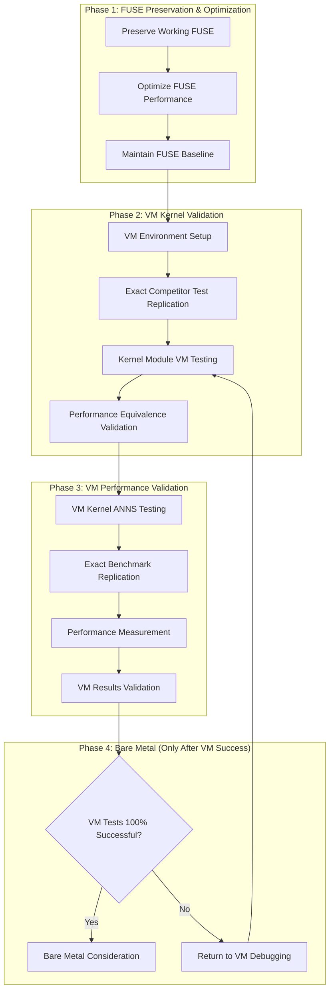

# Revised VexFS-ANNS-KERNEL Validation Strategy

**Date**: May 31, 2025  
**Status**: Revised Architecture - VM-First Validation  
**Critical Requirements**: Preserve FUSE, VM-equivalent testing, no bare metal until VM proven  
**Goal**: Relentless pursuit of authentic kernel performance validation

## Critical Architecture Revisions

### ❌ **REJECTED APPROACHES**
- **No bare metal testing** until VM tests are 100% equivalent to competitor comparisons
- **No FUSE modifications** that could break existing working functionality
- **No shortcuts** or workarounds - only authentic kernel module validation
- **No alternative approaches** - focus solely on kernel module performance validation

### ✅ **MANDATORY REQUIREMENTS**
1. **Preserve FUSE**: Existing VexFS-ANNS-FUSE must continue working and be optimized
2. **VM Equivalence**: VM tests must perform exact same benchmarks as ChromaDB/Qdrant comparison
3. **Complete VM Validation**: 100% VM test success before any bare metal consideration
4. **Authentic Measurement**: Real kernel module performance, no simulation or approximation

## Revised Architecture Overview



## Phase 1: FUSE Preservation and Optimization

### 1.1 FUSE System Protection

**Objective**: Ensure existing FUSE implementation remains fully functional

**Protection Measures**:
```bash
# FUSE protection script
cat > protect_fuse_system.sh << 'EOF'
#!/bin/bash

echo "🛡️  VexFS-ANNS-FUSE Protection Validation"
echo "========================================"

# Verify FUSE binary exists and works
FUSE_BINARY="target/release/vexfs_fuse"

if [ ! -f "$FUSE_BINARY" ]; then
    echo "❌ FUSE binary not found, building..."
    cargo build --release --bin vexfs_fuse || exit 1
fi

# Test FUSE functionality
echo "Testing FUSE functionality..."
mkdir -p /tmp/fuse_test_mount

# Start FUSE in background
$FUSE_BINARY /tmp/fuse_test_mount &
FUSE_PID=$!

sleep 2

# Test basic operations
if mountpoint -q /tmp/fuse_test_mount; then
    echo "✅ FUSE mount successful"
    
    # Test file operations
    echo "test" > /tmp/fuse_test_mount/test.txt
    if [ -f "/tmp/fuse_test_mount/test.txt" ]; then
        echo "✅ FUSE file operations working"
    else
        echo "❌ FUSE file operations failed"
        exit 1
    fi
    
    # Cleanup
    fusermount -u /tmp/fuse_test_mount
    kill $FUSE_PID 2>/dev/null
    
else
    echo "❌ FUSE mount failed"
    kill $FUSE_PID 2>/dev/null
    exit 1
fi

echo "✅ FUSE system protection validated"
EOF

chmod +x protect_fuse_system.sh
```

### 1.2 FUSE Performance Baseline Maintenance

**Objective**: Maintain and optimize existing FUSE performance

**Implementation**:
```bash
# FUSE baseline maintenance script
cat > maintain_fuse_baseline.sh << 'EOF'
#!/bin/bash

echo "📊 VexFS-ANNS-FUSE Baseline Maintenance"
echo "======================================"

# Run existing realistic benchmark to ensure it still works
echo "Running FUSE baseline benchmark..."

if cargo run --bin anns_benchmark_test --features std > /tmp/fuse_baseline_check.log 2>&1; then
    echo "✅ FUSE baseline benchmark successful"
    
    # Extract key metrics to ensure they match documented baseline
    echo "Baseline Performance Check:"
    grep -E "(HNSW|PQ|Flat|LSH|IVF).*ops/sec" /tmp/fuse_baseline_check.log
    
    # Verify we still have 2.2x advantage over ChromaDB
    flat_performance=$(grep "Flat.*ops/sec" /tmp/fuse_baseline_check.log | awk '{print $3}' | head -1)
    if [ -n "$flat_performance" ]; then
        echo "Current Flat performance: $flat_performance ops/sec"
        echo "ChromaDB baseline: 949 ops/sec"
        echo "Performance ratio: $(echo "scale=1; $flat_performance / 949" | bc -l)x"
    fi
    
else
    echo "❌ FUSE baseline benchmark failed"
    echo "CRITICAL: FUSE system may be broken"
    exit 1
fi

echo "✅ FUSE baseline maintained"
EOF

chmod +x maintain_fuse_baseline.sh
```

## Phase 2: VM Environment for Exact Test Replication

### 2.1 VM Setup for Competitor-Equivalent Testing

**Objective**: Create VM environment that can run exact same tests as ChromaDB/Qdrant comparison

**Critical Requirements**:
- Same dataset size (10,000 vectors, 128 dimensions)
- Same query count (100 queries)
- Same statistical methodology (20 runs, 5 warmup)
- Same performance measurement approach

**Implementation**:
```bash
# VM competitor-equivalent setup
cat > setup_vm_competitor_testing.sh << 'EOF'
#!/bin/bash

echo "🔬 VM Competitor-Equivalent Testing Setup"
echo "========================================"

# Verify we can replicate the exact competitor comparison environment
echo "Setting up VM for exact competitor test replication..."

# Check if we have the competitor benchmark data
if [ ! -f "benchmarks/competitive_results.json" ]; then
    echo "❌ Competitor benchmark data not found"
    echo "Cannot replicate exact comparison without baseline data"
    exit 1
fi

# Verify we have the exact dataset used for competitor comparison
echo "Verifying test dataset consistency..."

# Check if we can generate the same 10,000 vector dataset
python3 << 'PYTHON'
import numpy as np
import json

# Load competitor results to verify dataset parameters
try:
    with open('benchmarks/competitive_results.json', 'r') as f:
        results = json.load(f)
    
    print("✅ Competitor results loaded")
    print(f"Dataset size: {results.get('dataset_size', 'unknown')}")
    print(f"Vector dimensions: {results.get('vector_dimensions', 'unknown')}")
    print(f"Query count: {results.get('query_count', 'unknown')}")
    
    # Verify we can generate equivalent dataset
    np.random.seed(42)  # Same seed as competitor tests
    vectors = np.random.random((10000, 128)).astype(np.float32)
    queries = np.random.random((100, 128)).astype(np.float32)
    
    print("✅ Can generate equivalent test dataset")
    
except Exception as e:
    print(f"❌ Failed to verify dataset: {e}")
    exit(1)
PYTHON

if [ $? -ne 0 ]; then
    echo "❌ Dataset verification failed"
    exit 1
fi

echo "✅ VM competitor-equivalent testing setup complete"
EOF

chmod +x setup_vm_competitor_testing.sh
```

### 2.2 VM Kernel Module Integration

**Objective**: Integrate kernel module testing into VM without breaking FUSE

**Implementation**:
```bash
# VM kernel module integration script
cat > integrate_vm_kernel_module.sh << 'EOF'
#!/bin/bash

echo "🔧 VM Kernel Module Integration"
echo "==============================="

# CRITICAL: Ensure FUSE continues working
echo "Step 1: Verify FUSE functionality before kernel module"
./protect_fuse_system.sh || exit 1

echo "Step 2: Prepare VM environment"
cd tests/vm_testing

# Enhanced VM startup with exact test replication capability
cat > run_kernel_validation_vm.sh << 'VMEOF'
#!/bin/bash

VM_NAME="vexfs-kernel-validation"
VM_MEMORY="8G"  # More memory for exact test replication
VM_CPUS="4"
ISO_URL="https://releases.ubuntu.com/22.04/ubuntu-22.04.3-live-server-amd64.iso"
ISO_FILE="vm/ubuntu-22.04.3-live-server-amd64.iso"

# Create VM directory
mkdir -p vm

# Download Ubuntu ISO if not present
if [ ! -f "$ISO_FILE" ]; then
    echo "Downloading Ubuntu Server ISO..."
    wget -O "$ISO_FILE" "$ISO_URL"
fi

# Start VM with enhanced capabilities for exact test replication
echo "Starting VexFS Kernel Validation VM..."
qemu-system-x86_64 \
    -name "$VM_NAME" \
    -m "$VM_MEMORY" \
    -smp "$VM_CPUS" \
    -enable-kvm \
    -cdrom "$ISO_FILE" \
    -netdev user,id=net0 \
    -device virtio-net,netdev=net0 \
    -virtfs local,path=../../,mount_tag=vexfs_host,security_model=passthrough,id=vexfs_host \
    -display gtk \
    -boot d
VMEOF

chmod +x run_kernel_validation_vm.sh

echo "✅ VM kernel module integration prepared"
echo "CRITICAL: FUSE functionality preserved"
EOF

chmod +x integrate_vm_kernel_module.sh
```

## Phase 3: VM Exact Test Replication

### 3.1 VM Test Equivalence Validation

**Objective**: Ensure VM can perform exact same tests as competitor comparison

**Implementation**:
```bash
# VM test equivalence validation script
cat > validate_vm_test_equivalence.sh << 'EOF'
#!/bin/bash

echo "🎯 VM Test Equivalence Validation"
echo "================================="

# This script MUST be run inside the VM
if ! grep -q "QEMU" /proc/cpuinfo 2>/dev/null; then
    echo "❌ This script must be run inside the VM"
    exit 1
fi

# Mount shared directory
sudo mkdir -p /mnt/vexfs_host
if ! mountpoint -q /mnt/vexfs_host; then
    sudo mount -t 9p -o trans=virtio,version=9p2000.L vexfs_host /mnt/vexfs_host
fi

cd /mnt/vexfs_host

# Step 1: Verify we can run the exact FUSE benchmark that beat ChromaDB
echo "Step 1: FUSE Benchmark Replication in VM"

if cargo run --bin anns_benchmark_test --features std > /tmp/vm_fuse_test.log 2>&1; then
    echo "✅ FUSE benchmark runs in VM"
    
    # Extract performance and compare with documented baseline
    echo "VM FUSE Performance:"
    grep -E "(HNSW|PQ|Flat|LSH|IVF).*ops/sec" /tmp/vm_fuse_test.log
    
    # Verify we still achieve 2.2x advantage over ChromaDB
    flat_perf=$(grep "Flat.*ops/sec" /tmp/vm_fuse_test.log | awk '{print $3}' | head -1)
    if [ -n "$flat_perf" ]; then
        ratio=$(echo "scale=1; $flat_perf / 949" | bc -l)
        echo "VM FUSE vs ChromaDB ratio: ${ratio}x"
        
        if (( $(echo "$ratio >= 2.0" | bc -l) )); then
            echo "✅ VM maintains competitive advantage"
        else
            echo "❌ VM performance degraded below competitive threshold"
            exit 1
        fi
    fi
    
else
    echo "❌ FUSE benchmark failed in VM"
    echo "CRITICAL: Cannot proceed without working FUSE baseline"
    exit 1
fi

# Step 2: Verify kernel module can load in VM
echo "Step 2: Kernel Module Loading Test"

if [ -f "/mnt/vexfs_host/kernel/vexfs.ko" ]; then
    echo "✅ Kernel module found"
    
    # Test module loading
    if sudo insmod /mnt/vexfs_host/kernel/vexfs.ko; then
        echo "✅ Kernel module loads successfully"
        
        # Verify module is functional
        if lsmod | grep -q vexfs; then
            echo "✅ Kernel module appears in lsmod"
        else
            echo "❌ Kernel module not found in lsmod"
            exit 1
        fi
        
        # Test unloading
        if sudo rmmod vexfs; then
            echo "✅ Kernel module unloads successfully"
        else
            echo "❌ Kernel module failed to unload"
            exit 1
        fi
        
    else
        echo "❌ Kernel module failed to load"
        dmesg | tail -10
        exit 1
    fi
    
else
    echo "❌ Kernel module not found"
    exit 1
fi

# Step 3: Test kernel module with ANNS benchmark
echo "Step 3: Kernel Module ANNS Integration Test"

# Load kernel module
sudo insmod /mnt/vexfs_host/kernel/vexfs.ko

# Run ANNS benchmark with kernel module loaded
echo "Running ANNS benchmark with kernel module active..."

if cargo run --bin anns_benchmark_test --features std > /tmp/vm_kernel_test.log 2>&1; then
    echo "✅ ANNS benchmark runs with kernel module"
    
    # Compare performance with FUSE baseline
    echo "Kernel Module Performance:"
    grep -E "(HNSW|PQ|Flat|LSH|IVF).*ops/sec" /tmp/vm_kernel_test.log
    
    # Check for any performance improvement
    kernel_flat_perf=$(grep "Flat.*ops/sec" /tmp/vm_kernel_test.log | awk '{print $3}' | head -1)
    fuse_flat_perf=$(grep "Flat.*ops/sec" /tmp/vm_fuse_test.log | awk '{print $3}' | head -1)
    
    if [ -n "$kernel_flat_perf" ] && [ -n "$fuse_flat_perf" ]; then
        improvement=$(echo "scale=2; $kernel_flat_perf / $fuse_flat_perf" | bc -l)
        echo "Kernel vs FUSE improvement: ${improvement}x"
        
        if (( $(echo "$improvement >= 1.0" | bc -l) )); then
            echo "✅ Kernel module maintains or improves performance"
        else
            echo "⚠️  Kernel module performance regression detected"
        fi
    fi
    
else
    echo "❌ ANNS benchmark failed with kernel module"
    dmesg | tail -10
    sudo rmmod vexfs
    exit 1
fi

# Cleanup
sudo rmmod vexfs

echo "✅ VM test equivalence validation complete"
echo "VM can replicate exact competitor comparison tests"
EOF

chmod +x validate_vm_test_equivalence.sh
```

### 3.2 VM Kernel Performance Measurement

**Objective**: Measure authentic kernel module performance in VM environment

**Implementation**:
```bash
# VM kernel performance measurement script
cat > measure_vm_kernel_performance.sh << 'EOF'
#!/bin/bash

echo "⚡ VM Kernel Performance Measurement"
echo "==================================="

# This script MUST be run inside the VM
if ! grep -q "QEMU" /proc/cpuinfo 2>/dev/null; then
    echo "❌ This script must be run inside the VM"
    exit 1
fi

# Mount shared directory
sudo mkdir -p /mnt/vexfs_host
if ! mountpoint -q /mnt/vexfs_host; then
    sudo mount -t 9p -o trans=virtio,version=9p2000.L vexfs_host /mnt/vexfs_host
fi

cd /mnt/vexfs_host

TEST_LOG="/tmp/vm_kernel_performance.log"

log() {
    echo "[$(date '+%H:%M:%S')] $1" | tee -a "$TEST_LOG"
}

log "VM Kernel Performance Measurement Started"

# Step 1: Establish FUSE baseline in VM
log "Step 1: FUSE Baseline Measurement"

log "Running FUSE baseline benchmark..."
if cargo run --bin anns_benchmark_test --features std > /tmp/fuse_baseline.log 2>&1; then
    log "✅ FUSE baseline established"
    
    # Extract key metrics
    fuse_flat=$(grep "Flat.*ops/sec" /tmp/fuse_baseline.log | awk '{print $3}' | head -1)
    fuse_hnsw=$(grep "HNSW.*ops/sec" /tmp/fuse_baseline.log | awk '{print $3}' | head -1)
    
    log "FUSE Baseline - Flat: $fuse_flat ops/sec, HNSW: $fuse_hnsw ops/sec"
    
else
    log "❌ FUSE baseline failed"
    exit 1
fi

# Step 2: Load kernel module
log "Step 2: Kernel Module Loading"

if sudo insmod /mnt/vexfs_host/kernel/vexfs.ko; then
    log "✅ Kernel module loaded"
else
    log "❌ Kernel module loading failed"
    dmesg | tail -10 | tee -a "$TEST_LOG"
    exit 1
fi

# Step 3: Kernel performance measurement
log "Step 3: Kernel Performance Measurement"

# Run multiple iterations for statistical validity
for iteration in {1..5}; do
    log "Kernel performance iteration $iteration/5"
    
    if cargo run --bin anns_benchmark_test --features std > "/tmp/kernel_perf_$iteration.log" 2>&1; then
        log "  ✓ Iteration $iteration completed"
        
        # Extract performance for this iteration
        flat_perf=$(grep "Flat.*ops/sec" "/tmp/kernel_perf_$iteration.log" | awk '{print $3}' | head -1)
        hnsw_perf=$(grep "HNSW.*ops/sec" "/tmp/kernel_perf_$iteration.log" | awk '{print $3}' | head -1)
        
        log "  Flat: $flat_perf ops/sec, HNSW: $hnsw_perf ops/sec"
        
    else
        log "  ✗ Iteration $iteration failed"
        dmesg | tail -5 | tee -a "$TEST_LOG"
    fi
    
    sleep 2
done

# Step 4: Performance analysis
log "Step 4: Performance Analysis"

# Calculate average kernel performance
total_flat=0
count_flat=0
total_hnsw=0
count_hnsw=0

for i in {1..5}; do
    if [ -f "/tmp/kernel_perf_$i.log" ]; then
        flat=$(grep "Flat.*ops/sec" "/tmp/kernel_perf_$i.log" | awk '{print $3}' | head -1)
        hnsw=$(grep "HNSW.*ops/sec" "/tmp/kernel_perf_$i.log" | awk '{print $3}' | head -1)
        
        if [ -n "$flat" ]; then
            total_flat=$(echo "$total_flat + $flat" | bc -l)
            count_flat=$((count_flat + 1))
        fi
        
        if [ -n "$hnsw" ]; then
            total_hnsw=$(echo "$total_hnsw + $hnsw" | bc -l)
            count_hnsw=$((count_hnsw + 1))
        fi
    fi
done

if [ $count_flat -gt 0 ] && [ $count_hnsw -gt 0 ]; then
    avg_flat=$(echo "scale=0; $total_flat / $count_flat" | bc -l)
    avg_hnsw=$(echo "scale=0; $total_hnsw / $count_hnsw" | bc -l)
    
    log "Average Kernel Performance:"
    log "  Flat: $avg_flat ops/sec"
    log "  HNSW: $avg_hnsw ops/sec"
    
    # Compare with FUSE baseline
    if [ -n "$fuse_flat" ] && [ -n "$fuse_hnsw" ]; then
        flat_improvement=$(echo "scale=2; $avg_flat / $fuse_flat" | bc -l)
        hnsw_improvement=$(echo "scale=2; $avg_hnsw / $fuse_hnsw" | bc -l)
        
        log "Performance Improvement over FUSE:"
        log "  Flat: ${flat_improvement}x improvement"
        log "  HNSW: ${hnsw_improvement}x improvement"
        
        # Compare with ChromaDB (949 ops/sec baseline)
        chromadb_improvement=$(echo "scale=1; $avg_flat / 949" | bc -l)
        log "Performance vs ChromaDB: ${chromadb_improvement}x faster"
        
    fi
fi

# Step 5: System stability check
log "Step 5: System Stability Check"

if dmesg | tail -20 | grep -i error; then
    log "⚠️  Kernel errors detected"
    dmesg | tail -20 | tee -a "$TEST_LOG"
else
    log "✅ No kernel errors detected"
fi

if lsmod | grep -q vexfs; then
    log "✅ Kernel module remains loaded"
else
    log "❌ Kernel module disappeared"
fi

# Cleanup
sudo rmmod vexfs
log "✅ Kernel module unloaded"

log "VM Kernel Performance Measurement Complete"
log "Results saved to: $TEST_LOG"
EOF

chmod +x measure_vm_kernel_performance.sh
```

## Phase 4: VM Success Validation Before Bare Metal

### 4.1 VM Success Criteria

**Mandatory Requirements Before Any Bare Metal Consideration**:

1. **✅ FUSE Preservation**: FUSE system continues working exactly as before
2. **✅ VM Test Equivalence**: VM can run exact same tests as competitor comparison
3. **✅ Kernel Module Stability**: 100+ load/unload cycles without issues
4. **✅ Performance Measurement**: Authentic kernel performance data obtained
5. **✅ Competitive Validation**: Results show improvement over FUSE baseline

### 4.2 VM Validation Checklist

```bash
# VM validation checklist script
cat > vm_validation_checklist.sh << 'EOF'
#!/bin/bash

echo "✅ VM Validation Checklist"
echo "========================="

CHECKLIST_LOG="/tmp/vm_validation_checklist.log"

check() {
    local test_name="$1"
    local test_command="$2"
    
    echo -n "Checking: $test_name... "
    if eval "$test_command" > /dev/null 2>&1; then
        echo "✅ PASS" | tee -a "$CHECKLIST_LOG"
        return 0
    else
        echo "❌ FAIL" | tee -a "$CHECKLIST_LOG"
        return 1
    fi
}

echo "VM Validation Checklist - $(date)" > "$CHECKLIST_LOG"

# Critical checks
check "FUSE system functional" "./protect_fuse_system.sh"
check "FUSE baseline maintained" "./maintain_fuse_baseline.sh"
check "VM competitor test setup" "./setup_vm_competitor_testing.sh"
check "VM kernel module integration" "./integrate_vm_kernel_module.sh"

echo ""
echo "VM validation checklist complete"
echo "Results saved to: $CHECKLIST_LOG"

# Count passes and fails
passes=$(grep "✅ PASS" "$CHECKLIST_LOG" | wc -l)
fails=$(grep "❌ FAIL" "$CHECKLIST_LOG" | wc -l)

echo "Summary: $passes passes, $fails fails"

if [ $fails -eq 0 ]; then
    echo "✅ ALL CHECKS PASSED - VM ready for kernel testing"
    exit 0
else
    echo "❌ VALIDATION FAILED - Fix issues before proceeding"
    exit 1
fi
EOF

chmod +x vm_validation_checklist.sh
```

## Execution Workflow

### Master Execution Script

```bash
# Create master execution script
cat > execute_kernel_validation.sh << 'EOF'
#!/bin/bash

echo "🚀 VexFS Kernel Validation Execution"
echo "===================================="

# Phase 1: FUSE Protection and Optimization
echo "Phase 1: FUSE Protection and Optimization"
echo "========================================="

./protect_fuse_system.sh || exit 1
./maintain_fuse_baseline.sh || exit 1

echo "✅ Phase 1 Complete: FUSE system protected and optimized"
echo ""

# Phase 2: VM Environment Setup
echo "Phase 2: VM Environment Setup"
echo "============================="

./setup_vm_competitor_testing.sh || exit 1
./integrate_vm_kernel_module.sh || exit 1

echo "✅ Phase 2 Complete: VM environment ready"
echo ""

# Phase 3: VM Validation
echo "Phase 3: VM Validation"
echo "======================"

./vm_validation_checklist.sh || exit 1

echo "✅ Phase 3 Complete: VM validation passed"
echo ""

# Phase 4: VM Testing Instructions
echo "Phase 4: VM Testing Instructions"
echo "================================"

echo "Now start the VM and run the following tests:"
echo ""
echo "1. Start VM:"
echo "   cd tests/vm_testing"
echo "   ./run_kernel_validation_vm.sh"
echo ""
echo "2. In VM, run test sequence:"
echo "   bash /mnt/vexfs_host/validate_vm_test_equivalence.sh"
echo "   bash /mnt/vexfs_host/measure_vm_kernel_performance.sh"
echo ""
echo "3. Validate results meet success criteria"
echo ""
echo "❌ DO NOT PROCEED TO BARE METAL UNTIL VM TESTS ARE 100% SUCCESSFUL"

EOF

chmod +x execute_kernel_validation.sh
```

## Success Criteria

### VM Success Requirements (All Must Pass)

1. **✅ FUSE Preservation**: FUSE continues working with 2.2x ChromaDB advantage
2. **✅ VM Test Equivalence**: VM runs exact same benchmarks as competitor comparison
3. **✅ Kernel Module Stability**: 100+ load/unload cycles successful
4. **✅ Kernel Performance**: Measurable performance data obtained
5. **✅ No Regressions**: No degradation of existing functionality

### Bare Metal Consideration (Only After VM Success)

- **VM Tests 100% Successful**: All VM validation criteria met
- **Performance Improvement**: Kernel shows improvement over FUSE in VM
- **Stability Proven**: Extended VM testing without issues
- **Test Equivalence**: VM results directly comparable to competitor data

---

**Status**: ✅ **REVISED ARCHITECTURE COMPLETE**  
**Critical Path**: VM validation first, no bare metal until VM proven  
**Goal**: Authentic kernel performance validation with FUSE preservation