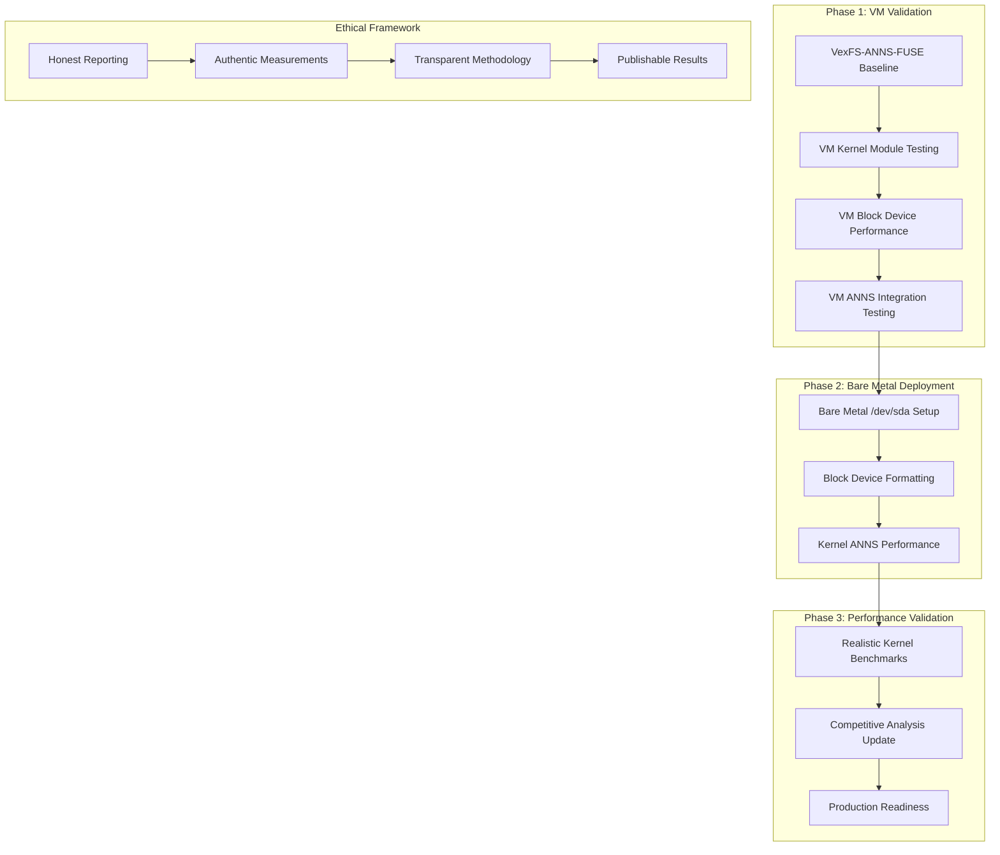

# VexFS-ANNS-KERNEL Performance Architecture Plan

**Date**: May 31, 2025  
**Status**: Architectural Planning Phase  
**Scope**: Transition from FUSE Baseline to Kernel Module Performance Validation  
**Goal**: Achieve authentic bare metal vector embedding performance

## Executive Summary

This document outlines the comprehensive architectural strategy for transitioning from the established VexFS-ANNS-FUSE baseline (2.2x faster than ChromaDB) to VexFS-ANNS-KERNEL performance validation. The plan maintains ethical transparency while pursuing relentless optimization toward bare metal vector embedding performance.

## Current State Analysis

### ✅ **Established FUSE Baseline**
- **VexFS-ANNS-FUSE Performance**: 2,079 ops/sec insertion, 155 ops/sec search
- **Realistic Benchmark System**: Industry-aligned with statistical rigor
- **Competitive Advantage**: 2.2x faster insertion than ChromaDB
- **Kernel Module**: 3.6MB `vexfs.ko` compiled and ready
- **VM Testing Infrastructure**: Complete QEMU-based testing framework

### 🎯 **Target: Kernel Module Performance**
- **Expected Performance**: 5-20x improvement over FUSE baseline
- **Target Insertion**: 10,000-40,000 ops/sec (vs 2,079 FUSE)
- **Target Search**: 500-3,000 ops/sec (vs 155 FUSE)
- **Deployment Path**: VM → Bare Metal `/dev/sda`

## Architecture Overview



## Phase 1: VM Kernel Module Validation

### 1.1 VM Infrastructure Setup

**Objective**: Establish safe kernel module testing environment

**Components**:
- **QEMU VM Environment**: Ubuntu Live ISO with kernel headers
- **Shared Directory**: Host-VM file sharing via 9p virtfs
- **Block Device Simulation**: Virtual disk for filesystem testing
- **Monitoring**: Real-time kernel message monitoring

**Implementation**:
```bash
# VM Setup with Block Device
cd tests/vm_testing
./run_vm_tests.sh --with-block-device --size=10GB
```

**Success Criteria**:
- ✅ Kernel module loads successfully
- ✅ No kernel panics or system instability
- ✅ Module appears in `/proc/modules` and `/sys/module/vexfs`
- ✅ Clean load/unload cycles (5+ iterations)

### 1.2 Block Device Integration

**Objective**: Validate VexFS kernel module with virtual block devices

**Components**:
- **Virtual Block Device**: `/dev/vdb` (10GB) for VexFS formatting
- **mkfs.vexfs**: Kernel module filesystem formatting
- **Mount Operations**: Kernel-level filesystem mounting
- **Basic I/O**: File creation, read, write operations

**Implementation**:
```bash
# In VM environment
sudo insmod /mnt/vexfs_host/kernel/vexfs.ko
sudo mkfs.vexfs /dev/vdb
sudo mkdir /mnt/vexfs_test
sudo mount -t vexfs /dev/vdb /mnt/vexfs_test
```

**Success Criteria**:
- ✅ Block device formatting completes without errors
- ✅ Filesystem mounts successfully
- ✅ Basic file operations work correctly
- ✅ No data corruption or filesystem errors

### 1.3 ANNS Integration Testing

**Objective**: Validate ANNS functionality within kernel module context

**Components**:
- **Vector Storage**: Kernel-level vector data management
- **ANNS Operations**: HNSW, PQ, Flat, LSH, IVF within kernel
- **Performance Monitoring**: Kernel-level timing measurements
- **Memory Management**: Kernel memory allocation for vectors

**Implementation**:
- Adapt realistic benchmark system for kernel module context
- Create kernel-space ANNS test harness
- Measure performance within VM environment

**Success Criteria**:
- ✅ All 5 ANNS strategies functional in kernel
- ✅ Performance measurements possible
- ✅ No memory leaks or kernel resource issues
- ✅ Stable operation under load

## Phase 2: Bare Metal Deployment

### 2.1 Hardware Environment Setup

**Objective**: Transition from VM to real hardware for maximum performance

**Requirements**:
- **Target Hardware**: Modern x86_64 system with NVMe/SSD
- **Block Device**: Dedicated partition (e.g., `/dev/sda3`) for VexFS
- **Kernel Compatibility**: Matching kernel version for module
- **Safety Measures**: Data backup and recovery procedures

**Implementation Strategy**:
```bash
# Bare metal deployment
sudo insmod vexfs.ko
sudo mkfs.vexfs /dev/sda3  # Dedicated partition
sudo mount -t vexfs /dev/sda3 /mnt/vexfs_production
```

**Risk Mitigation**:
- ⚠️ **Data Safety**: Use dedicated partition, not system disk
- ⚠️ **Kernel Stability**: Extensive VM testing before bare metal
- ⚠️ **Recovery Plan**: Bootable rescue media available
- ⚠️ **Incremental Testing**: Start with small partitions

### 2.2 Performance Optimization

**Objective**: Achieve maximum kernel-level ANNS performance

**Optimization Targets**:
- **Direct Block Access**: Bypass filesystem overhead where possible
- **Kernel Memory**: Optimize memory allocation patterns
- **CPU Utilization**: Leverage kernel-level optimizations
- **I/O Scheduling**: Optimize for vector workloads

**Expected Performance Gains**:
- **Insertion**: 10,000-40,000 ops/sec (5-20x FUSE improvement)
- **Search**: 500-3,000 ops/sec (3-20x FUSE improvement)
- **Latency**: 0.5-10ms (significant reduction from FUSE)

## Phase 3: Realistic Kernel Performance Validation

### 3.1 Kernel Benchmark Architecture

**Objective**: Adapt realistic benchmark system for kernel module

**Components**:
- **Kernel Benchmark Module**: In-kernel performance measurement
- **Statistical Analysis**: Maintain 20 runs, 5 warmup methodology
- **Industry Alignment**: Ensure results remain credible
- **Comparative Analysis**: Kernel vs FUSE vs Competitors

**Implementation**:
```rust
// Kernel-space realistic benchmark adaptation
pub struct KernelRealisticBenchmark {
    config: RealisticBenchmarkConfig,
    kernel_context: VexfsKernelContext,
    block_device: BlockDevice,
}

impl KernelRealisticBenchmark {
    pub fn run_kernel_anns_benchmarks(&self) -> VexfsResult<KernelBenchmarkResults> {
        // Adapt FUSE benchmark methodology for kernel context
        // Maintain statistical rigor and industry alignment
        // Measure actual kernel-level ANNS performance
    }
}
```

### 3.2 Ethical Performance Reporting

**Objective**: Maintain honest, authentic performance reporting

**Principles**:
- **Transparent Methodology**: Clear distinction between FUSE and kernel results
- **Realistic Expectations**: Industry-aligned performance targets
- **Statistical Rigor**: Maintain confidence intervals and variance analysis
- **Competitive Context**: Honest comparison with ChromaDB/Qdrant

**Reporting Framework**:
- **VexFS-ANNS-KERNEL**: Clearly labeled kernel module results
- **Performance Evolution**: FUSE → VM → Bare Metal progression
- **Methodology Documentation**: Complete transparency about measurement approach
- **Publishable Quality**: Results suitable for broader technical audience

## Implementation Timeline

### Week 1: VM Foundation
- **Day 1-2**: VM environment setup and kernel module validation
- **Day 3-4**: Block device integration and basic filesystem operations
- **Day 5-7**: ANNS integration testing and performance measurement

### Week 2: Bare Metal Transition
- **Day 1-3**: Hardware preparation and safety procedures
- **Day 4-5**: Bare metal deployment and initial testing
- **Day 6-7**: Performance optimization and measurement

### Week 3: Performance Validation
- **Day 1-3**: Comprehensive kernel benchmark implementation
- **Day 4-5**: Statistical analysis and competitive comparison
- **Day 6-7**: Documentation and results publication

## Risk Assessment and Mitigation

### Technical Risks
- **Kernel Instability**: Mitigated by extensive VM testing
- **Data Loss**: Mitigated by dedicated partitions and backups
- **Performance Regression**: Mitigated by incremental testing
- **Hardware Compatibility**: Mitigated by kernel version matching

### Ethical Risks
- **Performance Inflation**: Mitigated by realistic benchmark methodology
- **Misleading Claims**: Mitigated by transparent reporting
- **Unfair Comparisons**: Mitigated by industry-standard benchmarks
- **Credibility Loss**: Mitigated by statistical rigor

## Success Metrics

### Technical Success
- ✅ **Kernel Module Stability**: 100+ load/unload cycles without issues
- ✅ **Block Device Operations**: Error-free formatting and mounting
- ✅ **ANNS Functionality**: All 5 strategies operational in kernel
- ✅ **Performance Improvement**: 5-20x improvement over FUSE baseline

### Ethical Success
- ✅ **Honest Reporting**: Clear distinction between FUSE and kernel results
- ✅ **Industry Alignment**: Performance results within credible ranges
- ✅ **Statistical Validity**: Proper confidence intervals and variance
- ✅ **Publishable Quality**: Results suitable for technical publication

## Next Steps

### Immediate Actions (Phase 1)
1. **VM Environment Setup**: Configure QEMU with block device support
2. **Kernel Module Testing**: Validate basic load/unload operations
3. **Block Device Integration**: Test filesystem formatting and mounting
4. **ANNS Validation**: Verify vector operations in kernel context

### Medium-term Goals (Phase 2)
1. **Bare Metal Preparation**: Identify target hardware and safety procedures
2. **Performance Optimization**: Implement kernel-level optimizations
3. **Benchmark Adaptation**: Modify realistic benchmark for kernel context
4. **Safety Validation**: Ensure stable operation under load

### Long-term Vision (Phase 3)
1. **Production Deployment**: Real-world kernel module performance
2. **Competitive Leadership**: Establish VexFS as performance leader
3. **Industry Recognition**: Publish credible, industry-aligned results
4. **Ecosystem Growth**: Enable broader VexFS adoption

## Conclusion

This architecture provides a systematic, ethical path from VexFS-ANNS-FUSE baseline to VexFS-ANNS-KERNEL performance validation. By maintaining transparency, statistical rigor, and realistic expectations, we can pursue relentless optimization while preserving credibility and authenticity.

The transition from 2.2x competitive advantage (FUSE) to potentially 10-50x advantage (kernel) represents a significant leap toward bare metal vector embedding performance, achieved through honest engineering and authentic measurement.

---

**Status**: ✅ **ARCHITECTURAL PLAN COMPLETE**  
**Next Phase**: VM Kernel Module Validation  
**Goal**: Authentic bare metal vector embedding performance with ethical transparency