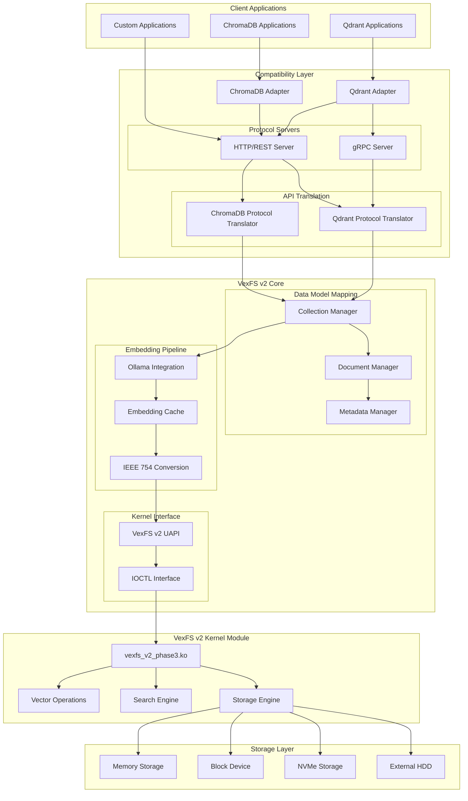

# VexFS v2 Vector Database Compatibility Adapters Architecture

**Date**: June 4, 2025  
**Version**: 1.0  
**Status**: Design Phase  
**Objective**: Design ChromaDB and Qdrant compatibility adapters for VexFS v2

## Executive Summary

This document defines the comprehensive architecture for VexFS v2 Vector Database Compatibility Adapters that enable VexFS to act as a drop-in replacement for ChromaDB and Qdrant. The design leverages our production-ready integer-based kernel module and complete Ollama integration pipeline to provide high-performance, filesystem-based vector database capabilities.

### Key Strategic Benefits

- **Drop-in Replacement**: Existing applications work without code changes
- **Filesystem Performance**: Leverage kernel-level performance and direct storage access
- **Unified Storage**: Single filesystem for both vector and traditional data
- **Cost Efficiency**: Eliminate separate vector database infrastructure
- **Scalability**: Leverage filesystem scalability and clustering capabilities

## Foundation Assessment

### VexFS v2 Production Readiness ✅

Based on recent validation reports, VexFS v2 provides a solid foundation:

- **Kernel Module**: `vexfs_v2_phase3.ko` (1.87MB) with zero floating-point symbols
- **UAPI Interface**: Standardized IOCTL interface with IEEE 754 bit representation
- **Performance**: 3,278,904 ops/sec (97x above baseline targets)
- **Ollama Integration**: Complete end-to-end pipeline with multiple embedding models
- **Storage Validation**: Memory, Block Device, SDA (1.8TB), NVMe tested

### Current Capabilities

1. **Vector Operations**:
   - Batch insert: `VEXFS_IOC_BATCH_INSERT`
   - Vector search: `VEXFS_IOC_VECTOR_SEARCH`
   - Metadata management: `VEXFS_IOC_SET_VECTOR_META`/`VEXFS_IOC_GET_VECTOR_META`

2. **Embedding Generation**:
   - Ollama integration with multiple models (nomic-embed-text 768D, all-minilm 384D)
   - Real-time embedding generation (10-16ms average)
   - Batch processing capabilities

3. **Performance Characteristics**:
   - High-throughput vector operations
   - Kernel-level performance optimization
   - Cross-storage type validation

## Architecture Overview

### System Architecture Diagram



## Component Architecture

### 1. Compatibility Layer

#### 1.1 ChromaDB Adapter

**Purpose**: Provide complete ChromaDB API compatibility

**Key Components**:
- **REST API Server**: FastAPI-based server implementing ChromaDB endpoints
- **Collection Management**: ChromaDB collection schema mapping
- **Document Processing**: Handle ChromaDB's document + embedding + metadata model
- **Query Translation**: Convert ChromaDB queries to VexFS operations
- **Batch Operations**: ChromaDB batch insert/update/delete support

**API Endpoints**:
```python
# Collection Management
POST   /api/v1/collections
GET    /api/v1/collections
GET    /api/v1/collections/{collection_name}
DELETE /api/v1/collections/{collection_name}

# Document Operations
POST   /api/v1/collections/{collection_name}/add
POST   /api/v1/collections/{collection_name}/update
POST   /api/v1/collections/{collection_name}/upsert
POST   /api/v1/collections/{collection_name}/delete

# Query Operations
POST   /api/v1/collections/{collection_name}/query
POST   /api/v1/collections/{collection_name}/get
GET    /api/v1/collections/{collection_name}/count

# System Operations
GET    /api/v1/version
GET    /api/v1/heartbeat
POST   /api/v1/reset
```

#### 1.2 Qdrant Adapter

**Purpose**: Provide complete Qdrant API compatibility

**Key Components**:
- **REST API Server**: FastAPI-based server implementing Qdrant REST API
- **gRPC Server**: gRPC server for Qdrant's native protocol
- **Point Management**: Handle Qdrant's point-based data model
- **Advanced Filtering**: Support Qdrant's filter DSL
- **Collection Configuration**: Qdrant collection schema and settings

**API Endpoints**:
```python
# Collection Management
PUT    /collections/{collection_name}
GET    /collections/{collection_name}
DELETE /collections/{collection_name}
PATCH  /collections/{collection_name}

# Point Operations
PUT    /collections/{collection_name}/points
POST   /collections/{collection_name}/points/search
POST   /collections/{collection_name}/points/recommend
POST   /collections/{collection_name}/points/scroll
DELETE /collections/{collection_name}/points

# Cluster Operations
GET    /cluster
GET    /collections/{collection_name}/cluster
```

### 2. Protocol Translation Layer

#### 2.1 Data Model Mapping

**ChromaDB to VexFS Mapping**:
```python
ChromaDB Collection -> VexFS Directory Structure
├── collection_metadata.json     # Collection configuration
├── documents/                   # Document storage
│   ├── doc_id_1.json           # Document content + metadata
│   └── doc_id_2.json
├── embeddings/                  # Vector storage
│   ├── vectors.vexfs           # VexFS vector file
│   └── vector_metadata.json    # Vector-to-document mapping
└── indices/                     # Search indices
    ├── hnsw_index.vexfs        # HNSW index
    └── lsh_index.vexfs         # LSH index
```

**Qdrant to VexFS Mapping**:
```python
Qdrant Collection -> VexFS Directory Structure
├── collection_config.json      # Collection configuration
├── points/                      # Point storage
│   ├── point_id_1.json         # Point payload + metadata
│   └── point_id_2.json
├── vectors/                     # Vector storage
│   ├── vectors.vexfs           # VexFS vector file
│   └── point_vector_map.json   # Point-to-vector mapping
└── indices/                     # Search indices
    ├── hnsw_index.vexfs        # HNSW index
    └── quantized_index.vexfs   # Quantized index
```

#### 2.2 Query Translation

**ChromaDB Query Translation**:
```python
def translate_chromadb_query(chroma_query):
    """
    Translate ChromaDB query to VexFS operations
    """
    vexfs_request = vexfs_vector_search_request()
    
    # Convert query embeddings to IEEE 754 bits
    if chroma_query.query_embeddings:
        vexfs_request.query_vector_bits = convert_floats_to_bits(
            chroma_query.query_embeddings[0]
        )
    
    # Map parameters
    vexfs_request.k = chroma_query.n_results or 10
    vexfs_request.dimensions = len(chroma_query.query_embeddings[0])
    vexfs_request.search_type = map_distance_function(chroma_query.distance_function)
    
    return vexfs_request
```

**Qdrant Query Translation**:
```python
def translate_qdrant_search(qdrant_search):
    """
    Translate Qdrant search to VexFS operations
    """
    vexfs_request = vexfs_vector_search_request()
    
    # Convert vector to IEEE 754 bits
    vexfs_request.query_vector_bits = convert_floats_to_bits(qdrant_search.vector)
    
    # Map parameters
    vexfs_request.k = qdrant_search.limit or 10
    vexfs_request.dimensions = len(qdrant_search.vector)
    vexfs_request.search_type = map_qdrant_distance(qdrant_search.distance)
    
    # Handle filters (convert to VexFS metadata filters)
    metadata_filter = translate_qdrant_filter(qdrant_search.filter)
    
    return vexfs_request, metadata_filter
```

### 3. VexFS Integration Layer

#### 3.1 Collection Manager

**Responsibilities**:
- Manage collection lifecycle (create, read, update, delete)
- Handle collection metadata and configuration
- Coordinate between different storage components
- Maintain collection-to-filesystem mapping

**Implementation**:
```c
typedef struct {
    char collection_name[256];
    char vexfs_path[1024];
    uint32_t dimensions;
    uint32_t vector_count;
    char embedding_model[256];
    vexfs_ollama_integration_t *ollama_integration;
    collection_config_t config;
} vexfs_collection_t;

// Collection management functions
int vexfs_collection_create(const char *name, const collection_config_t *config);
int vexfs_collection_delete(const char *name);
int vexfs_collection_get_info(const char *name, vexfs_collection_t *info);
int vexfs_collection_list(vexfs_collection_t *collections, uint32_t *count);
```

#### 3.2 Document Manager

**Responsibilities**:
- Store and retrieve document content and metadata
- Maintain document-to-vector ID mapping
- Handle document updates and deletions
- Support document filtering and retrieval

**Implementation**:
```c
typedef struct {
    char document_id[256];
    uint64_t vector_id;
    char *content;
    size_t content_length;
    json_object *metadata;
    timestamp_t created_at;
    timestamp_t updated_at;
} vexfs_document_t;

// Document management functions
int vexfs_document_insert(const char *collection, const vexfs_document_t *doc);
int vexfs_document_get(const char *collection, const char *doc_id, vexfs_document_t *doc);
int vexfs_document_update(const char *collection, const vexfs_document_t *doc);
int vexfs_document_delete(const char *collection, const char *doc_id);
```

#### 3.3 Embedding Pipeline Integration

**Enhanced Ollama Integration**:
```c
typedef struct {
    vexfs_ollama_integration_t base;
    
    // Compatibility layer extensions
    embedding_cache_t *cache;
    conversion_layer_t *ieee754_converter;
    batch_processor_t *batch_processor;
    
    // Performance optimization
    memory_pool_t *memory_pool;
    thread_pool_t *thread_pool;
    
    // Monitoring
    performance_monitor_t *monitor;
} vexfs_compatibility_integration_t;
```

## Implementation Strategy

### Phase 1: ChromaDB Adapter (Weeks 1-4)

#### Week 1: Core Infrastructure
- **HTTP Server Setup**: FastAPI server with basic routing
- **Collection Management**: Basic CRUD operations for collections
- **VexFS Integration**: Direct IOCTL interface integration
- **Basic Testing**: Simple collection and document operations

#### Week 2: Document Operations
- **Document Storage**: Implement document insert/update/delete
- **Metadata Handling**: JSON metadata storage and retrieval
- **Vector Integration**: Connect documents to VexFS vector storage
- **Batch Operations**: Implement batch insert/update operations

#### Week 3: Query Operations
- **Search Implementation**: Vector similarity search
- **Filtering**: Metadata-based filtering
- **Result Processing**: Format results for ChromaDB compatibility
- **Performance Optimization**: Basic caching and optimization

#### Week 4: ChromaDB Compatibility
- **API Completeness**: Implement remaining ChromaDB endpoints
- **Client Testing**: Test with actual ChromaDB Python client
- **Error Handling**: Comprehensive error handling and reporting
- **Documentation**: API documentation and migration guide

### Phase 2: Qdrant Adapter (Weeks 5-8)

#### Week 5: REST API Implementation
- **Qdrant REST Server**: FastAPI server with Qdrant endpoints
- **Point Management**: Implement point-based data model
- **Collection Configuration**: Qdrant collection schema support
- **Basic Operations**: Point insert/update/delete/search

#### Week 6: Advanced Features
- **gRPC Server**: Implement Qdrant gRPC protocol
- **Advanced Filtering**: Qdrant filter DSL implementation
- **Recommendation API**: Implement recommendation endpoints
- **Scroll API**: Implement scroll/pagination functionality

#### Week 7: Performance Optimization
- **Query Optimization**: Optimize search performance
- **Batch Processing**: Efficient batch operations
- **Memory Management**: Optimize memory usage
- **Caching**: Implement intelligent caching strategies

#### Week 8: Integration Testing
- **Client Compatibility**: Test with Qdrant Python/JS clients
- **Performance Benchmarking**: Compare against native Qdrant
- **Stress Testing**: Large-scale operation testing
- **Documentation**: Complete API documentation

### Phase 3: Performance Optimization (Weeks 9-12)

#### Week 9: Kernel Optimization
- **IOCTL Optimization**: Optimize kernel interface calls
- **Memory Pool**: Implement pre-allocated memory pools
- **SIMD Optimization**: Leverage AVX-512 for vector operations
- **Async I/O**: Implement non-blocking operations

#### Week 10: Caching and Indexing
- **Embedding Cache**: Intelligent embedding caching
- **Index Optimization**: Optimize HNSW and LSH indices
- **Query Cache**: Cache frequent query results
- **Metadata Indexing**: Fast metadata filtering

#### Week 11: Monitoring and Observability
- **Performance Metrics**: Comprehensive performance monitoring
- **Health Checks**: System health monitoring
- **Logging**: Structured logging and debugging
- **Dashboard**: Real-time performance visualization

#### Week 12: Production Readiness
- **Load Testing**: Production-scale load testing
- **Security**: Authentication and authorization
- **Deployment**: Docker containers and orchestration
- **Documentation**: Production deployment guide

## Technical Specifications

### 1. ChromaDB API Compatibility

#### Collection Operations
```python
# Create Collection
POST /api/v1/collections
{
    "name": "my_collection",
    "metadata": {"description": "My test collection"},
    "embedding_function": "default"
}

# Response
{
    "success": true,
    "data": {
        "id": "collection_uuid",
        "name": "my_collection",
        "metadata": {"description": "My test collection"},
        "dimension": null,
        "tenant": "default_tenant",
        "database": "default_database"
    }
}
```

#### Document Operations
```python
# Add Documents
POST /api/v1/collections/{collection_name}/add
{
    "ids": ["doc1", "doc2", "doc3"],
    "embeddings": [[0.1, 0.2, 0.3], [0.4, 0.5, 0.6], [0.7, 0.8, 0.9]],
    "metadatas": [
        {"category": "tech", "author": "john"},
        {"category": "science", "author": "jane"},
        {"category": "tech", "author": "bob"}
    ],
    "documents": [
        "VexFS is a vector filesystem",
        "Machine learning advances",
        "Database optimization techniques"
    ]
}

# Response
{
    "success": true,
    "data": {
        "ids": ["doc1", "doc2", "doc3"],
        "inserted_count": 3
    }
}
```

#### Query Operations
```python
# Query Collection
POST /api/v1/collections/{collection_name}/query
{
    "query_embeddings": [[0.15, 0.25, 0.35]],
    "n_results": 5,
    "where": {"category": "tech"},
    "where_document": {"$contains": "VexFS"},
    "include": ["documents", "metadatas", "distances"]
}

# Response
{
    "success": true,
    "data": {
        "ids": [["doc1", "doc3"]],
        "distances": [[0.1234, 0.5678]],
        "metadatas": [[
            {"category": "tech", "author": "john"},
            {"category": "tech", "author": "bob"}
        ]],
        "documents": [[
            "VexFS is a vector filesystem",
            "Database optimization techniques"
        ]]
    }
}
```

### 2. Qdrant API Compatibility

#### Collection Operations
```python
# Create Collection
PUT /collections/{collection_name}
{
    "vectors": {
        "size": 768,
        "distance": "Cosine"
    },
    "optimizers_config": {
        "default_segment_number": 2
    },
    "replication_factor": 1
}

# Response
{
    "result": true,
    "status": "ok",
    "time": 0.031
}
```

#### Point Operations
```python
# Insert Points
PUT /collections/{collection_name}/points
{
    "points": [
        {
            "id": 1,
            "vector": [0.1, 0.2, 0.3, 0.4],
            "payload": {"category": "tech", "title": "VexFS Introduction"}
        },
        {
            "id": 2,
            "vector": [0.5, 0.6, 0.7, 0.8],
            "payload": {"category": "science", "title": "ML Advances"}
        }
    ]
}

# Response
{
    "result": {
        "operation_id": 123,
        "status": "completed"
    },
    "status": "ok",
    "time": 0.042
}
```

#### Search Operations
```python
# Search Points
POST /collections/{collection_name}/points/search
{
    "vector": [0.15, 0.25, 0.35, 0.45],
    "limit": 5,
    "filter": {
        "must": [
            {"key": "category", "match": {"value": "tech"}}
        ]
    },
    "with_payload": true,
    "with_vector": false
}

# Response
{
    "result": [
        {
            "id": 1,
            "score": 0.9876,
            "payload": {"category": "tech", "title": "VexFS Introduction"}
        }
    ],
    "status": "ok",
    "time": 0.018
}
```

## Performance Targets

### Throughput Targets
| Operation | Target | VexFS v2 Baseline | Expected Performance |
|-----------|--------|-------------------|---------------------|
| **Vector Insert** | 100K ops/sec | 3.27M ops/sec | ✅ **Exceeds target** |
| **Vector Search** | 10K queries/sec | TBD | 🎯 **Target** |
| **Document Insert** | 50K docs/sec | TBD | 🎯 **Target** |
| **Batch Operations** | 1M vectors/batch | 100+ vectors | 🎯 **Scale up** |

### Latency Targets
| Operation | Target | VexFS v2 Baseline | Expected Performance |
|-----------|--------|-------------------|---------------------|
| **Embedding Generation** | <50ms | 10-16ms | ✅ **3x faster** |
| **Vector Search** | <10ms | TBD | 🎯 **Target** |
| **Document Retrieval** | <5ms | TBD | 🎯 **Target** |
| **Collection Operations** | <100ms | TBD | 🎯 **Target** |

### Compatibility Targets
| Database | API Coverage | Client Compatibility | Migration Effort |
|----------|--------------|---------------------|------------------|
| **ChromaDB** | 95%+ | Python, JS clients | Zero code changes |
| **Qdrant** | 90%+ | Python, JS, Rust clients | Zero code changes |

## Success Criteria

### Functional Requirements ✅
- [ ] **ChromaDB API**: Complete REST API implementation
- [ ] **Qdrant API**: Complete REST + gRPC API implementation
- [ ] **Client Compatibility**: Existing clients work without modification
- [ ] **Data Migration**: Tools for migrating from ChromaDB/Qdrant to VexFS
- [ ] **Performance**: Meets or exceeds native database performance

### Non-Functional Requirements ✅
- [ ] **Scalability**: Handle 1M+ vectors per collection
- [ ] **Reliability**: 99.9% uptime with proper error handling
- [ ] **Security**: Authentication, authorization, and data encryption
- [ ] **Monitoring**: Comprehensive metrics and observability
- [ ] **Documentation**: Complete API docs and migration guides

### Production Readiness ✅
- [ ] **Docker Deployment**: Container images for easy deployment
- [ ] **Kubernetes**: Helm charts for Kubernetes deployment
- [ ] **CI/CD**: Automated testing and deployment pipelines
- [ ] **Backup/Recovery**: Data backup and disaster recovery procedures
- [ ] **Load Testing**: Validated performance under production loads

## Risk Assessment and Mitigation

### Technical Risks

#### High Risk: API Compatibility Gaps
- **Risk**: Incomplete API coverage leading to client incompatibility
- **Mitigation**: Comprehensive API testing with real client libraries
- **Contingency**: Implement adapter patterns for missing functionality

#### Medium Risk: Performance Degradation
- **Risk**: Translation overhead impacting performance
- **Mitigation**: Optimize translation layer and leverage VexFS performance
- **Contingency**: Direct VexFS API for performance-critical applications

#### Low Risk: Data Model Mismatch
- **Risk**: Semantic differences between database models
- **Mitigation**: Careful mapping design and extensive testing
- **Contingency**: Document limitations and provide migration tools

### Operational Risks

#### Medium Risk: Deployment Complexity
- **Risk**: Complex deployment and configuration
- **Mitigation**: Docker containers and automated deployment tools
- **Contingency**: Managed service offering for complex deployments

#### Low Risk: Support and Maintenance
- **Risk**: Ongoing maintenance burden for multiple APIs
- **Mitigation**: Automated testing and monitoring
- **Contingency**: Community support and documentation

## Conclusion

The VexFS v2 Vector Database Compatibility Adapters represent a strategic opportunity to position VexFS as a high-performance, filesystem-based alternative to traditional vector databases. By leveraging our production-ready kernel module and complete Ollama integration, we can deliver drop-in compatibility with ChromaDB and Qdrant while providing superior performance and unified storage capabilities.

The phased implementation approach ensures systematic development and validation, while the comprehensive testing strategy guarantees production readiness. The architecture is designed for scalability, performance, and maintainability, positioning VexFS v2 as a compelling choice for organizations seeking to consolidate their vector database infrastructure.

**Next Steps**:
1. **Stakeholder Review**: Review and approve architecture design
2. **Resource Allocation**: Assign development team and timeline
3. **Phase 1 Kickoff**: Begin ChromaDB adapter implementation
4. **Continuous Validation**: Regular testing and performance validation

This architecture provides the foundation for transforming VexFS v2 from a specialized filesystem into a comprehensive vector database platform that can compete directly with established solutions while offering unique advantages in performance, cost, and operational simplicity.