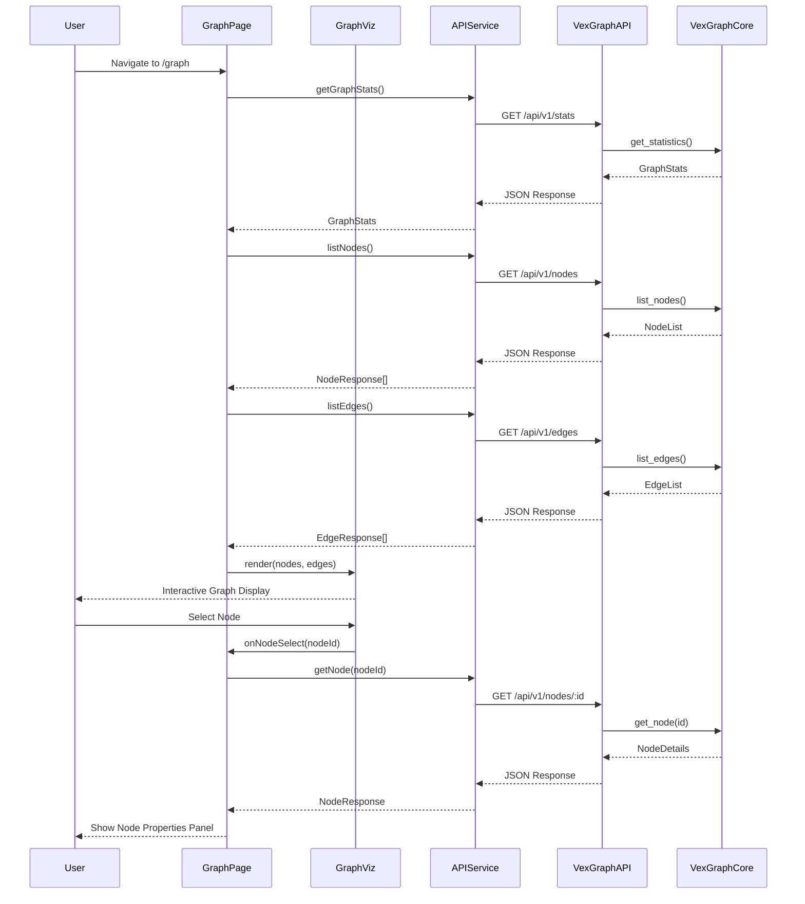
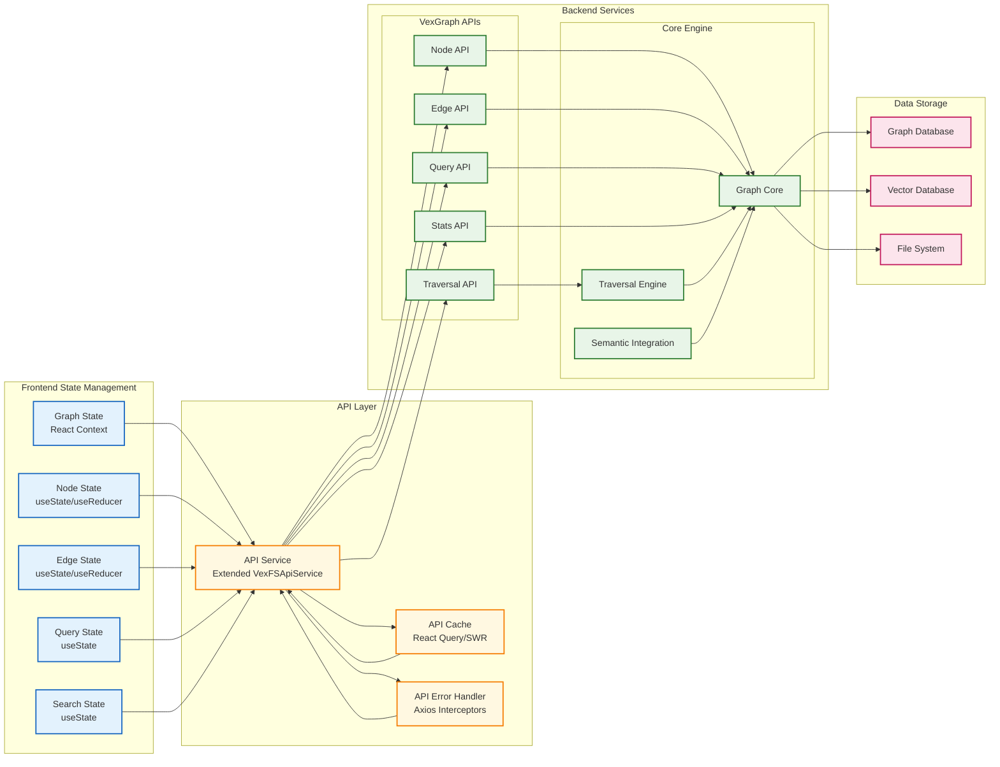
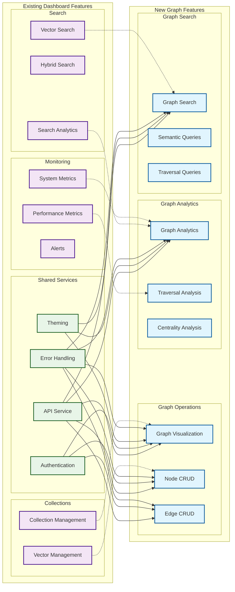

# VexGraph Dashboard Integration Architecture Diagram

## System Architecture Overview

```mermaid
graph TB
    subgraph "VexFS Dashboard (React + Material-UI)"
        subgraph "Navigation Layer"
            NAV[Sidebar Navigation]
            ROUTES[React Router]
        end
        
        subgraph "Existing Pages"
            DASH[Dashboard Page]
            COLL[Collections Page]
            SEARCH[Vector Search Page]
            MON[Monitoring Page]
            SET[Settings Page]
        end
        
        subgraph "New Graph Page"
            GRAPH[Graph Page]
            
            subgraph "Graph Components"
                VIZ[Graph Visualization<br/>Cytoscape.js]
                CRUD[Node/Edge CRUD<br/>Material-UI Forms]
                QUERY[Traversal Query Builder<br/>BFS/DFS/Dijkstra]
                GSEARCH[Graph Semantic Search<br/>Vector Similarity]
                ANALYTICS[Graph Analytics<br/>MUI Charts]
                SCHEMA[Schema Management<br/>Types & Properties]
            end
        end
        
        subgraph "Shared Services"
            API[Extended API Service<br/>VexFSApiService]
            AUTH[Auth Provider]
            ERROR[Error Handling]
            THEME[Material-UI Theme]
        end
    end
    
    subgraph "VexFS Backend"
        subgraph "Existing APIs"
            VAPI[Vector API<br/>/api/v1/collections]
            MAPI[Monitoring API<br/>/monitoring/*]
        end
        
        subgraph "VexGraph Phase 2 APIs"
            NAPI[Node API<br/>/api/v1/nodes]
            EAPI[Edge API<br/>/api/v1/edges]
            TAPI[Traversal API<br/>/api/v1/traversal]
            QAPI[Query API<br/>/api/v1/query]
            SAPI[Stats API<br/>/api/v1/stats]
        end
        
        subgraph "Core Systems"
            CORE[VexGraph Core]
            TRAVERSAL[Traversal Engine]
            SEMANTIC[Semantic Integration]
            STORAGE[Storage Layer]
        end
    end
    
    %% Navigation connections
    NAV --> ROUTES
    ROUTES --> DASH
    ROUTES --> COLL
    ROUTES --> SEARCH
    ROUTES --> MON
    ROUTES --> SET
    ROUTES --> GRAPH
    
    %% Graph page internal connections
    GRAPH --> VIZ
    GRAPH --> CRUD
    GRAPH --> QUERY
    GRAPH --> GSEARCH
    GRAPH --> ANALYTICS
    GRAPH --> SCHEMA
    
    %% Component to service connections
    VIZ --> API
    CRUD --> API
    QUERY --> API
    GSEARCH --> API
    ANALYTICS --> API
    SCHEMA --> API
    
    %% Existing page connections
    DASH --> API
    COLL --> API
    SEARCH --> API
    MON --> API
    
    %% Shared service connections
    API --> AUTH
    GRAPH --> ERROR
    GRAPH --> THEME
    
    %% API to backend connections
    API --> VAPI
    API --> MAPI
    API --> NAPI
    API --> EAPI
    API --> TAPI
    API --> QAPI
    API --> SAPI
    
    %% Backend internal connections
    NAPI --> CORE
    EAPI --> CORE
    TAPI --> TRAVERSAL
    QAPI --> CORE
    SAPI --> CORE
    
    CORE --> STORAGE
    TRAVERSAL --> CORE
    SEMANTIC --> CORE
    
    %% Styling
    classDef newComponent fill:#e1f5fe,stroke:#01579b,stroke-width:2px
    classDef existingComponent fill:#f3e5f5,stroke:#4a148c,stroke-width:2px
    classDef backend fill:#e8f5e8,stroke:#1b5e20,stroke-width:2px
    classDef api fill:#fff3e0,stroke:#e65100,stroke-width:2px
    
    class GRAPH,VIZ,CRUD,QUERY,GSEARCH,ANALYTICS,SCHEMA newComponent
    class DASH,COLL,SEARCH,MON,SET,NAV,ROUTES,AUTH,ERROR,THEME existingComponent
    class CORE,TRAVERSAL,SEMANTIC,STORAGE backend
    class API,VAPI,MAPI,NAPI,EAPI,TAPI,QAPI,SAPI api
```

## Component Integration Flow

## Data Flow Architecture

## UI Component Hierarchy

```mermaid
graph TD
    subgraph "Graph Page Layout"
        GP[Graph.tsx<br/>Main Page Component]
        
        subgraph "Layout Grid"
            TL[Top Left<br/>Graph Controls]
            TR[Top Right<br/>Properties Panel]
            BL[Bottom Left<br/>Query Builder]
            BR[Bottom Right<br/>Analytics]
            CENTER[Center<br/>Graph Visualization]
        end
    end
    
    subgraph "Graph Controls (TL)"
        GC[Graph Controls]
        LB[Layout Buttons]
        ZC[Zoom Controls]
        EX[Export Options]
    end
    
    subgraph "Properties Panel (TR)"
        PP[Properties Panel]
        NP[Node Properties]
        EP[Edge Properties]
        SP[Schema Properties]
    end
    
    subgraph "Query Builder (BL)"
        QB[Query Builder]
        AS[Algorithm Selector]
        NF[Node Filters]
        EF[Edge Filters]
        QR[Query Results]
    end
    
    subgraph "Analytics (BR)"
        AN[Analytics Panel]
        GM[Graph Metrics]
        CH[Charts]
        ST[Statistics]
    end
    
    subgraph "Graph Visualization (CENTER)"
        GV[GraphVisualization.tsx]
        CY[Cytoscape.js Canvas]
        OV[Overlay Controls]
        SE[Selection Handlers]
    end
    
    subgraph "Dialogs & Modals"
        CND[Create Node Dialog]
        CED[Create Edge Dialog]
        END[Edit Node Dialog]
        EED[Edit Edge Dialog]
        SED[Schema Editor Dialog]
    end
    
    %% Main connections
    GP --> TL
    GP --> TR
    GP --> BL
    GP --> BR
    GP --> CENTER
    
    %% Component connections
    TL --> GC
    GC --> LB
    GC --> ZC
    GC --> EX
    
    TR --> PP
    PP --> NP
    PP --> EP
    PP --> SP
    
    BL --> QB
    QB --> AS
    QB --> NF
    QB --> EF
    QB --> QR
    
    BR --> AN
    AN --> GM
    AN --> CH
    AN --> ST
    
    CENTER --> GV
    GV --> CY
    GV --> OV
    GV --> SE
    
    %% Dialog connections
    GP -.-> CND
    GP -.-> CED
    GP -.-> END
    GP -.-> EED
    GP -.-> SED
    
    %% Interaction flows
    GV -.-> PP
    GV -.-> QB
    QB -.-> GV
    PP -.-> GV
    
    %% Styling
    classDef mainComponent fill:#e1f5fe,stroke:#01579b,stroke-width:3px
    classDef layoutComponent fill:#f3e5f5,stroke:#4a148c,stroke-width:2px
    classDef subComponent fill:#e8f5e8,stroke:#1b5e20,stroke-width:1px
    classDef dialogComponent fill:#fff3e0,stroke:#e65100,stroke-width:2px,stroke-dasharray: 5 5
    
    class GP mainComponent
    class TL,TR,BL,BR,CENTER layoutComponent
    class GC,LB,ZC,EX,PP,NP,EP,SP,QB,AS,NF,EF,QR,AN,GM,CH,ST,GV,CY,OV,SE subComponent
    class CND,CED,END,EED,SED dialogComponent
```

## Integration Points with Existing Dashboard

## Technology Stack Integration

| Layer | Existing Technology | Graph Extension | Integration Method |
|-------|-------------------|-----------------|-------------------|
| **Frontend Framework** | React 18 + TypeScript | Same | Direct integration |
| **UI Library** | Material-UI v5 | Same + Graph components | Extend existing theme |
| **Routing** | React Router v6 | Add /graph route | Extend existing router |
| **State Management** | React Context + hooks | Graph-specific contexts | Follow existing patterns |
| **API Client** | Axios with interceptors | Extend VexFSApiService | Add graph methods |
| **Visualization** | MUI Charts | Cytoscape.js | New dependency |
| **Testing** | Playwright + Jest | Same | Extend test suites |
| **Build Tool** | Vite | Same | No changes needed |
| **Backend API** | REST endpoints | VexGraph REST API | Extend existing server |

This architecture ensures seamless integration of VexGraph functionality into the existing VexFS dashboard while maintaining consistency, performance, and maintainability.