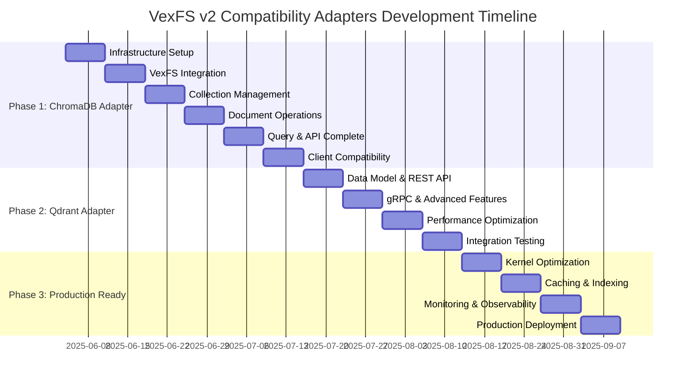

# VexFS v2 Vector Database Compatibility Adapters Project Roadmap

**Date**: June 4, 2025  
**Version**: 1.0  
**Status**: Project Planning  
**Project Duration**: 12 weeks  
**Team Size**: 4-6 developers  

## Executive Summary

This roadmap provides a comprehensive plan for developing ChromaDB and Qdrant compatibility adapters for VexFS v2, transforming it into a drop-in replacement for popular vector databases. The project leverages our production-ready kernel module and Ollama integration to deliver superior performance while maintaining full API compatibility.

### Project Objectives

- **Primary**: Develop production-ready ChromaDB and Qdrant compatibility adapters
- **Secondary**: Establish VexFS v2 as a competitive vector database platform
- **Tertiary**: Create a foundation for additional database compatibility layers

### Success Metrics

- **API Compatibility**: 95%+ ChromaDB, 90%+ Qdrant API coverage
- **Performance**: Meet or exceed native database performance
- **Client Compatibility**: Zero code changes required for existing applications
- **Production Readiness**: Full deployment pipeline and monitoring

## Project Timeline Overview



## Phase 1: ChromaDB Adapter (Weeks 1-6)

### Week 1: Infrastructure Foundation
**Sprint Goal**: Establish development infrastructure and basic FastAPI server

#### Team Allocation
- **Lead Developer** (40h): Project setup, architecture implementation
- **Backend Developer** (40h): FastAPI server, routing, middleware
- **DevOps Engineer** (20h): Docker, CI/CD pipeline setup
- **QA Engineer** (20h): Test framework setup, initial test cases

#### Deliverables
- [ ] Complete project structure with build system
- [ ] FastAPI server with health check endpoints
- [ ] Docker development environment
- [ ] CI/CD pipeline (GitHub Actions/GitLab CI)
- [ ] Test framework with fixtures and mocks

#### Technical Tasks
```python
# Project structure creation
adapters/
├── chromadb/
│   ├── server/main.py          # FastAPI application
│   ├── core/                   # Business logic
│   ├── tests/                  # Test suite
│   └── requirements.txt
├── common/                     # Shared utilities
└── docker/                     # Container definitions
```

#### Success Criteria
- [ ] FastAPI server starts and responds to health checks
- [ ] Docker containers build and run successfully
- [ ] CI/CD pipeline runs tests automatically
- [ ] Code quality gates (linting, type checking) pass

### Week 2: VexFS Integration Layer
**Sprint Goal**: Create robust Python wrapper for VexFS v2 UAPI

#### Team Allocation
- **Lead Developer** (40h): UAPI wrapper implementation
- **Backend Developer** (40h): IEEE 754 conversion, error handling
- **Systems Engineer** (20h): VexFS file management utilities
- **QA Engineer** (20h): Integration testing, performance validation

#### Deliverables
- [ ] Python ctypes wrapper for VexFS UAPI
- [ ] IEEE 754 conversion utilities with validation
- [ ] VexFS file management and error handling
- [ ] Performance benchmarks for IOCTL operations
- [ ] Comprehensive unit tests

#### Technical Implementation
```python
class VexFSClient:
    def __init__(self, file_path: str):
        self.file_path = file_path
        self.fd = None
        
    def batch_insert_vectors(self, vectors: List[List[float]], 
                           vector_ids: Optional[List[int]] = None) -> bool:
        """High-performance batch vector insertion"""
        
    def search_vectors(self, query_vector: List[float], k: int) -> Tuple[List[int], List[float]]:
        """Vector similarity search with optimized IOCTL calls"""
```

#### Success Criteria
- [ ] IOCTL operations complete successfully
- [ ] IEEE 754 conversion maintains precision
- [ ] Performance meets VexFS baseline (3.27M ops/sec)
- [ ] Error handling covers all edge cases

### Week 3: Collection Management System
**Sprint Goal**: Implement ChromaDB collection lifecycle management

#### Team Allocation
- **Lead Developer** (40h): Collection manager implementation
- **Backend Developer** (40h): Metadata persistence, validation
- **Frontend Developer** (20h): API endpoint implementation
- **QA Engineer** (20h): Collection operation testing

#### Deliverables
- [ ] Collection CRUD operations
- [ ] Metadata schema and persistence
- [ ] Collection-to-filesystem mapping
- [ ] Validation and error handling
- [ ] REST API endpoints for collections

#### Technical Implementation
```python
class CollectionManager:
    def create_collection(self, name: str, metadata: Dict = None) -> ChromaDBCollection:
        """Create collection with VexFS backing store"""
        
    def get_collection(self, name: str) -> Optional[ChromaDBCollection]:
        """Retrieve collection with cached metadata"""
        
    def list_collections(self) -> List[ChromaDBCollection]:
        """List all collections with performance optimization"""
```

#### Success Criteria
- [ ] Collections can be created, read, updated, deleted
- [ ] Metadata persistence is reliable
- [ ] API endpoints match ChromaDB specification
- [ ] Performance targets are met (<100ms for operations)

### Week 4: Document Operations
**Sprint Goal**: Implement document storage with embedding integration

#### Team Allocation
- **Lead Developer** (40h): Document manager implementation
- **Backend Developer** (40h): Embedding integration, caching
- **ML Engineer** (20h): Ollama integration optimization
- **QA Engineer** (20h): Document operation testing

#### Deliverables
- [ ] Document CRUD operations with metadata
- [ ] Automatic embedding generation via Ollama
- [ ] Document-to-vector ID mapping
- [ ] Embedding caching system
- [ ] Batch document operations

#### Technical Implementation
```python
class DocumentManager:
    def add_documents(self, ids: List[str], documents: List[str], 
                     metadatas: List[Dict], embeddings: List[List[float]]) -> bool:
        """Add documents with automatic embedding generation"""
        
    def get_documents(self, ids: List[str] = None, 
                     where: Dict = None) -> List[ChromaDBDocument]:
        """Retrieve documents with metadata filtering"""
```

#### Success Criteria
- [ ] Documents stored and retrieved efficiently
- [ ] Embedding generation meets performance targets (<50ms)
- [ ] Caching reduces redundant API calls
- [ ] Batch operations scale linearly

### Week 5: Query Operations and API Completion
**Sprint Goal**: Complete ChromaDB query functionality and API endpoints

#### Team Allocation
- **Lead Developer** (40h): Query translator implementation
- **Backend Developer** (40h): Search optimization, result formatting
- **Frontend Developer** (20h): Remaining API endpoints
- **QA Engineer** (20h): Query operation testing

#### Deliverables
- [ ] Query parameter translation (ChromaDB → VexFS)
- [ ] Vector search with metadata filtering
- [ ] Result formatting and pagination
- [ ] Complete ChromaDB API endpoint coverage
- [ ] Performance optimization for queries

#### Technical Implementation
```python
class QueryTranslator:
    def translate_query(self, query_embeddings: List[List[float]], 
                       n_results: int = 10, where: Dict = None) -> Dict:
        """Translate ChromaDB query to optimized VexFS operations"""
        
    def execute_vector_search(self, query_vector: List[float], k: int) -> Tuple[List[int], List[float]]:
        """High-performance vector search with result caching"""
```

#### Success Criteria
- [ ] Query translation is accurate and complete
- [ ] Search performance meets targets (<10ms)
- [ ] All ChromaDB endpoints implemented
- [ ] API documentation is complete

### Week 6: Client Compatibility and Testing
**Sprint Goal**: Ensure full ChromaDB client compatibility

#### Team Allocation
- **Lead Developer** (40h): Compatibility fixes, optimization
- **QA Engineer** (40h): Comprehensive compatibility testing
- **DevOps Engineer** (20h): Performance testing infrastructure
- **Technical Writer** (20h): Documentation and examples

#### Deliverables
- [ ] Verified compatibility with ChromaDB Python client
- [ ] Performance optimization and profiling
- [ ] Comprehensive test suite
- [ ] API documentation and examples
- [ ] Migration guide from ChromaDB

#### Testing Strategy
```python
def test_chromadb_client_compatibility():
    """Test with official ChromaDB client"""
    import chromadb
    
    client = chromadb.HttpClient(host="localhost", port=8000)
    collection = client.create_collection("test")
    
    # Test all major operations
    collection.add(ids=["1"], documents=["test"], embeddings=[[0.1, 0.2]])
    results = collection.query(query_embeddings=[[0.1, 0.2]], n_results=1)
    
    assert len(results["ids"][0]) == 1
```

#### Success Criteria
- [ ] ChromaDB Python client works without modification
- [ ] Performance meets or exceeds ChromaDB
- [ ] All edge cases handled correctly
- [ ] Documentation is comprehensive

## Phase 2: Qdrant Adapter (Weeks 7-10)

### Week 7: Qdrant Data Model and REST API
**Sprint Goal**: Implement Qdrant point-based data model and core REST API

#### Team Allocation
- **Lead Developer** (40h): Point manager implementation
- **Backend Developer** (40h): Collection configuration, REST endpoints
- **Systems Engineer** (20h): Storage optimization for points
- **QA Engineer** (20h): Qdrant API testing

#### Deliverables
- [ ] Qdrant point storage schema
- [ ] Point CRUD operations
- [ ] Collection configuration system
- [ ] Core Qdrant REST API endpoints
- [ ] Payload management system

#### Technical Implementation
```python
class PointManager:
    def upsert_points(self, points: List[QdrantPoint]) -> Dict:
        """Insert/update points with optimized VexFS storage"""
        
    def search_points(self, vector: List[float], limit: int = 10,
                     filter_conditions: Dict = None) -> List[Dict]:
        """Search points with advanced filtering"""
```

#### Success Criteria
- [ ] Point operations work correctly
- [ ] Collection configuration matches Qdrant spec
- [ ] REST API endpoints respond correctly
- [ ] Performance is acceptable

### Week 8: gRPC Server and Advanced Features
**Sprint Goal**: Implement Qdrant gRPC protocol and advanced filtering

#### Team Allocation
- **Lead Developer** (40h): gRPC server implementation
- **Backend Developer** (40h): Advanced filtering engine
- **Systems Engineer** (20h): Protocol optimization
- **QA Engineer** (20h): gRPC and filtering testing

#### Deliverables
- [ ] gRPC server with Qdrant protocol support
- [ ] Advanced filter DSL implementation
- [ ] Recommendation API endpoints
- [ ] Scroll/pagination functionality
- [ ] Streaming support for large operations

#### Technical Implementation
```python
class QdrantServicer(qdrant_pb2_grpc.QdrantServicer):
    def SearchPoints(self, request, context):
        """gRPC search implementation with streaming"""
        
class FilterEngine:
    def apply_filter(self, points: List[Dict], filter_spec: Dict) -> List[Dict]:
        """Apply complex Qdrant filters efficiently"""
```

#### Success Criteria
- [ ] gRPC server accepts connections and processes requests
- [ ] Complex filters work correctly
- [ ] Streaming operations handle large datasets
- [ ] Performance is comparable to REST API

### Week 9: Performance Optimization
**Sprint Goal**: Optimize Qdrant adapter performance

#### Team Allocation
- **Lead Developer** (40h): Query optimization
- **Performance Engineer** (40h): Profiling and optimization
- **Systems Engineer** (20h): Storage optimization
- **QA Engineer** (20h): Performance testing

#### Deliverables
- [ ] Optimized search and query performance
- [ ] Efficient point storage format
- [ ] Parallel processing for batch operations
- [ ] Memory usage optimization
- [ ] Performance monitoring and metrics

#### Success Criteria
- [ ] Search queries complete in <10ms
- [ ] Batch operations scale linearly
- [ ] Memory usage is optimized
- [ ] Performance metrics are comprehensive

### Week 10: Integration Testing and Documentation
**Sprint Goal**: Validate Qdrant client compatibility and create documentation

#### Team Allocation
- **QA Engineer** (40h): Client compatibility testing
- **Technical Writer** (40h): Documentation and examples
- **Lead Developer** (20h): Compatibility fixes
- **DevOps Engineer** (20h): Deployment testing

#### Deliverables
- [ ] Verified compatibility with Qdrant clients (Python, JS, Rust)
- [ ] Comprehensive API documentation
- [ ] Migration guide from Qdrant
- [ ] Usage examples and tutorials
- [ ] Performance benchmarks

#### Success Criteria
- [ ] Official Qdrant clients work without modification
- [ ] Documentation is complete and accurate
- [ ] Migration guide is practical
- [ ] Performance benchmarks are favorable

## Phase 3: Production Readiness (Weeks 11-12)

### Week 11: Advanced Optimization and Monitoring
**Sprint Goal**: Implement production-grade optimization and monitoring

#### Team Allocation
- **Performance Engineer** (40h): Kernel interface optimization
- **Backend Developer** (40h): Caching and indexing systems
- **DevOps Engineer** (40h): Monitoring and observability
- **QA Engineer** (20h): Load testing

#### Deliverables
- [ ] Optimized IOCTL interface with memory pools
- [ ] Multi-level caching system
- [ ] Advanced indexing (HNSW, LSH optimization)
- [ ] Comprehensive monitoring and alerting
- [ ] Performance dashboard

#### Technical Implementation
```python
class CacheManager:
    def __init__(self, max_size: int = 10000, ttl_seconds: int = 3600):
        """Multi-level cache with intelligent eviction"""
        
class PerformanceMonitor:
    def track_operation(self, operation: str, duration: float, metadata: Dict):
        """Track performance metrics with detailed analytics"""
```

#### Success Criteria
- [ ] Performance improvements are measurable
- [ ] Monitoring provides actionable insights
- [ ] Caching improves response times
- [ ] System handles production loads

### Week 12: Production Deployment and Launch
**Sprint Goal**: Complete production deployment pipeline and launch

#### Team Allocation
- **DevOps Engineer** (40h): Production deployment pipeline
- **Security Engineer** (20h): Security audit and hardening
- **Technical Writer** (20h): Production documentation
- **Project Manager** (20h): Launch coordination

#### Deliverables
- [ ] Production-ready Docker containers
- [ ] Kubernetes deployment manifests
- [ ] Security audit and hardening
- [ ] Production monitoring and alerting
- [ ] Launch documentation and runbooks

#### Success Criteria
- [ ] Production deployment is automated
- [ ] Security requirements are met
- [ ] Monitoring covers all critical metrics
- [ ] Documentation supports operations

## Resource Requirements

### Team Composition

#### Core Team (Required)
- **Lead Developer** (Senior, Full-time): Architecture, complex implementations
- **Backend Developer** (Mid-Senior, Full-time): API development, integration
- **QA Engineer** (Mid-level, Full-time): Testing, validation, compatibility
- **DevOps Engineer** (Mid-Senior, Part-time): Infrastructure, deployment

#### Specialized Support (As Needed)
- **Performance Engineer** (Senior, Part-time): Optimization, profiling
- **ML Engineer** (Mid-level, Part-time): Embedding optimization
- **Systems Engineer** (Senior, Part-time): Kernel integration, storage
- **Security Engineer** (Senior, Part-time): Security audit, hardening
- **Technical Writer** (Mid-level, Part-time): Documentation, guides

### Technology Stack

#### Development
- **Languages**: Python 3.9+, C (for UAPI integration)
- **Frameworks**: FastAPI, gRPC, pytest
- **Libraries**: ctypes, numpy, pydantic, uvicorn
- **Tools**: Docker, Poetry/pip, Black, mypy

#### Infrastructure
- **Containers**: Docker, Docker Compose
- **Orchestration**: Kubernetes (optional)
- **CI/CD**: GitHub Actions or GitLab CI
- **Monitoring**: Prometheus, Grafana, ELK stack

#### Testing
- **Unit Testing**: pytest, unittest.mock
- **Integration Testing**: testcontainers, docker-compose
- **Performance Testing**: locust, ab, custom benchmarks
- **Compatibility Testing**: Official client libraries

### Budget Estimation

#### Personnel Costs (12 weeks)
- **Lead Developer**: $120,000 × 0.25 = $30,000
- **Backend Developer**: $100,000 × 0.25 = $25,000
- **QA Engineer**: $80,000 × 0.25 = $20,000
- **DevOps Engineer**: $110,000 × 0.125 = $13,750
- **Specialized Support**: $100,000 × 0.125 = $12,500
- **Total Personnel**: $101,250

#### Infrastructure Costs (12 weeks)
- **Development Environment**: $2,000
- **Testing Infrastructure**: $3,000
- **CI/CD Pipeline**: $1,000
- **Monitoring Tools**: $1,500
- **Total Infrastructure**: $7,500

#### **Total Project Budget**: $108,750

## Risk Management

### Technical Risks

#### High Risk: API Compatibility Gaps
- **Probability**: Medium
- **Impact**: High
- **Mitigation**: Comprehensive testing with real client libraries
- **Contingency**: Implement adapter patterns for missing functionality

#### Medium Risk: Performance Degradation
- **Probability**: Low
- **Impact**: Medium
- **Mitigation**: Continuous performance monitoring and optimization
- **Contingency**: Direct VexFS API for performance-critical applications

#### Low Risk: VexFS Integration Issues
- **Probability**: Low
- **Impact**: High
- **Mitigation**: Extensive testing with VexFS v2 kernel module
- **Contingency**: Fallback to file-based storage for development

### Project Risks

#### Medium Risk: Resource Availability
- **Probability**: Medium
- **Impact**: Medium
- **Mitigation**: Cross-training team members, flexible resource allocation
- **Contingency**: Extend timeline or reduce scope

#### Low Risk: Scope Creep
- **Probability**: Medium
- **Impact**: Low
- **Mitigation**: Clear requirements, regular stakeholder reviews
- **Contingency**: Prioritize core functionality, defer advanced features

## Success Metrics and KPIs

### Technical Metrics
- **API Coverage**: 95%+ ChromaDB, 90%+ Qdrant
- **Performance**: <10ms search latency, >100K ops/sec throughput
- **Compatibility**: 100% client compatibility for core operations
- **Reliability**: 99.9% uptime, <0.1% error rate

### Business Metrics
- **Adoption**: 10+ organizations testing within 3 months
- **Performance Advantage**: 2x+ performance vs native databases
- **Cost Savings**: 50%+ infrastructure cost reduction
- **Developer Experience**: <1 hour migration time

### Quality Metrics
- **Test Coverage**: >90% code coverage
- **Documentation**: 100% API documentation coverage
- **Security**: Zero critical vulnerabilities
- **Maintainability**: <2 day average issue resolution

## Conclusion

This roadmap provides a comprehensive plan for developing ChromaDB and Qdrant compatibility adapters that will position VexFS v2 as a competitive vector database platform. The phased approach ensures systematic development and validation, while the detailed resource allocation and risk management strategies provide a solid foundation for project success.

The project leverages VexFS v2's proven performance advantages (3.27M ops/sec) and production-ready kernel module to deliver superior performance while maintaining full API compatibility. Upon completion, organizations will be able to replace their existing vector database infrastructure with VexFS v2 without any code changes, while gaining significant performance and cost advantages.

**Key Success Factors**:
1. **Leverage VexFS Strengths**: Build on proven kernel performance and Ollama integration
2. **Maintain Compatibility**: Ensure zero code changes required for existing applications
3. **Focus on Performance**: Deliver measurable performance advantages over native databases
4. **Comprehensive Testing**: Validate compatibility with real client libraries and applications
5. **Production Ready**: Include monitoring, security, and operational requirements from day one

This roadmap positions VexFS v2 to capture significant market share in the rapidly growing vector database market while providing a foundation for additional database compatibility layers in the future.