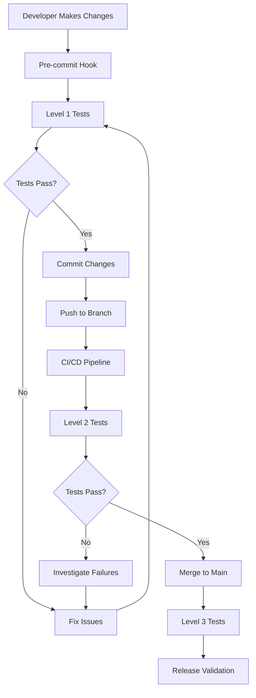

# VexFS Testing Infrastructure - Architecture and Workflows

**Task 33.10 Implementation**: Comprehensive architecture and workflow documentation for the VexFS testing infrastructure

## Table of Contents

1. [Architecture Overview](#architecture-overview)
2. [Component Architecture](#component-architecture)
3. [Data Flow Diagrams](#data-flow-diagrams)
4. [Testing Workflows](#testing-workflows)
5. [Integration Patterns](#integration-patterns)
6. [Scalability and Performance](#scalability-and-performance)
7. [Security Considerations](#security-considerations)
8. [Monitoring and Observability](#monitoring-and-observability)

## Architecture Overview

### High-Level System Architecture

```
┌─────────────────────────────────────────────────────────────────┐
│                    VexFS Testing Infrastructure                  │
├─────────────────────────────────────────────────────────────────┤
│                                                                 │
│  ┌─────────────────┐    ┌─────────────────┐    ┌──────────────┐ │
│  │   Test Levels   │    │   Orchestration │    │   Reporting  │ │
│  │                 │    │                 │    │              │ │
│  │ ┌─────────────┐ │    │ ┌─────────────┐ │    │ ┌──────────┐ │ │
│  │ │   Level 1   │ │    │ │ Unified     │ │    │ │ HTML     │ │ │
│  │ │   Basic     │ │◄───┤ │ Test        │ │───►│ │ Reports  │ │ │
│  │ │ Validation  │ │    │ │ Runner      │ │    │ │          │ │ │
│  │ └─────────────┘ │    │ └─────────────┘ │    │ └──────────┘ │ │
│  │                 │    │                 │    │              │ │
│  │ ┌─────────────┐ │    │ ┌─────────────┐ │    │ ┌──────────┐ │ │
│  │ │   Level 2   │ │    │ │ Avocado-VT  │ │    │ │ JSON     │ │ │
│  │ │ VM Mount    │ │◄───┤ │ Manager     │ │───►│ │ Results  │ │ │
│  │ │ Operations  │ │    │ │             │ │    │ │          │ │ │
│  │ └─────────────┘ │    │ └─────────────┘ │    │ └──────────┘ │ │
│  │                 │    │                 │    │              │ │
│  │ ┌─────────────┐ │    │ ┌─────────────┐ │    │ ┌──────────┐ │ │
│  │ │   Level 3   │ │    │ │ CI/CD       │ │    │ │ PDF      │ │ │
│  │ │ Ultimate    │ │◄───┤ │ Integration │ │───►│ │ Reports  │ │ │
│  │ │ Stress      │ │    │ │             │ │    │ │          │ │ │
│  │ └─────────────┘ │    │ └─────────────┘ │    │ └──────────┘ │ │
│  └─────────────────┘    └─────────────────┘    └──────────────┘ │
│                                                                 │
├─────────────────────────────────────────────────────────────────┤
│                        Core Components                          │
├─────────────────────────────────────────────────────────────────┤
│                                                                 │
│ ┌─────────────┐ ┌─────────────┐ ┌─────────────┐ ┌─────────────┐ │
│ │ VM          │ │ Advanced    │ │ Performance │ │ Fault       │ │
│ │ Management  │ │ Crash       │ │ Monitoring  │ │ Injection   │ │
│ │             │ │ Detection   │ │             │ │ Framework   │ │
│ │ ┌─────────┐ │ │ ┌─────────┐ │ │ ┌─────────┐ │ │ ┌─────────┐ │ │
│ │ │ QEMU/   │ │ │ │ Pattern │ │ │ │ eBPF    │ │ │ │ Syscall │ │ │
│ │ │ KVM     │ │ │ │ Matching│ │ │ │ Tracing │ │ │ │ Fuzzing │ │ │
│ │ └─────────┘ │ │ └─────────┘ │ │ └─────────┘ │ │ └─────────┘ │ │
│ │             │ │             │ │             │ │             │ │
│ │ ┌─────────┐ │ │ ┌─────────┐ │ │ ┌─────────┐ │ │ ┌─────────┐ │ │
│ │ │ Alpine  │ │ │ │ Race    │ │ │ │ Resource│ │ │ │ Memory  │ │ │
│ │ │ Linux   │ │ │ │ Condition│ │ │ │ Metrics │ │ │ │ Pressure│ │ │
│ │ └─────────┘ │ │ └─────────┘ │ │ └─────────┘ │ │ └─────────┘ │ │
│ └─────────────┘ └─────────────┘ └─────────────┘ └─────────────┘ │
│                                                                 │
├─────────────────────────────────────────────────────────────────┤
│                     External Integrations                       │
├─────────────────────────────────────────────────────────────────┤
│                                                                 │
│ ┌─────────────┐ ┌─────────────┐ ┌─────────────┐ ┌─────────────┐ │
│ │ Syzkaller   │ │ GitHub      │ │ Prometheus  │ │ Grafana     │ │
│ │ Fuzzing     │ │ Actions     │ │ Metrics     │ │ Dashboard   │ │
│ └─────────────┘ └─────────────┘ └─────────────┘ └─────────────┘ │
│                                                                 │
└─────────────────────────────────────────────────────────────────┘
```

### Three-Level Testing Architecture

The VexFS testing infrastructure implements a sophisticated three-level architecture:

#### Level 1: Basic Validation
- **Purpose**: Quick smoke tests and basic functionality validation
- **Duration**: 5-15 minutes
- **Components**: Core filesystem operations, basic mount/unmount, simple I/O
- **Use Cases**: Pre-commit validation, rapid development feedback

#### Level 2: VM Mount Operations
- **Purpose**: Comprehensive testing in virtualized environment
- **Duration**: 30-60 minutes
- **Components**: Full VM lifecycle, complex mount scenarios, performance benchmarks
- **Use Cases**: Integration testing, pre-release validation

#### Level 3: Ultimate Stress Testing
- **Purpose**: Extreme stress testing and edge case validation
- **Duration**: 2-8 hours
- **Components**: Syzkaller fuzzing, advanced crash detection, long-running stress tests
- **Use Cases**: Release validation, security testing, robustness verification

## Component Architecture

### Core Framework (Rust)

```rust
// Architectural overview of Rust components

pub mod unified_test_runner {
    //! Central orchestrator for all testing activities
    //! 
    //! Responsibilities:
    //! - Test level coordination
    //! - Component lifecycle management
    //! - Result aggregation
    //! - Error handling and recovery
}

pub mod stress_testing_framework {
    //! High-performance stress testing implementation
    //! 
    //! Features:
    //! - Concurrent I/O operations
    //! - Memory pressure simulation
    //! - CPU-intensive workloads
    //! - Resource exhaustion testing
}

pub mod resource_monitoring {
    //! Real-time system resource monitoring
    //! 
    //! Metrics:
    //! - CPU utilization
    //! - Memory usage patterns
    //! - I/O throughput and latency
    //! - Network activity
}

pub mod kernel_instrumentation {
    //! Kernel-level instrumentation and tracing
    //! 
    //! Capabilities:
    //! - Function call tracing
    //! - Performance profiling
    //! - Lock contention analysis
    //! - Memory allocation tracking
}
```

### VM Infrastructure (Shell/Python)

```python
# VM Infrastructure Architecture

class VMManager:
    """Central VM lifecycle management"""
    
    def __init__(self):
        self.vm_instances = {}
        self.network_config = NetworkConfig()
        self.storage_config = StorageConfig()
    
    async def create_vm(self, config: VMConfig) -> VMInstance:
        """Create and configure VM instance"""
        pass
    
    async def start_vm(self, vm_id: str) -> bool:
        """Start VM with proper initialization"""
        pass
    
    async def stop_vm(self, vm_id: str) -> bool:
        """Gracefully stop VM"""
        pass

class NetworkConfig:
    """VM network configuration management"""
    
    def setup_port_forwarding(self, vm_id: str, ports: List[int]):
        """Configure port forwarding for VM access"""
        pass
    
    def setup_bridge_network(self, vm_id: str):
        """Configure bridge networking for VM"""
        pass

class StorageConfig:
    """VM storage configuration management"""
    
    def create_disk_image(self, size: str, format: str) -> Path:
        """Create VM disk image"""
        pass
    
    def mount_host_directory(self, vm_id: str, host_path: Path, vm_path: Path):
        """Mount host directory in VM"""
        pass
```

### Advanced Detection Framework (Python)

```python
# Advanced Detection Architecture

class CrashDetector:
    """Advanced crash pattern detection"""
    
    def __init__(self):
        self.pattern_database = PatternDatabase()
        self.ml_classifier = MLClassifier()
        self.confidence_threshold = 0.8
    
    async def analyze_logs(self, log_data: List[str]) -> CrashAnalysisResult:
        """Analyze logs for crash patterns"""
        pass
    
    def detect_race_conditions(self, trace_data: TraceData) -> List[RaceCondition]:
        """Detect race conditions from trace data"""
        pass

class FaultInjectionFramework:
    """Systematic fault injection for robustness testing"""
    
    def __init__(self):
        self.injection_points = []
        self.fault_types = [
            'memory_allocation_failure',
            'disk_io_error',
            'network_timeout',
            'syscall_interruption'
        ]
    
    async def inject_fault(self, fault_type: str, target: str) -> bool:
        """Inject specific fault at target location"""
        pass
```

## Data Flow Diagrams

### Test Execution Data Flow

```
┌─────────────────┐
│ Test Request    │
│ (Level 1/2/3)   │
└─────────┬───────┘
          │
          ▼
┌─────────────────┐
│ Unified Test    │
│ Runner          │
│ - Parse config  │
│ - Validate env  │
│ - Initialize    │
└─────────┬───────┘
          │
          ▼
┌─────────────────┐    ┌─────────────────┐    ┌─────────────────┐
│ VM Management   │    │ Component       │    │ Resource        │
│ - Start VM      │    │ Execution       │    │ Monitoring      │
│ - Setup network │    │ - Stress tests  │    │ - CPU/Memory    │
│ - Mount storage │    │ - Benchmarks    │    │ - I/O metrics   │
└─────────┬───────┘    └─────────┬───────┘    └─────────┬───────┘
          │                      │                      │
          └──────────────────────┼──────────────────────┘
                                 │
                                 ▼
                    ┌─────────────────┐
                    │ Result          │
                    │ Collection      │
                    │ - Aggregate     │
                    │ - Validate      │
                    │ - Format        │
                    └─────────┬───────┘
                              │
                              ▼
                    ┌─────────────────┐
                    │ Report          │
                    │ Generation      │
                    │ - HTML/JSON/PDF │
                    │ - Visualizations│
                    │ - Metrics       │
                    └─────────────────┘
```

### Crash Detection Data Flow

```
┌─────────────────┐    ┌─────────────────┐    ┌─────────────────┐
│ Kernel Logs     │    │ System Traces   │    │ Performance     │
│ - dmesg output  │    │ - eBPF data     │    │ Metrics         │
│ - syslog data   │    │ - ftrace logs   │    │ - CPU usage     │
│ - crash dumps   │    │ - lockdep info  │    │ - Memory stats  │
└─────────┬───────┘    └─────────┬───────┘    └─────────┬───────┘
          │                      │                      │
          └──────────────────────┼──────────────────────┘
                                 │
                                 ▼
                    ┌─────────────────┐
                    │ Advanced Crash  │
                    │ Detection       │
                    │ - Pattern match │
                    │ - ML analysis   │
                    │ - Correlation   │
                    └─────────┬───────┘
                              │
                              ▼
                    ┌─────────────────┐
                    │ Analysis        │
                    │ Results         │
                    │ - Crash events  │
                    │ - Root causes   │
                    │ - Recommendations│
                    └─────────────────┘
```

## Testing Workflows

### Development Workflow



### CI/CD Integration Workflow

```yaml
# GitHub Actions Workflow Example
name: VexFS Testing Pipeline

on:
  push:
    branches: [ main, develop ]
  pull_request:
    branches: [ main ]

jobs:
  level-1-tests:
    runs-on: ubuntu-latest
    steps:
      - uses: actions/checkout@v3
      - name: Setup Environment
        run: |
          sudo apt-get update
          sudo apt-get install -y qemu-system-x86_64 qemu-utils
      - name: Run Level 1 Tests
        run: |
          cd tests/vm_testing
          ./run_enhanced_vm_tests.sh --level 1 --ci-mode
      - name: Upload Results
        uses: actions/upload-artifact@v3
        with:
          name: level-1-results
          path: tests/vm_testing/results_*

  level-2-tests:
    needs: level-1-tests
    runs-on: ubuntu-latest
    if: github.event_name == 'push' || github.event.pull_request.base.ref == 'main'
    steps:
      - uses: actions/checkout@v3
      - name: Setup Environment
        run: |
          sudo apt-get update
          sudo apt-get install -y qemu-system-x86_64 qemu-utils
      - name: Run Level 2 Tests
        run: |
          cd tests/vm_testing
          ./run_enhanced_vm_tests.sh --level 2 --ci-mode
      - name: Upload Results
        uses: actions/upload-artifact@v3
        with:
          name: level-2-results
          path: tests/vm_testing/results_*

  level-3-tests:
    needs: level-2-tests
    runs-on: ubuntu-latest
    if: github.ref == 'refs/heads/main'
    steps:
      - uses: actions/checkout@v3
      - name: Setup Environment
        run: |
          sudo apt-get update
          sudo apt-get install -y qemu-system-x86_64 qemu-utils
      - name: Run Level 3 Tests
        run: |
          cd tests/vm_testing
          ./run_enhanced_vm_tests.sh --level 3 --ci-mode
      - name: Upload Results
        uses: actions/upload-artifact@v3
        with:
          name: level-3-results
          path: tests/vm_testing/results_*
```

### Performance Testing Workflow

```python
# Performance Testing Workflow Implementation

class PerformanceTestingWorkflow:
    """Orchestrates performance testing across all levels"""
    
    def __init__(self):
        self.baseline_metrics = self.load_baseline_metrics()
        self.performance_thresholds = self.load_thresholds()
    
    async def execute_performance_suite(self, level: int) -> PerformanceResults:
        """Execute performance testing suite for specified level"""
        
        # Pre-test system preparation
        await self.prepare_system_for_performance_testing()
        
        # Execute performance tests
        if level == 1:
            results = await self.run_basic_performance_tests()
        elif level == 2:
            results = await self.run_comprehensive_performance_tests()
        elif level == 3:
            results = await self.run_extreme_performance_tests()
        
        # Analyze results against baselines
        analysis = await self.analyze_performance_results(results)
        
        # Generate performance report
        report = await self.generate_performance_report(analysis)
        
        return PerformanceResults(
            raw_metrics=results,
            analysis=analysis,
            report=report,
            regression_detected=analysis.has_regressions()
        )
    
    async def run_basic_performance_tests(self) -> Dict[str, float]:
        """Basic performance tests for Level 1"""
        return {
            'mount_time_ms': await self.measure_mount_time(),
            'unmount_time_ms': await self.measure_unmount_time(),
            'basic_io_throughput_mbps': await self.measure_basic_io(),
            'metadata_operations_per_sec': await self.measure_metadata_ops()
        }
    
    async def run_comprehensive_performance_tests(self) -> Dict[str, float]:
        """Comprehensive performance tests for Level 2"""
        basic_metrics = await self.run_basic_performance_tests()
        
        advanced_metrics = {
            'concurrent_io_throughput_mbps': await self.measure_concurrent_io(),
            'large_file_performance_mbps': await self.measure_large_file_ops(),
            'small_file_performance_ops_per_sec': await self.measure_small_file_ops(),
            'memory_usage_peak_mb': await self.measure_memory_usage(),
            'cpu_utilization_percent': await self.measure_cpu_usage()
        }
        
        return {**basic_metrics, **advanced_metrics}
    
    async def run_extreme_performance_tests(self) -> Dict[str, float]:
        """Extreme performance tests for Level 3"""
        comprehensive_metrics = await self.run_comprehensive_performance_tests()
        
        extreme_metrics = {
            'stress_test_duration_minutes': await self.run_stress_test(),
            'fault_injection_recovery_time_ms': await self.measure_fault_recovery(),
            'memory_pressure_performance_degradation_percent': await self.measure_memory_pressure_impact(),
            'network_latency_impact_percent': await self.measure_network_impact()
        }
        
        return {**comprehensive_metrics, **extreme_metrics}
```

## Integration Patterns

### Component Integration Pattern

```python
# Component Integration Architecture

class ComponentIntegrationManager:
    """Manages integration between testing components"""
    
    def __init__(self):
        self.components = {}
        self.integration_graph = DependencyGraph()
        self.event_bus = EventBus()
    
    def register_component(self, component: TestComponent):
        """Register a new testing component"""
        self.components[component.name] = component
        self.integration_graph.add_node(component)
        
        # Setup event handlers
        component.on_start = lambda: self.event_bus.emit('component_started', component.name)
        component.on_complete = lambda result: self.event_bus.emit('component_completed', component.name, result)
        component.on_error = lambda error: self.event_bus.emit('component_error', component.name, error)
    
    async def execute_integrated_test_suite(self, level: int) -> IntegratedResults:
        """Execute test suite with proper component integration"""
        
        # Determine execution order based on dependencies
        execution_order = self.integration_graph.topological_sort()
        
        results = IntegratedResults()
        
        for component in execution_order:
            if self.should_execute_component(component, level):
                try:
                    # Setup component dependencies
                    await self.setup_component_dependencies(component)
                    
                    # Execute component
                    component_result = await component.execute()
                    results.add_component_result(component.name, component_result)
                    
                    # Validate integration points
                    await self.validate_integration_points(component, component_result)
                    
                except Exception as e:
                    results.add_error(component.name, e)
                    
                    # Determine if error is fatal for integration
                    if self.is_fatal_integration_error(e):
                        break
                
                finally:
                    # Cleanup component dependencies
                    await self.cleanup_component_dependencies(component)
        
        return results
```

### Event-Driven Architecture

```python
# Event-Driven Testing Architecture

class TestingEventBus:
    """Central event bus for testing infrastructure"""
    
    def __init__(self):
        self.subscribers = defaultdict(list)
        self.event_history = []
    
    def subscribe(self, event_type: str, handler: Callable):
        """Subscribe to specific event type"""
        self.subscribers[event_type].append(handler)
    
    async def emit(self, event_type: str, *args, **kwargs):
        """Emit event to all subscribers"""
        event = TestEvent(
            type=event_type,
            timestamp=datetime.now(),
            args=args,
            kwargs=kwargs
        )
        
        self.event_history.append(event)
        
        # Notify all subscribers
        for handler in self.subscribers[event_type]:
            try:
                if asyncio.iscoroutinefunction(handler):
                    await handler(event)
                else:
                    handler(event)
            except Exception as e:
                logger.error(f"Event handler error: {e}")

# Event handlers for different components
class VMEventHandler:
    """Handles VM-related events"""
    
    def __init__(self, vm_manager: VMManager):
        self.vm_manager = vm_manager
    
    async def on_test_started(self, event: TestEvent):
        """Handle test start event"""
        await self.vm_manager.prepare_for_testing()
    
    async def on_test_completed(self, event: TestEvent):
        """Handle test completion event"""
        await self.vm_manager.cleanup_after_testing()
    
    async def on_component_error(self, event: TestEvent):
        """Handle component error event"""
        if event.kwargs.get('component') == 'vm_management':
            await self.vm_manager.emergency_cleanup()

class MonitoringEventHandler:
    """Handles monitoring-related events"""
    
    def __init__(self, monitor: ResourceMonitor):
        self.monitor = monitor
    
    async def on_test_started(self, event: TestEvent):
        """Start monitoring when test begins"""
        await self.monitor.start_monitoring()
    
    async def on_test_completed(self, event: TestEvent):
        """Stop monitoring and collect metrics"""
        metrics = await self.monitor.stop_monitoring()
        await self.monitor.save_metrics(metrics)
```

## Scalability and Performance

### Horizontal Scaling Architecture

```python
# Horizontal Scaling Implementation

class DistributedTestRunner:
    """Distributed test execution across multiple nodes"""
    
    def __init__(self):
        self.worker_nodes = []
        self.task_queue = asyncio.Queue()
        self.result_collector = ResultCollector()
    
    async def add_worker_node(self, node_config: WorkerNodeConfig):
        """Add a new worker node to the cluster"""
        worker = WorkerNode(node_config)
        await worker.initialize()
        self.worker_nodes.append(worker)
    
    async def execute_distributed_test_suite(self, test_suite: TestSuite) -> DistributedResults:
        """Execute test suite across distributed workers"""
        
        # Partition test suite across workers
        test_partitions = self.partition_tests(test_suite, len(self.worker_nodes))
        
        # Start workers
        worker_tasks = []
        for i, worker in enumerate(self.worker_nodes):
            task = asyncio.create_task(
                worker.execute_test_partition(test_partitions[i])
            )
            worker_tasks.append(task)
        
        # Collect results from all workers
        worker_results = await asyncio.gather(*worker_tasks, return_exceptions=True)
        
        # Aggregate results
        aggregated_results = self.result_collector.aggregate_distributed_results(worker_results)
        
        return aggregated_results
    
    def partition_tests(self, test_suite: TestSuite, num_partitions: int) -> List[TestPartition]:
        """Partition tests for optimal distribution"""
        # Implement intelligent partitioning based on:
        # - Test execution time estimates
        # - Resource requirements
        # - Dependencies between tests
        pass

class WorkerNode:
    """Individual worker node for distributed testing"""
    
    def __init__(self, config: WorkerNodeConfig):
        self.config = config
        self.vm_manager = VMManager()
        self.resource_monitor = ResourceMonitor()
    
    async def execute_test_partition(self, partition: TestPartition) -> WorkerResults:
        """Execute assigned test partition"""
        results = WorkerResults(worker_id=self.config.worker_id)
        
        try:
            # Setup worker environment
            await self.setup_worker_environment()
            
            # Execute tests in partition
            for test in partition.tests:
                test_result = await self.execute_single_test(test)
                results.add_test_result(test_result)
            
        except Exception as e:
            results.add_error(e)
        
        finally:
            # Cleanup worker environment
            await self.cleanup_worker_environment()
        
        return results
```

### Performance Optimization Strategies

```python
# Performance Optimization Implementation

class PerformanceOptimizer:
    """Optimizes testing infrastructure performance"""
    
    def __init__(self):
        self.optimization_strategies = [
            self.optimize_vm_configuration,
            self.optimize_test_parallelization,
            self.optimize_resource_allocation,
            self.optimize_data_transfer
        ]
    
    async def optimize_testing_performance(self, config: TestConfig) -> OptimizedConfig:
        """Apply performance optimizations to test configuration"""
        optimized_config = config.copy()
        
        for strategy in self.optimization_strategies:
            optimized_config = await strategy(optimized_config)
        
        return optimized_config
    
    async def optimize_vm_configuration(self, config: TestConfig) -> TestConfig:
        """Optimize VM configuration for performance"""
        # CPU optimization
        config.vm_config.cpu_type = "host"  # Use host CPU features
        config.vm_config.cpu_cores = min(os.cpu_count(), 4)  # Optimal core count
        
        # Memory optimization
        available_memory = psutil.virtual_memory().available
        optimal_memory = min(available_memory // 2, 4 * 1024 * 1024 * 1024)  # 4GB max
        config.vm_config.memory_bytes = optimal_memory
        
        # Storage optimization
        config.vm_config.disk_cache = "writeback"  # Better performance
        config.vm_config.disk_aio = "native"  # Native AIO
        
        # Network optimization
        config.vm_config.network_model = "virtio"  # High-performance network
        
        return config
    
    async def optimize_test_parallelization(self, config: TestConfig) -> TestConfig:
        """Optimize test parallelization settings"""
        # Determine optimal parallelization based on system resources
        cpu_cores = os.cpu_count()
        memory_gb = psutil.virtual_memory().total // (1024 ** 3)
        
        # Conservative parallelization to avoid resource contention
        if memory_gb >= 16 and cpu_cores >= 8:
            config.parallelization.max_concurrent_tests = 4
            config.parallelization.max_concurrent_vms = 2
        elif memory_gb >= 8 and cpu_cores >= 4:
            config.parallelization.max_concurrent_tests = 2
            config.parallelization.max_concurrent_vms = 1
        else:
            config.parallelization.max_concurrent_tests = 1
            config.parallelization.max_concurrent_vms = 1
        
        return config
```

## Security Considerations

### Security Architecture

```python
# Security Implementation for Testing Infrastructure

class TestingSecurityManager:
    """Manages security aspects of testing infrastructure"""
    
    def __init__(self):
        self.isolation_manager = IsolationManager()
        self.access_controller = AccessController()
        self.audit_logger = AuditLogger()
    
    async def setup_secure_testing_environment(self) -> SecurityContext:
        """Setup secure testing environment"""
        context = SecurityContext()
        
        # VM isolation
        await self.isolation_manager.setup_vm_isolation()
        
        # Network isolation
        await self.isolation_manager.setup_network_isolation()
        
        # File system isolation
        await self.isolation_manager.setup_filesystem_isolation()
        
        # Access controls
controller.setup_access_controls()
        
        # Audit logging
        await self.audit_logger.start_audit_logging()
        
        return context
    
    async def validate_security_compliance(self) -> SecurityReport:
        """Validate security compliance of testing infrastructure"""
        report = SecurityReport()
        
        # Check VM isolation
        isolation_status = await self.isolation_manager.validate_isolation()
        report.add_check("vm_isolation", isolation_status)
        
        # Check access controls
        access_status = await self.access_controller.validate_access_controls()
        report.add_check("access_controls", access_status)
        
        # Check for security vulnerabilities
        vuln_scan = await self.scan_for_vulnerabilities()
        report.add_check("vulnerability_scan", vuln_scan)
        
        return report

class IsolationManager:
    """Manages isolation between test environments"""
    
    async def setup_vm_isolation(self):
        """Setup VM-level isolation"""
        # Network namespace isolation
        await self.create_network_namespace()
        
        # Process isolation
        await self.setup_process_isolation()
        
        # File system isolation
        await self.setup_filesystem_isolation()
    
    async def setup_network_isolation(self):
        """Setup network isolation for testing"""
        # Create isolated network bridge
        await self.create_isolated_bridge()
        
        # Setup firewall rules
        await self.configure_firewall_rules()
        
        # Enable network monitoring
        await self.enable_network_monitoring()
```

## Monitoring and Observability

### Comprehensive Monitoring Architecture

```python
# Monitoring and Observability Implementation

class TestingObservabilityPlatform:
    """Comprehensive observability for testing infrastructure"""
    
    def __init__(self):
        self.metrics_collector = MetricsCollector()
        self.log_aggregator = LogAggregator()
        self.trace_collector = TraceCollector()
        self.alerting_system = AlertingSystem()
    
    async def setup_observability(self) -> ObservabilityContext:
        """Setup comprehensive observability"""
        context = ObservabilityContext()
        
        # Setup metrics collection
        await self.metrics_collector.start_collection()
        
        # Setup log aggregation
        await self.log_aggregator.start_aggregation()
        
        # Setup distributed tracing
        await self.trace_collector.start_tracing()
        
        # Setup alerting
        await self.alerting_system.configure_alerts()
        
        return context
    
    async def generate_observability_dashboard(self) -> Dashboard:
        """Generate real-time observability dashboard"""
        dashboard = Dashboard()
        
        # System metrics
        system_metrics = await self.metrics_collector.get_system_metrics()
        dashboard.add_panel("system_metrics", system_metrics)
        
        # Test execution metrics
        test_metrics = await self.metrics_collector.get_test_metrics()
        dashboard.add_panel("test_metrics", test_metrics)
        
        # Error rates and patterns
        error_metrics = await self.log_aggregator.get_error_patterns()
        dashboard.add_panel("error_patterns", error_metrics)
        
        # Performance trends
        performance_trends = await self.metrics_collector.get_performance_trends()
        dashboard.add_panel("performance_trends", performance_trends)
        
        return dashboard

class MetricsCollector:
    """Collects and aggregates testing metrics"""
    
    def __init__(self):
        self.prometheus_client = PrometheusClient()
        self.custom_metrics = {}
    
    async def collect_test_execution_metrics(self, test_result: TestResult):
        """Collect metrics from test execution"""
        metrics = {
            'test_duration_seconds': test_result.duration_seconds,
            'test_success_rate': test_result.success_rate,
            'resource_utilization_cpu': test_result.cpu_utilization,
            'resource_utilization_memory': test_result.memory_utilization,
            'io_throughput_mbps': test_result.io_throughput,
            'error_count': test_result.error_count
        }
        
        # Send to Prometheus
        for metric_name, value in metrics.items():
            self.prometheus_client.gauge(metric_name).set(value)
        
        # Store custom metrics
        self.custom_metrics[test_result.test_id] = metrics
    
    async def get_performance_trends(self) -> PerformanceTrends:
        """Analyze performance trends over time"""
        # Query historical data
        historical_data = await self.prometheus_client.query_range(
            'test_duration_seconds',
            start_time=datetime.now() - timedelta(days=30),
            end_time=datetime.now()
        )
        
        # Analyze trends
        trends = PerformanceTrends()
        trends.analyze_duration_trends(historical_data)
        trends.detect_performance_regressions()
        trends.predict_future_performance()
        
        return trends
```

### Real-time Alerting System

```python
# Real-time Alerting Implementation

class AlertingSystem:
    """Real-time alerting for testing infrastructure"""
    
    def __init__(self):
        self.alert_rules = []
        self.notification_channels = []
        self.alert_history = []
    
    def add_alert_rule(self, rule: AlertRule):
        """Add new alert rule"""
        self.alert_rules.append(rule)
    
    def add_notification_channel(self, channel: NotificationChannel):
        """Add notification channel"""
        self.notification_channels.append(channel)
    
    async def evaluate_alerts(self, metrics: Dict[str, float]):
        """Evaluate all alert rules against current metrics"""
        for rule in self.alert_rules:
            if rule.should_trigger(metrics):
                alert = Alert(
                    rule_name=rule.name,
                    severity=rule.severity,
                    message=rule.generate_message(metrics),
                    timestamp=datetime.now()
                )
                
                await self.send_alert(alert)
                self.alert_history.append(alert)
    
    async def send_alert(self, alert: Alert):
        """Send alert through all configured channels"""
        for channel in self.notification_channels:
            try:
                await channel.send_alert(alert)
            except Exception as e:
                logger.error(f"Failed to send alert via {channel.name}: {e}")

# Predefined alert rules
CRITICAL_ALERT_RULES = [
    AlertRule(
        name="test_failure_rate_high",
        condition="test_failure_rate > 0.1",
        severity="critical",
        message="Test failure rate exceeded 10%"
    ),
    AlertRule(
        name="vm_startup_failure",
        condition="vm_startup_success_rate < 0.9",
        severity="high",
        message="VM startup success rate below 90%"
    ),
    AlertRule(
        name="memory_usage_high",
        condition="memory_utilization > 0.9",
        severity="warning",
        message="Memory utilization above 90%"
    ),
    AlertRule(
        name="test_duration_anomaly",
        condition="test_duration > baseline_duration * 2",
        severity="warning",
        message="Test duration significantly higher than baseline"
    )
]
```

## Summary

The VexFS Testing Infrastructure represents a comprehensive, enterprise-grade testing framework designed to ensure the reliability, performance, and security of the VexFS kernel module. This architecture documentation provides:

### Key Architectural Components

1. **Three-Level Testing Architecture**: Progressive testing levels from basic validation to extreme stress testing
2. **Modular Component Design**: Loosely coupled components with standardized interfaces
3. **VM-Based Isolation**: Secure, isolated testing environments using QEMU/KVM
4. **Advanced Detection Systems**: ML-powered crash detection and fault injection frameworks
5. **Comprehensive Monitoring**: Real-time observability with metrics, logging, and alerting

### Integration Capabilities

- **CI/CD Integration**: Seamless integration with GitHub Actions and other CI/CD platforms
- **Distributed Execution**: Horizontal scaling across multiple worker nodes
- **Event-Driven Architecture**: Reactive system design with comprehensive event handling
- **Security-First Design**: Built-in security controls and compliance validation

### Performance and Scalability

- **Optimized Resource Utilization**: Intelligent resource allocation and optimization
- **Parallel Execution**: Concurrent test execution with proper isolation
- **Performance Monitoring**: Continuous performance tracking and regression detection
- **Scalable Architecture**: Designed to scale from single-node to distributed deployments

This documentation serves as the definitive guide for understanding, maintaining, and extending the VexFS testing infrastructure, ensuring that contributors can effectively work with this sophisticated testing framework.

---

**Document Status**: Complete - Task 33.10 Implementation
**Last Updated**: 2025-01-31
**Version**: 1.0.0
        await self.access_